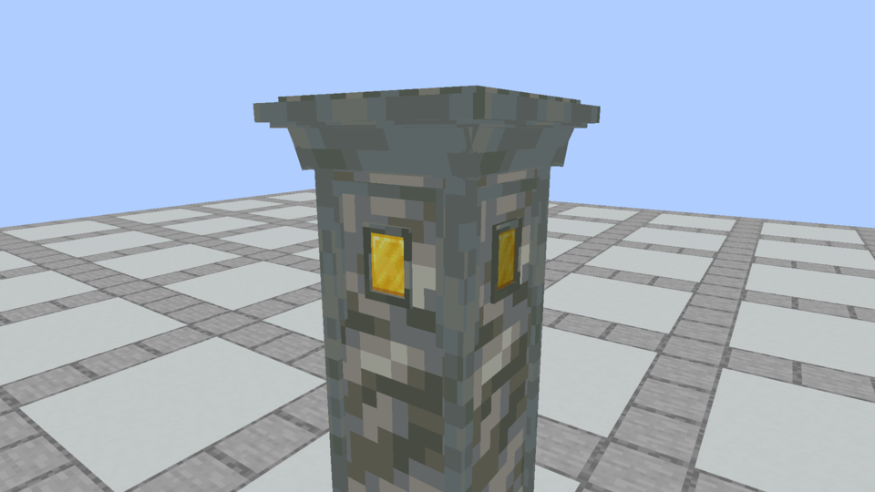
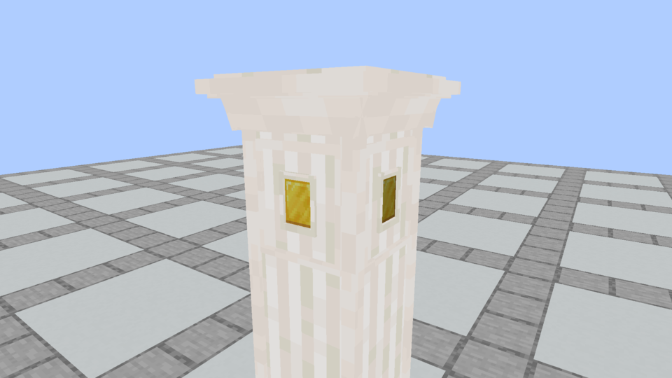

# Remove the column-head lower frame bar · October 5

**Later in-game review:** the owner rejected the elaborate Plinth. The [simple Plinth revision](../apparatus-simple-plinth/README.md) supersedes its geometry with three stone cuboids and centered flat sockets on every segment. These Plinth images remain historical evidence; Spellstone is unchanged.

The owner identified the raised horizontal bar below the Gold insert in [their screenshot](owner-bar-reference.png). It was the lower rail of the large architectural face frame, separate from the small outline around the imbuement. Stacked caps now omit that bar on all four sides, across all 36 finishes. The small socket borders and all other cap detail are retained. Standalone Plinths, Spellstones, bases, shafts, textures, item scale, sockets, recipes and shaping are unchanged. Physical collision is regenerated for the removed bars.

## Actual Minecraft before and after

| Before | After |
| --- | --- |
|  |  |
|  |  |

These are unmodified native frame captures with the same close camera, four-Plinth column and Gold on the cap. Actual state snapshots verify `base / shaft / shaft / cap`. The only changed loaded model hash in each comparison is its cap. [Capture evidence](capture-evidence.json) pins image hashes, loaded assets and states. These views supersede earlier column-head images.

The [model and seam audit](model-and-seam-audit.json) checks all 36 finishes: original standalone detail intact, exactly four lower large-frame rails removed, all 16 small socket-border bars retained, unchanged physical bounds, and 20 matching side-face sections at every vertical join. Column base/shaft/cap now use **7/5/45 elements**. Standalone Plinth/Spellstone remain **51/32**.

[Verification](verification.json) records 85 passing unit tests, all 151 required Minecraft tests, Kithkyn compatibility, and 180 packaged apparatus block models matching source. Both native capture builds pass. [Installation](prism-install.json) records the Kithkyn Testing update; restart Minecraft to load it. Automated checks use NeoForge 21.1.72; manual playtesting on the instance’s 21.1.248 remains with the owner.
