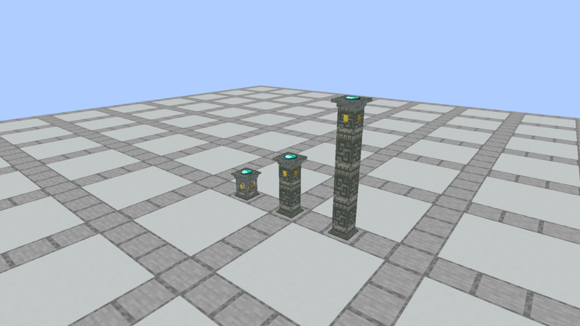
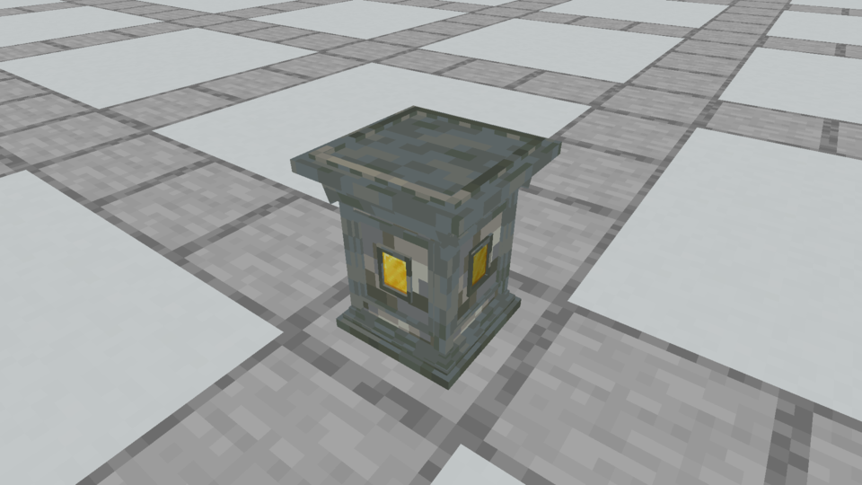
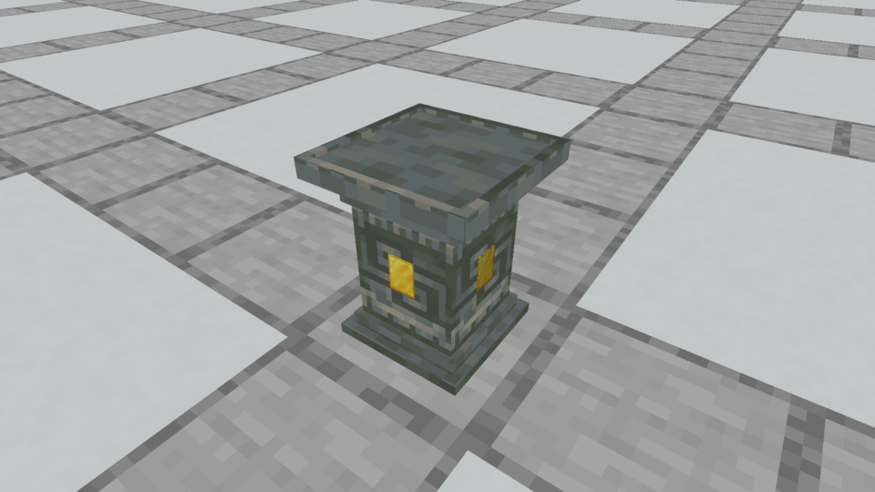
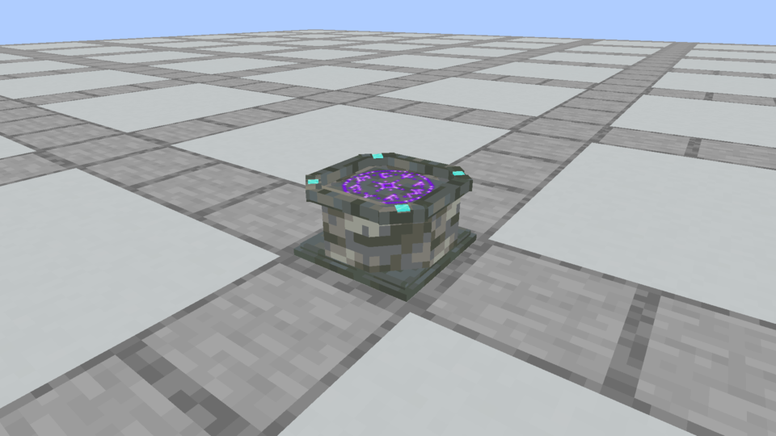

# Connected Plinth columns and simpler model comparison

October 5, 2026, first column iteration. **Historical comparison:** the owner first requested a middle ground, then clarified that only the original bottom steps should be simplified. The [current native revision](../apparatus-foot-refinement/README.md) has 51/32 standalone elements, complete original upper detail and continuous masonry/trim mapping. The 9/15 minimal alternative below was not adopted; these original captures and counts are preserved unchanged.

## Connected columns

Sneak-place Plinths on top of one another. Any of the 36 finishes connects with any other finish. The bottom segment supplies one stepped foot, middle segments form a continuous narrow shaft, and the top supplies one crown. There are no repeated shelves between segments. Removing a segment updates its neighbors, and a single remaining Plinth restores the approved standalone model.



Each block retains its own offering and material socket through shape changes. Only the exposed top Plinth is a ritual node and accepts new offerings. Covered stored offerings remain recoverable by empty-hand side clicks; sockets remain independently accessible. Breaking a segment returns its own contents. Adding a segment above an active ritual surface cancels that ritual before commitment, preserving ingredients and releasing reservations. Supporting segments add neither recipe slots nor shaping bonuses; the cap's position supplies the active geometry.

This first iteration used **3 elements for the base, 1 for a middle shaft and 7 for the cap**. Current middle models use 7/5/22. Both iterations reach the next block's boundary and retain the approved y14/16 offering surface and 14.3/16 crown height. The current revision replaces the repeated carved shaft tiles shown here with continuous masonry and corner trim.

## Before and after in Minecraft

These are unchanged native framebuffer captures at the same camera, lighting and Tuff finish. The after version uses a capture-only resource pack. No browser imitation or generated picture is used.

| Model | Approved before | Simpler alternative |
| --- | --- | --- |
| Plinth |  |  |
| Spellstone |  |  |

The Plinth removes tiny panel-frame bars, angled shoulders and extra molding strips. Whole vanilla carved texture tiles supply the side recess detail. Its offering bed, maximum crown width and socket alignment stay the same. This reduces **52 elements / 312 authored faces to 9 / 54**, with no rotated elements. It retains the familiar silhouette with much less geometry.

The Spellstone alternative uses square-cut corners and simpler ledges in place of the angled octagonal moldings. It retains four small flush Diamond inlays, the recessed y7/16 scroll bed and the original intact purple rune. It reduces **33 elements / 193 authored faces to 15 / 85**, eliminating 20 rotated elements. These totals include the unchanged rune plane; physical stone elements drop from 32 to 14. The current native rune renderer and restrained halo are unchanged. Its footprint changes slightly from approximately 14.43/16 to 14/16. The simplified silhouette looks more square; retaining the approved octagonal Spellstone is a reasonable visual choice.

Recommendation: adopt the simpler Plinth if the owner likes the comparison. Review the Spellstone separately because its silhouette changes more. Neither standalone alternative is silently adopted by this work.

## Vanilla reference

Counts come from resolved Minecraft 1.21.1 model JSON, including inherited elements, frozen with source hashes in [the vanilla audit](vanilla-model-complexity.json).

| Vanilla model | Cuboid elements | Authored faces |
| --- | ---: | ---: |
| Stone / Lodestone | 1 | 6 |
| Stone Brick Stairs | 2 | 11 |
| Stonecutter | 2 | 8 |
| Lectern | 3 | 16 |
| Anvil | 4 | 21 |
| Brewing Stand | 4 | 24 |
| Grindstone | 5 | 26 |
| Campfire | 7 | 32 |

Minecraft supports cuboid model elements and rotations; the [NeoForge model documentation](https://docs.neoforged.net/docs/1.21.1/resources/client/models/) describes their format. The approved apparatus is substantially more elaborate than these vanilla workstations. Simplifying the small moldings brings the visual construction closer to vanilla and reduces authored geometry. Element counts alone do not establish an FPS problem or improvement: this is a model/appearance comparison, not a performance benchmark. Block-entity extras such as enchanting books, campfire food and apparatus items/rune halos are outside these JSON counts.

## Reproduction and verification

The [comparison ledger](comparison-models.json) records every finish's element, face and rotation counts. Archived before/after model files preserve the alternatives. [Capture evidence](capture-evidence.json) pins unchanged frame hashes and the model hashes actually loaded by Minecraft's resource manager, including resource-pack overrides.

```sh
python3 tools/author_apparatus_models.py --check
python3 tools/author_apparatus_comparison.py --check
./gradlew runEffectsCapture -Pcapture_kind=apparatus -Pcapture_spells=spellstone,plinth,plinth_columns -Pcapture_material=tuff -Pcapture_seconds=2 -Pcapture_output=build/apparatus-columns-current
./gradlew runEffectsCapture -Pcapture_kind=apparatus -Pcapture_spells=spellstone,plinth,plinth_columns -Pcapture_material=tuff -Pcapture_seconds=2 -Papparatus_preview=simplified -Pcapture_output=build/apparatus-columns-simplified
```

Use fresh output directories. Generate the capture-only pack first with `python3 tools/author_apparatus_comparison.py`. It is outside shipped resources and never installed into Prism by this task. Native visual inspection covers Tuff at matched cameras; all 36 finishes share generated geometry, and the column behavior test exercises every finish. Current build/test and installation results are recorded in [development status](../../development-status.md).

The [verified native column build](prism-install.json) is installed in Prism / **Kithkyn Testing**. Restart Minecraft there to test it. All 85 unit tests and 146 required Minecraft tests pass. Automated checks use NeoForge 21.1.72; the instance's 21.1.248 gameplay remains the owner's manual playtest boundary. The simpler standalone pack is excluded from that installation.
