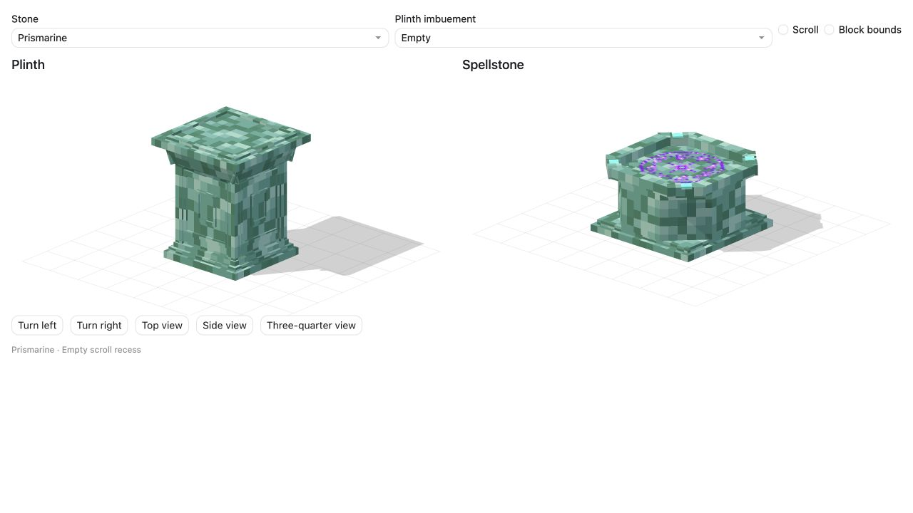
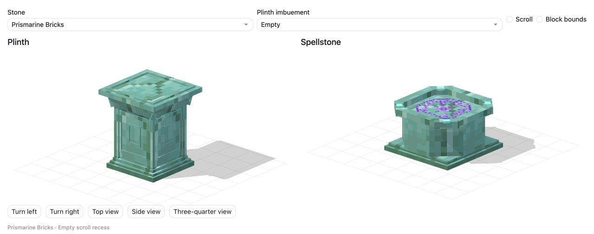
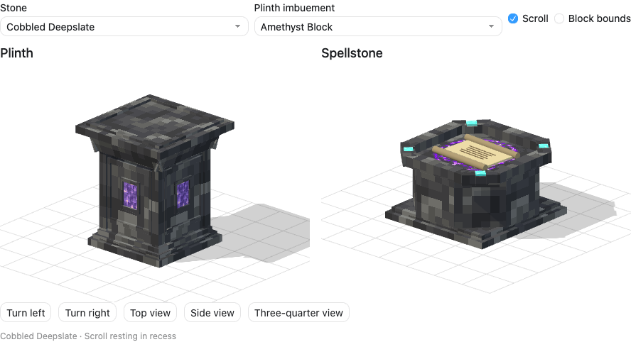
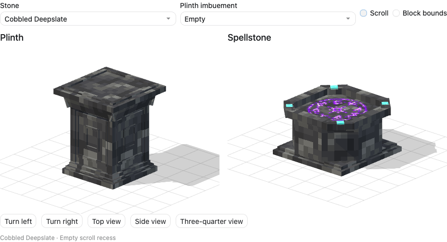
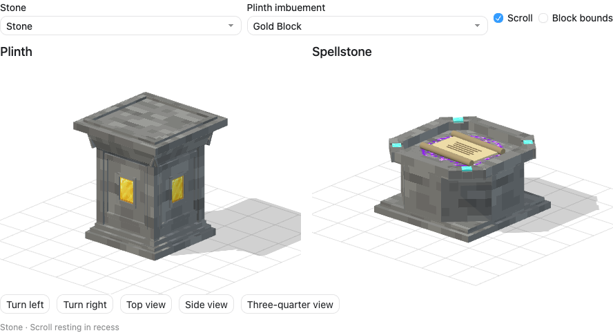
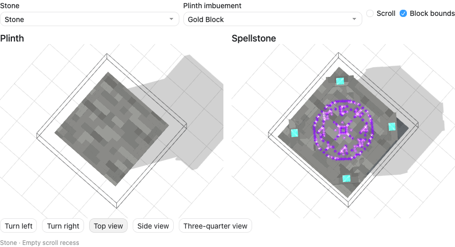

# Plinth and Spellstone model review

Status: owner-selected silhouettes and 36-material support set, updated 2026-10-05. The review exports supply the native apparatus authoring inputs. Owner-supplied construction grids are recorded in the canonical material manifest; native integration and current Minecraft captures are recorded in [apparatus models](../../design/apparatus-models.md).

The owner supplied `owner-plinth-reference.png`: a classical pedestal with a narrow shaft, recessed face panels, a stepped foot, angled shoulders and an overhanging cap. The Plinth follows that silhouette. The Spellstone has its own broad, eight-sided body and crown, a shallow scroll bed, luminous purple sigils and four small flush diamond crown inlays.

The owner previously rejected a family of broad pedestals distinguished mainly by size. This pass gives the Plinth a taller column silhouette and the Spellstone its own eight-sided altar geometry. The first render of this pass used only stepped shoulders and a larger scroll; the shoulders became sloped to follow the photograph, and the scroll became smaller so it no longer concealed most of the rune circle. Those changes were rendered and inspected again.

The owner liked both silhouettes and requested purple runes, removal of the Spellstone's purple side divots, and optional diamond detail. That revision removes both Amethyst side seals and their frames, leaving uninterrupted stone sides. Four modest diamond caps are inset into the diagonal crown pieces, flush with the existing rim. The Plinth geometry is unchanged. The new rune texture follows the full-size earlier source's broken ring, small central diamond and distinct surrounding glyphs; a first generated recolor was rejected because it changed the glyph layout.

The current requested glow revision keeps the entire original sigil pattern on one plane at y = 7.12/16, only 0.12/16 of a block above the y = 7/16 stone backdrop. The texture, center mark and ring stay together, with luminous glyph cores and a restrained alpha-following glow at the same height. A resting scroll naturally covers the portion underneath it. There is no secondary inscription, split-height pattern, local colored light or continuous animation.

Rejected glow direction: the previous pass put a faint copy against the stone and lifted the outer glyphs to y = 8.42/16 while leaving the center lower. The owner rejected the doubled, faint-underlay appearance and clarified that the whole original pattern should hover ever so slightly above its backdrop. That direction is superseded; do not restore the ghost copy or split the sigil into different heights.

## Review

Open `preview.html` for the interactive comparison. Drag either model to orbit both. The buttons provide top, side and three-quarter views. The material picker compares all 36 stone/masonry stair materials selected by the owner, excluding wood, bamboo and Copper. Each has both stairs and slabs in Minecraft 1.21.1. The complete palette is recorded in the [canonical material manifest](../../design/apparatus-materials.json) and [vanilla stair reference](../../research/vanilla-stair-materials-1.21.1.json). Cobbled Deepslate is the starting treatment; Sandstone most closely resembles the reference photograph's pale stone. This set supersedes the earlier 14-material list and 25 wall-based proposal, and applies to both models.

The Plinth inset picker shows one embedded material through four side windows. It does not imply four independent imbuements. The scroll and block-bounds controls help assess the receiving surface and footprint. All appearance choices are cosmetic, with no recipe, trait, Spellshaping or attunement differences.

The [full 36-material gallery](review-material-gallery.png) predates the Prismarine correction. These focused captures show the current two finishes:

## Native model files

The 72 JSON files under `models/` are Minecraft block-element models. Each role has one shared geometry repeated across 36 texture mappings. `author_models.py` reads the canonical [material manifest](../../design/apparatus-materials.json), authors all 72 and embeds the same geometry and palette into the editable review source. The former `*-stone.json` Stone Brick sample now represents plain Stone; explicit Stone Brick exports are `*-stone_bricks.json`.

| Geometry | Plinth | Spellstone |
| --- | --- | --- |
| Maximum visual height | 14.3/16 block | 8/16 block |
| Maximum footprint | 12.22/16 square | approximately 14.43/16 square |
| Main shaft/body | 7.90/16 shaft, plus face frames | broad eight-sided body |
| Item receiving surface | y = 14/16 | y = 7/16 |
| Top rim height | y = 14.3/16 | y = 8/16 |
| Element count | 52 | 33 |
| Element angles | 22.5-degree shoulder slopes | 45-degree diagonal faces |

Every transformed element corner fits inside the block's 0..16 bounds. Fractional units are intentional. The taller Plinth is proposed to follow the new photograph; it is not an assertion that the installed Plinth's collision or rendering already uses this height.

The Spellstone's physical stone remains 8/16 high and its item surface remains at 7/16. The single decorative sigil sits at 7.12/16 within the recess; it does not change collision. `rune-presentation.json` records that height, core brightness and halo settings. The author embeds the same settings in the comparison. Native cutout JSONs preserve the single-plane geometry; full-bright cores and the halo need matching client rendering during adoption. Native vanilla rendering does not supply this preview halo automatically.

The Plinth's north inset is centered at approximately `[8, 6.7685, 4.0896]`, with dimensions `[2.0868, 2.8282, 0.10]` in model units. Repeat around the center by quarter turns, reading one stored imbuement. The base JSON supplies the surrounding frame; the selected material is a separate renderer fixture in this review.

The scroll is also a review fixture. It rests flat inside the Spellstone's recess, with its rolled ends below the rim and visible runes around the parchment. It does not replace the live reference/result scroll renderer.

## Material provenance

Body textures correspond to the exact 36 selected vanilla materials. Carved or polished trim stays within the surrounding stone family where possible; the canonical manifest records every texture mapping. Prismarine Bricks uses its own brick texture for body, carving and trim. Decorative trim does not add another material variant or change the owner-supplied construction ingredients.

Prismarine's vanilla PNG is a 16-by-64 animated sheet containing four 16-by-16 frames. The review retains that asset unchanged and reads vanilla animation metadata to sample its first frame, instead of stretching all four frames across a surface. Native models still reference the named vanilla texture, so Minecraft owns its normal animation. Static textures retain their full UV area.

The selectable Plinth Amethyst/Gold/Diamond insets and the Spellstone's crown diamonds use vanilla textures. The purple rune circle references `vestige:block/spellstone_runes_purple`; its project-bound review asset is `textures/spellstone_runes_purple.png`. The native apparatus author reads that sibling texture when packaging the new models.

The purple texture was made with the built-in image generation tool, editing the full-size earlier `docs/art/apparatus-v9/rune-selected-source.png`. The selected 1254-by-1254 generated PNG is preserved unchanged as `rune-purple-generated-source.png`; the native overlay is a 64-by-64 PNG, matching the earlier native rune resolution. Exported with `sips --resampleHeightWidth 64 64 rune-purple-generated-source.png --out textures/spellstone_runes_purple.png`. The exact prompt is saved in `purple-runes-prompt.txt`. The authoring script reads the native overlay and vanilla material PNGs to embed the review. No Iron assets or code are copied. Construction recipes follow the separate owner-supplied grids in the material manifest.

## Verification and adoption

`python3 docs/art/apparatus-concepts/author_models.py --check` verifies generated model content, supported native rotations, transformed block bounds, UV ranges and preview-input agreement. The script accepts `--client-jar` and `--fragment` for a different local environment.

Browser verification results are in `preview-checks.json`; all 36 material choices rendered for both roles with no script/console errors or failed requests. Captures cover desktop, 320/360-pixel narrow layouts, light/dark appearance, glowing sigils with and without a scroll, the scroll recess and the 36-material comparison above. `review-sigils.png` shows the complete pattern at its slight hover height; `review-sigils-top.png` shows the intact center and ring. View controls, drag rotation, inset selection and scroll/bounds toggles passed. The subsequent Prismarine sampling/brick-trim correction has its own focused captures and checks in `prismarine-preview-checks.json`. This is browser presentation verification, not in-game presentation verification.

Live apparatus adoption should update collision/selection shape, offering height and imbuement renderer placement together, supporting the 36 selected appearances for both roles. Keep existing one-offering/one-imbuement rules, reference-scroll preservation and cosmetic exclusion from attunement identities. The canonical manifest supplies the accepted construction grids and quantities. No runtime logic or deployment is changed by this review package.
