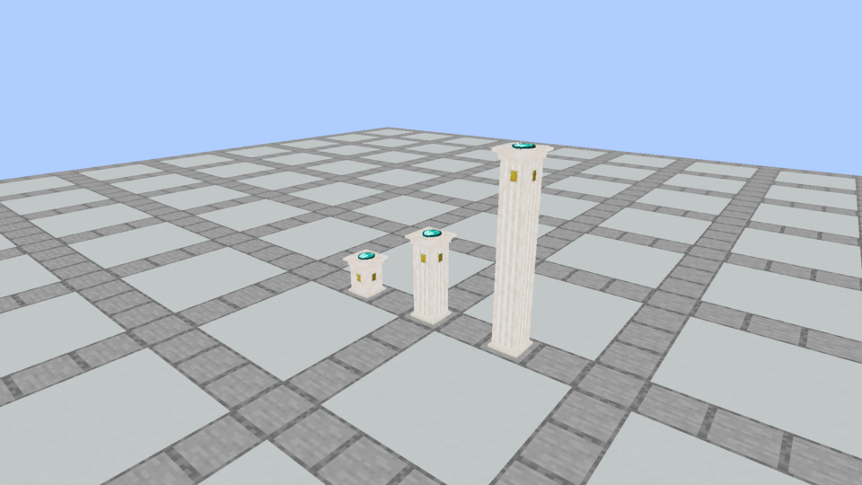
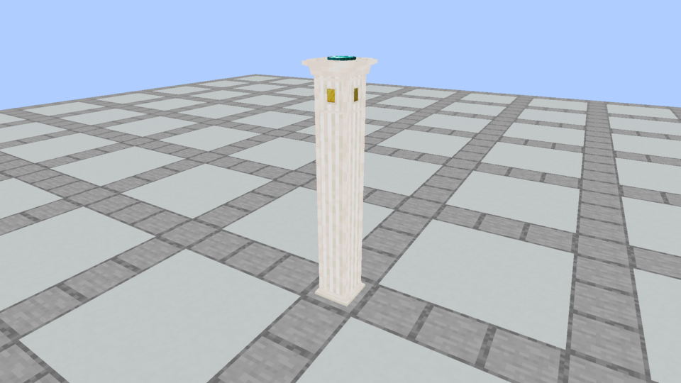

# Detailed apparatus with simpler bottom steps

**Later in-game review:** the owner rejected the elaborate Plinth. The [simple Plinth revision](../apparatus-simple-plinth/README.md) supersedes its geometry with three stone cuboids and centered flat sockets on every segment. These Plinth images remain historical evidence; Spellstone is unchanged.

**Later column refinement:** the owner subsequently identified the wide lower face-frame bar as unwanted on stacked heads. The [current column-bar revision](../apparatus-column-bar/README.md) removes that bar on all four cap sides (49→45 elements), preserving all small socket outlines. The standalone comparisons below remain current; this archive’s column frames and audit describe the preceding revision.

October 5, 2026. The owner clarified that the original detailed models were preferred, especially the Plinth's outline around its imbuement. The requested simplification applies **only to the bottom steps**. This is the native model set across all 36 finishes; the [minimal](../apparatus-columns/README.md) and [middle-ground](../apparatus-middle-ground/README.md) alternatives are historical comparisons.

| Model | Original bottom steps | Current bottom steps | Original elements | Current elements |
| --- | ---: | ---: | ---: | ---: |
| Plinth | 3 | 2 | 52 | 51 |
| Spellstone, including rune | 2 | 1 | 33 | 32 |

All **49 Plinth elements above its foot** are identical to the original reviewed export. This preserves both the large architectural frame and the small outline around the imbuement on all four sides, the four angled shoulders, the detailed crown and the recessed receiving top. All **31 Spellstone elements above its foot** are also identical: its octagonal body, carved rim, fitted Diamond settings, scroll bed and intact purple rune are restored.

## Actual Minecraft comparison

These images are unchanged Minecraft framebuffer captures. The current images use the registered native blocks with `apparatusPresentation=current`, without a comparison resource pack. Original Tuff images use the same camera and material.

| Original detailed model | Current: bottom steps only |
| --- | --- |
|  |  |
|  |  |

## Continuous stacked columns

**Capture correction:** the later [water/socket review](../apparatus-water/README.md) caught raw fixture placement leaving the head renderer in `part=single`. It resolves neighbor-derived states before placement and verifies `part=cap` in its server snapshot. The column images below now use those corrected captures; earlier column frames in this archive are historical.



Column parts use **7 base, 5 shaft and 49 cap elements**. The cap retains all 44 original frame, shoulder and crown elements; only its core and four corner strips extend downward to connect to the supporting shaft. The base has the same two-step foot as a standalone Plinth. Middle sections have continuous masonry and corner trim without repeated shelves or decorative frames. The corner strips match the original head's width.



Columns keep fixed texture scale and phase at each join. Ordinary masonry retains its full vanilla tile courses; bordered polished materials use the tile's interior rows. Quartz and Purpur use their vanilla pillar textures on supporting shafts. Standalone texture references and UVs above the foot are exactly the original ones. All stone and trim pixels remain existing vanilla assets. Mixed finishes connect geometrically but keep their colors.

Receiving heights, maximum footprints, socket position and dropped-item scale retain their previous values. Collision follows the revised physical geometry. Only the exposed head accepts offerings or acts as a ritual node. Supporting blocks retain their stored contents, and do not add slots or modifiers.

## Verification and installation

[Model and seam audit](model-and-seam-audit.json) checks all 36 finishes, exact original upper-detail preservation, physical bounds, UVs, rotations and 20 matching side-face sections at every column join. Authoring is deterministic:

```sh
python3 tools/author_apparatus_models.py --check
python3 tools/audit_apparatus_detail.py --check
python3 tools/author_apparatus_middle.py --check
python3 docs/art/apparatus-concepts/author_models.py --check
```

Current verification and installation results are recorded in [development status](../../development-status.md). Actual client inspection covers Tuff standalone models/columns and Quartz columns. Other finishes share the audited geometry/mapping rules. Element counts are not an FPS benchmark.

[Verification](verification.json) records **85 passing unit tests and all 146 required Minecraft tests**. All 180 packaged block models match their source bytes. [Capture evidence](capture-evidence.json) pins the six unchanged screenshots and resource hashes loaded by Minecraft. The [installed jar](prism-install.json) is in **Prism / Kithkyn Testing**; restart Minecraft to test it. Automated checks use NeoForge 21.1.72; the instance's 21.1.248 remains the owner's manual gameplay boundary.
