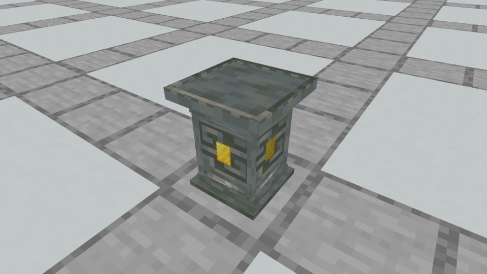
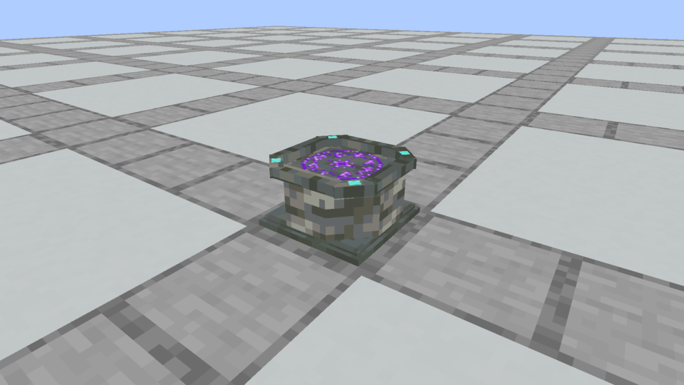
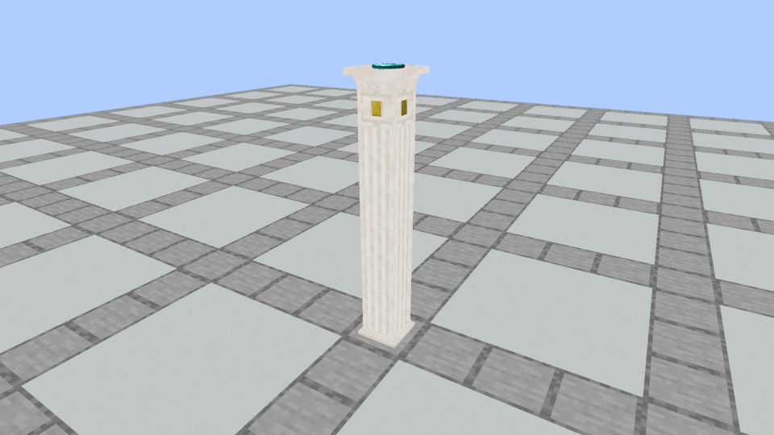
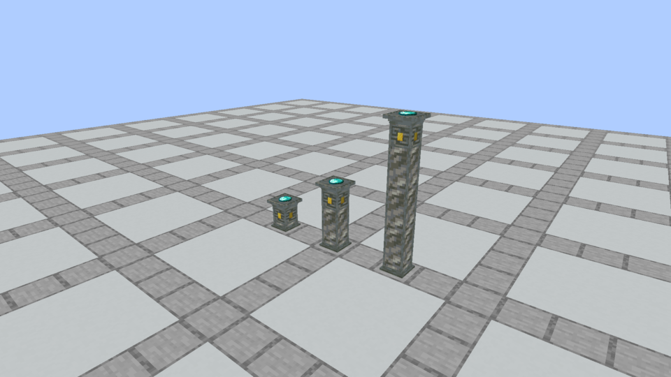

# Middle-ground apparatus and continuous columns

**Historical candidate, superseded October 5.** The owner clarified that the original detailed models were preferred, with only fewer bottom steps and the complete Plinth imbuement outline preserved. See the [current foot-only refinement](../apparatus-foot-refinement/README.md). The following records this earlier iteration and its verification.

October 5, 2026. The owner requested a middle ground between the elaborate original models and the minimal previews, with more seamless stacked Plinth textures. **This revision was the native model set before that clarification.** The earlier [52/33 versus 9/15 comparison](../apparatus-columns/README.md) is historical evidence; the minimal alternative was not adopted.

| Model | Original | Minimal preview | Current middle |
| --- | ---: | ---: | ---: |
| Plinth | 52 elements / 312 faces | 9 / 54 | **24 / 144** |
| Spellstone, including rune | 33 / 193 | 15 / 85 | **25 / 125** |

Plinth keeps its stepped foot, three-stage crown, shallow top recess, corner trim and framed carved panels. Tiny socket-frame bars and angled shoulder strips are removed. Spellstone keeps its octagonal body, two-stage foot, recessed scroll bed and original purple glyph. Each three-piece diagonal corner molding becomes one piece; four near-flush Diamond decals replace the small inset boxes. There are 20 physical Spellstone cuboids, four Diamond decal planes and one unchanged rune plane. Its receiving surface and physical bounds remain unchanged.

## Actual Minecraft comparison

These are unchanged native Minecraft framebuffer PNGs. The final revision was captured with `apparatus_preview=current`, using the registered models directly, without a preview resource pack. Original captures use the same Tuff finish and camera.

| Original | Current middle |
| --- | --- |
|  |  |
|  |  |

## Continuous stacked texture



The first column iteration stretched a complete chiseled tile across each segment, repeating a framed carving at every join. The new shaft uses a continuous masonry surface and four uninterrupted corner strips. All segments share horizontal UV orientation, texel scale and vertical phase. Only the head carries the carved offering/socket panel.

Ordinary masonry keeps its full 16-row tile and brick courses. Bordered polished tiles use their 14 interior rows, avoiding decorative edge bands at artificial block boundaries. Quartz and Purpur shafts use their existing vanilla pillar textures. All stone/trim tiles remain normal 16-pixel vanilla assets; no raster pixels were generated or edited. Texture pattern still repeats as Minecraft tiling normally does. Mixed finishes connect geometrically but retain their different material colors.



Column parts have **7 base elements, 5 middle-shaft elements and 22 cap elements**. Lower pieces join at full block height. The cap keeps its 14/16 offering surface and 14.3/16 rim; Spellstone keeps its y7/16 scroll bed and y8/16 physical crown. Gold socket positions and native item scale are unchanged. Only exposed cap/standalone Plinths are ritual nodes; supporting segments add no recipe slots or modifiers.

## Iterations and verification

- The minimal standalone preview removed too much of the architectural silhouette for the owner's preference. The middle version restores framed panels and the octagonal Spellstone.
- An intermediate Quartz capture retained horizontal bands from `quartz_block_side`. The final mapping uses vanilla `quartz_pillar` and removes bordered corner-tile edges. The final native Quartz capture verifies uninterrupted fluting.

[Model and seam audit](model-and-seam-audit.json) records all 36 finishes, element/face counts, texture choices and 20 matching side-face sections at every base/shaft/cap join. The audit checks UV scale/phase, model bounds, supported rotations, texture references and exact preservation of the original rune. Archived model files retain both original and middle geometries, plus before/current column parts.

```sh
python3 tools/author_apparatus_models.py --check
python3 tools/author_apparatus_middle.py --check
python3 docs/art/apparatus-concepts/author_models.py --check
./gradlew runEffectsCapture -Pcapture_kind=apparatus -Pcapture_spells=spellstone,plinth,plinth_columns,plinth_column_detail -Pcapture_material=tuff -Pcapture_seconds=2 -Pcapture_output=build/apparatus-middle-native-tuff
./gradlew runEffectsCapture -Pcapture_kind=apparatus -Pcapture_spells=spellstone,plinth,plinth_columns,plinth_column_detail -Pcapture_material=quartz -Pcapture_seconds=2 -Pcapture_output=build/apparatus-middle-native-quartz
```

Use fresh output directories. The optional middle preview pack can be generated with `python3 tools/author_apparatus_middle.py`, but is not required for the native revision and is excluded from the jar. Current test and installation evidence is recorded in [development status](../../development-status.md). Native visual inspection covers Tuff and Quartz; all finishes share the audited geometry/mapping rules. Element counts are not an FPS benchmark.

[Verification](verification.json) records 85 passing unit tests and all 146 required Minecraft tests. All 180 packaged block-model files match the final source assets. [Capture evidence](capture-evidence.json) pins the unchanged screenshots and the resource hashes actually loaded by Minecraft. The [installed jar](prism-install.json) is in **Prism / Kithkyn Testing**; restart Minecraft to test it. Its NeoForge 21.1.248 gameplay remains the owner's manual playtest boundary, separate from automated 21.1.72 checks.
