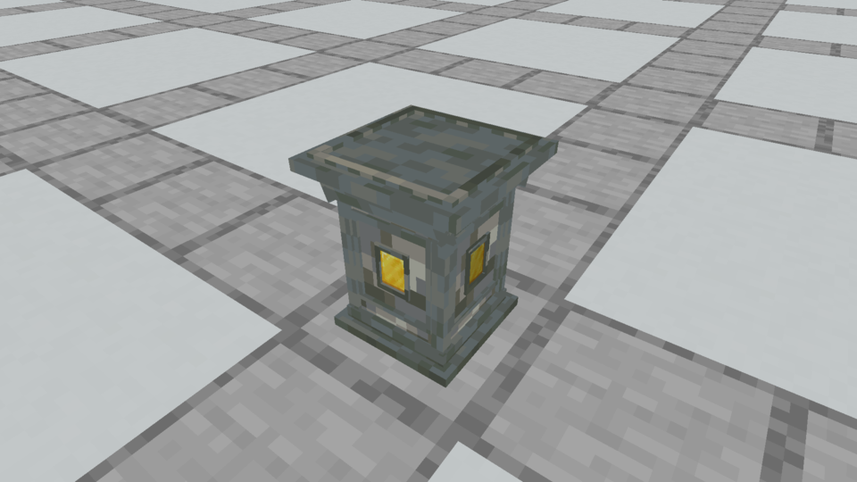
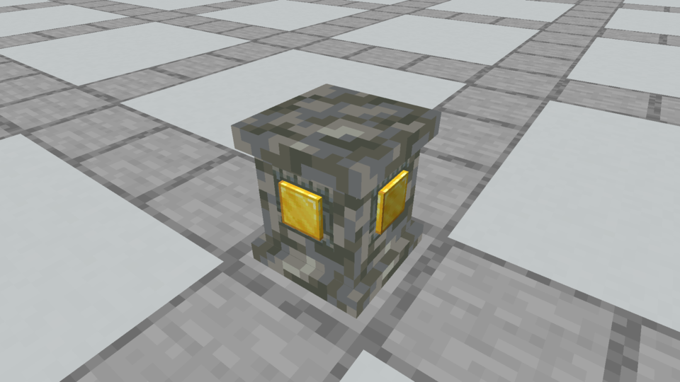
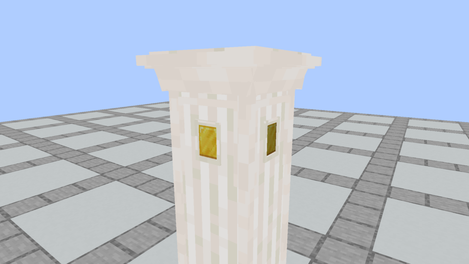
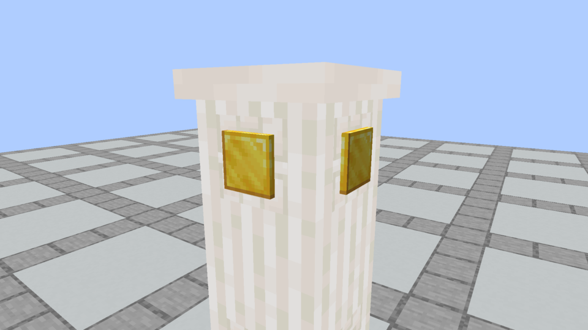
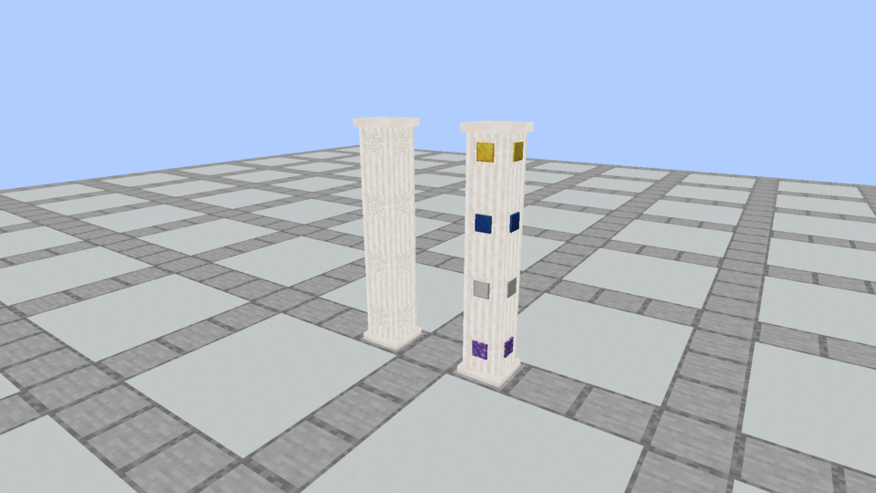
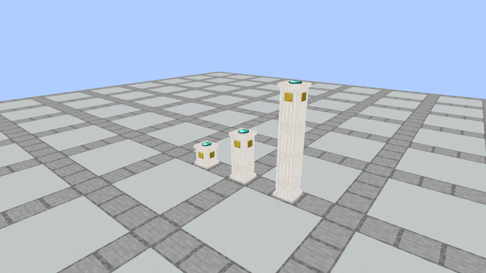

# Simple Plinth · October 5 in-game review

**Plinth remains current.** A subsequent [Spellstone foundation revision](../apparatus-spellstone-corners/README.md) clips the square slab's corners. The unchanged-Spellstone statements and jar hashes below record this Plinth revision's original scope.

The owner rejected the elaborate Plinth after playing with it. The current version uses a square shaft, one foot and one flat cap. All raised outlines, corner strips, beveled shoulders and multi-step moldings are removed. A flat carved socket plaque appears on every segment, including empty and covered base/shaft segments. Each segment’s own installed material renders as a thin raised plate, centered at the same block-local y8/16. It protrudes half a model unit (1/32 block), with simple straight edges; the carved plaque stays flat against the stone. This replaces the miniature flattened block meshes and their old low socket position.

## Actual Minecraft before and after

| Previous detailed Plinth | Current simple Plinth |
| --- | --- |
|  |  |
|  |  |

## Columns and independent sockets

The left column is empty; the right holds Amethyst, Iron, Lapis and Gold from bottom to top. All eight segments have the same carved socket geometry and slightly raised material placement. Each has its own independently stored material. Only the clear cap can hold a recipe offering. The carved socket is centered at y8/16 on every form; its outer plaque is 6×6 model units, with a 4×4 material face inside. Foot/cap are 12/16 wide, the shaft is 10/16 wide and the flat offering/physical top is y14/16. No item scale or offering animation change.

## Geometry and vanilla comparison

| Form | Solid cuboids | Flat socket plaques | Static baked faces |
| --- | ---: | ---: | ---: |
| Standalone | 3 | 4 | 20 |
| Base | 2 | 4 | 14 |
| Shaft | 1 | 4 | 8 |
| Cap | 2 | 4 | 14 |

The previous standalone model had 51 cuboids / 306 faces. Static baked faces drop by about 93%; installed materials add twenty visible faces per segment (five per thin plate; no hidden backs). These counts are not a frame-rate benchmark. The [pinned vanilla comparison](vanilla-comparison.json), resolving inherited geometry in Minecraft 1.21.1’s client assets, records Enchanting Table: 1 cuboid / 6 faces (book excluded), Lectern: 3 / 16, Anvil: 4 / 21, and Hopper: 7 / 32.

Existing vanilla masonry/carved tiles supply all texture pixels. Standalone and column forms share fixed shaft UV phase; Quartz/Purpur use native pillar shafts. Flat plaques add no collision. The [audit](model-and-seam-audit.json) verifies all 36 finishes, physical bounds, same socket on every form and matching four-face shaft joins. The original Spellstone stays unchanged, including its rune, item model and collision. Recipes, independent socket state, waterlogging, offering clearance, crafting and shaping remain unchanged.

## Verification and installation

[Verification](verification.json) records 85 passing unit tests and all 151 required Minecraft tests, Kithkyn compatibility, and 180 packaged apparatus block models matching source. The existing collision test now verifies the flat top. All 36 Spellstone block/item models and all 72 construction recipes match the prior jar. The initial simple-geometry revision passed all 151 world tests; the subsequent raised-inset change touches client rendering and coordinates only, with all static model/collision shapes preserved. Final raised-inset packaging and both native capture builds pass; all eight actual images above and the additional Tuff/Quartz frames were inspected. [Capture evidence](capture-evidence.json) pins image and loaded-resource hashes and actual block/socket states. Images are copied unchanged from the game.

The [installation record](prism-install.json) pins the update in **Prism / Kithkyn Testing**. Restart Minecraft to load it. The installed jar is replaced atomically so an already running session can keep its previous open jar. Automated tests/captures use NeoForge 21.1.72; manual testing on the instance’s 21.1.248 remains with the owner.
