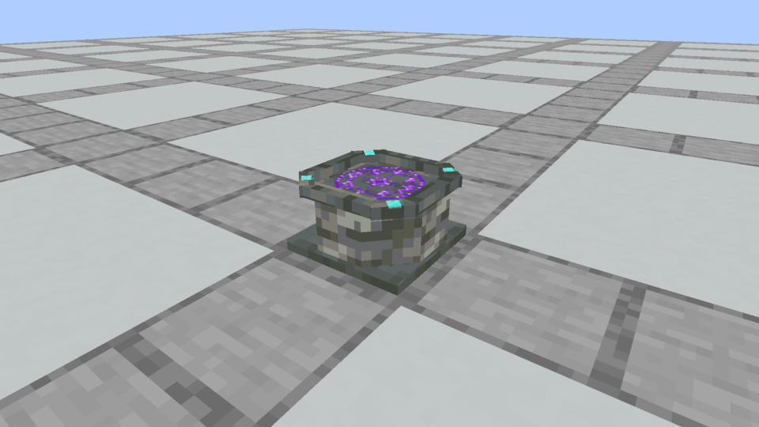
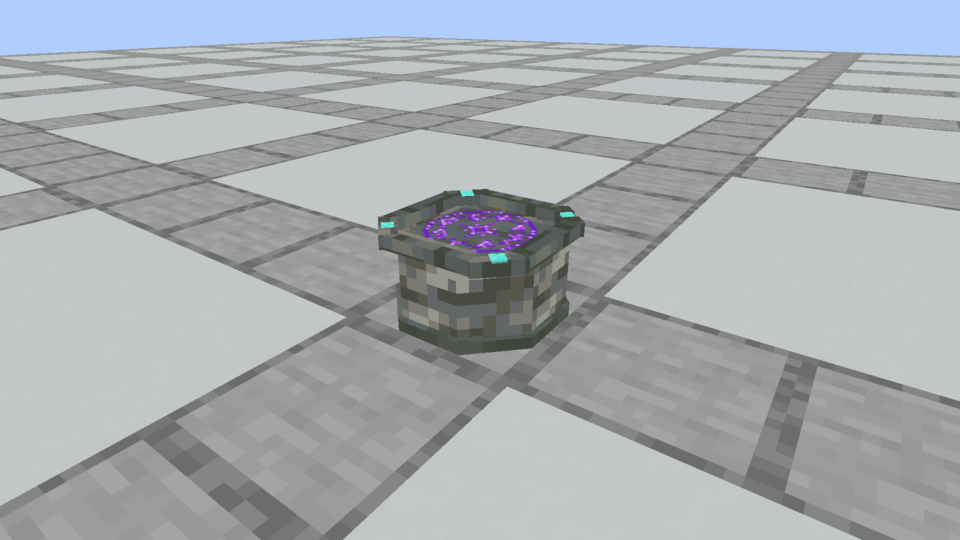
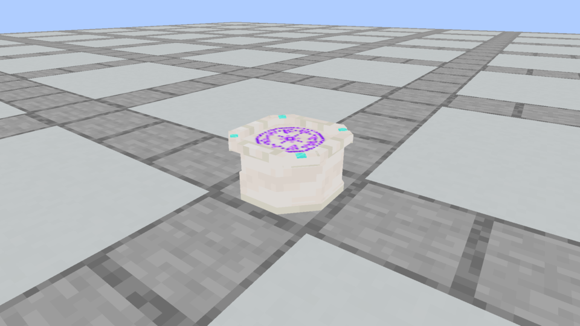

# Spellstone foundation · clipped corners

The owner rejected the square bottom slab and requested clipped corners. The foundation now follows the Spellstone's octagonal body: four 45-degree cuts, with a small overhang and no additional tiers. Its thickness remains 1.3/16 of a block and its outside width remains 14/16. The body, top rim, Diamond settings, rune, textures and scroll surface are unchanged.

## Actual Minecraft comparison

| Previous square foundation | Current clipped foundation |
| --- | --- |
|  |  |

These images are unchanged native Minecraft framebuffer captures. The Tuff before/after use the same camera. [Capture evidence](capture-evidence.json) records the image and loaded-resource hashes. The inspected finishes are Tuff and Quartz; all 36 cosmetic finishes share the same audited geometry.

## Geometry and verification

Seven standard Minecraft model cuboids form the cut foundation: three axis-aligned pieces and four rotated at 45 degrees. This adds six elements to the previous one-piece square slab; it adds no bevels, moldings or extra tiers. There are 37 physical block elements, or 38 including the inventory rune. Every element above the foot is identical to the prior model. The [audit](model-and-seam-audit.json) verifies the intended octagonal footprint using point-in-union sampling for every finish, plus unchanged Plinth geometry, socket placement and column joins. Collision uses the existing enclosing-box convention for rotated pieces; this is a visual corner cut, without introducing precise diagonal collision.

[Verification](verification.json) records a passing Java 21 build, Kithkyn compatibility, 85 unit tests and all 151 required Minecraft tests. All 180 packaged apparatus block models match source. All 180 Plinth block/item models, 72 construction recipes and raster textures are unchanged. Both native capture builds pass and the views were inspected.

[Installation evidence](prism-install.json) pins the verified jar in Prism's **Kithkyn Testing** instance, with a backup and atomic replacement. Restart Minecraft to load the updated model. Automated checks/captures use NeoForge 21.1.72; the instance's 21.1.248 remains subject to owner playtesting.
