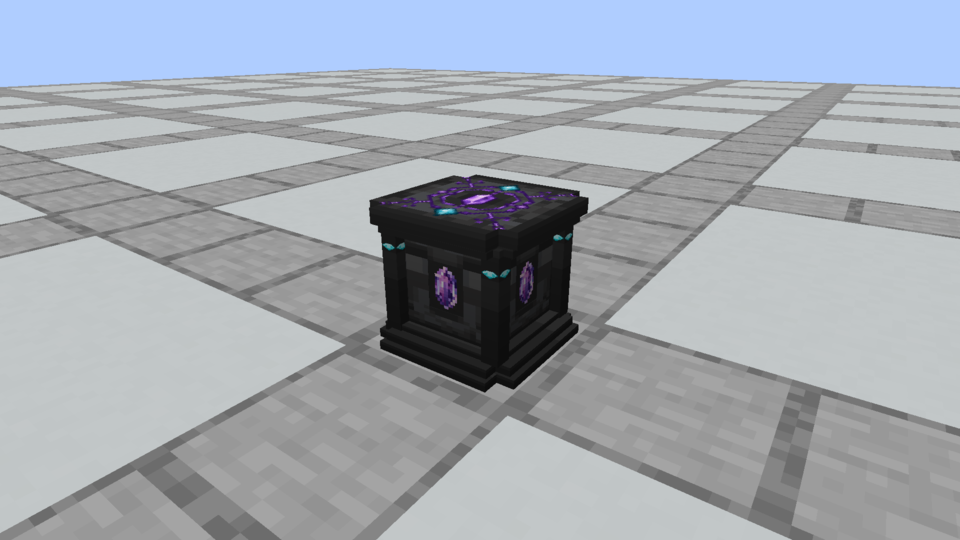
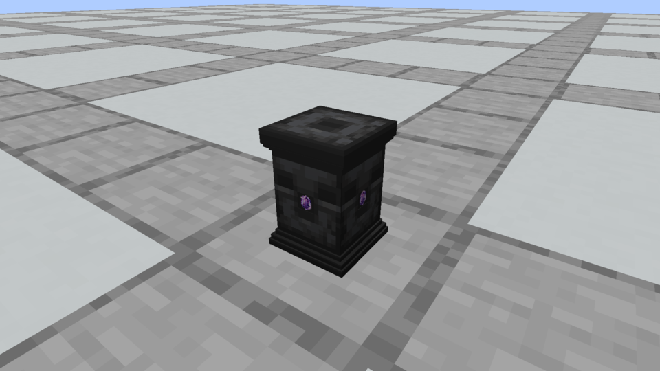
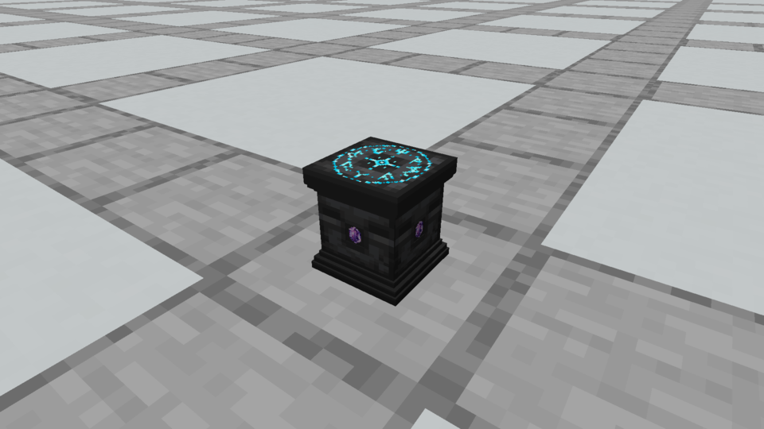
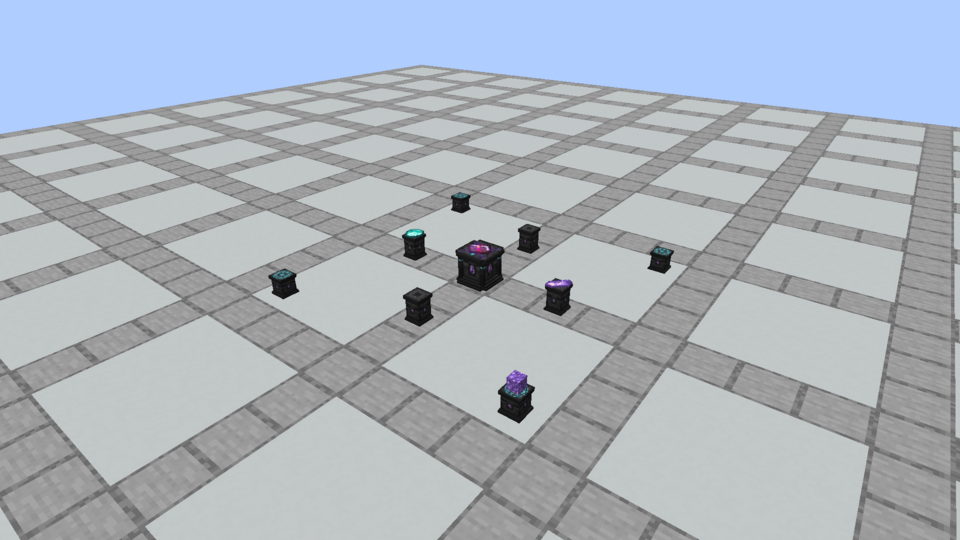

# Native apparatus and redesigned Spellstone

October 3, 2026. All three blocks are now registered, craftable and placeable, with persistent single-item display. The owner requested a complete Spellstone redesign while retaining the selected material recipe. Its new framed stone altar has a corner-cut stepped base/crown, four grounded supports, larger recessed Amethyst and fine violet engraving with two Diamond clasps. Stone Pedestal and Runic Pedestal keep their accepted ninth-draft models and textures.

The construction recipes are unchanged: Spellstone uses four Chiseled Deepslate, one Amethyst Block, two Diamonds and two Amethyst Shards; Stone Pedestal uses four Deepslate and two shards; Runic Pedestal uses three Deepslate, one Diamond Block and two shards. Output is one block. Native item stands are implemented; discovery, augmentation, supporting-block effects and operational structure layout remain planned.

The new crown is a true **64-by-64** inlay over the existing mirrored **16-by-16** stone pattern. Built-in imagegen created [the initial source](spellstone-crown-initial-source.png) using [this exact prompt](spellstone-crown-generation-prompt.txt). A [targeted edit prompt](spellstone-crown-edit-prompt.txt) changed its central literal heart shape into a pointed hexagonal cut Amethyst; [the selected edited source](spellstone-crown-source.png) is preserved unchanged. These large source files remain separate from the native PNGs. Preparation uses area reduction and a 96/255 alpha cutoff, then nearest-enlarged vanilla stone under the overlay. [Preparation and hashes](texture-provenance.json) identify the final resources. Earlier Amethyst/Diamond/Runic sources remain in the seventh and ninth archives.

The images below are unchanged **Minecraft framebuffer captures**, using the registered blocks, block entities and renderer. Their capture records pin all current model and material hashes. This differs from the separately saved offline model-review renders.

Capture records: [Spellstone](minecraft-spellstone-capture.json), [Stone Pedestal](minecraft-stone_pedestal-capture.json), [Runic Pedestal](minecraft-runic_pedestal-capture.json), [item layout](minecraft-apparatus_layout-capture.json). The layout is a visual fixture; its distances are not a gameplay rule. The ordinary developer client remains available for owner testing.

[Current implementation/design guide](../../design/apparatus-models.md) · [Download asset bundle](apparatus-models.zip).

The asset bundle preserves current models, native textures, blockstates, selected active recipes, loot, recipe unlocks, mining tags and names, alongside this README and prompt/provenance files. It contains resource assets, not the Java implementation; use the built Vestige mod jar to test the native blocks. Both top composites include modified Minecraft 1.21.1 Chiseled Deepslate texels by Mojang. No Iron code, artwork or dependency is introduced.
