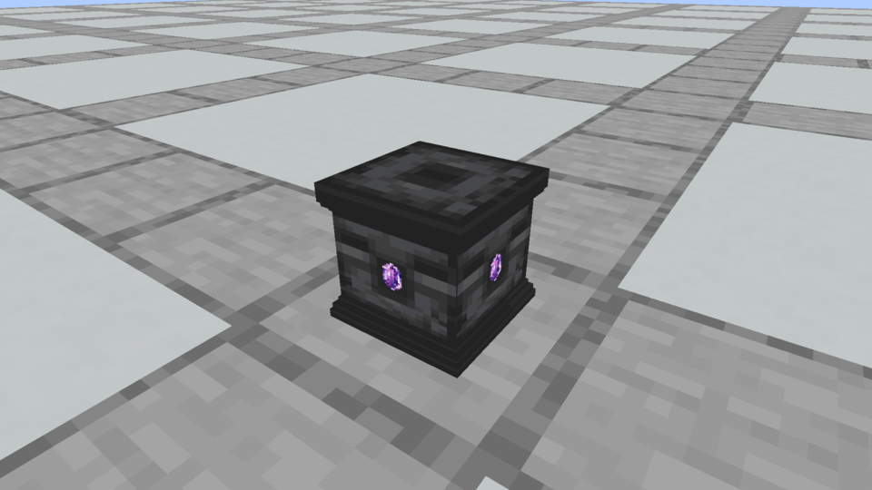
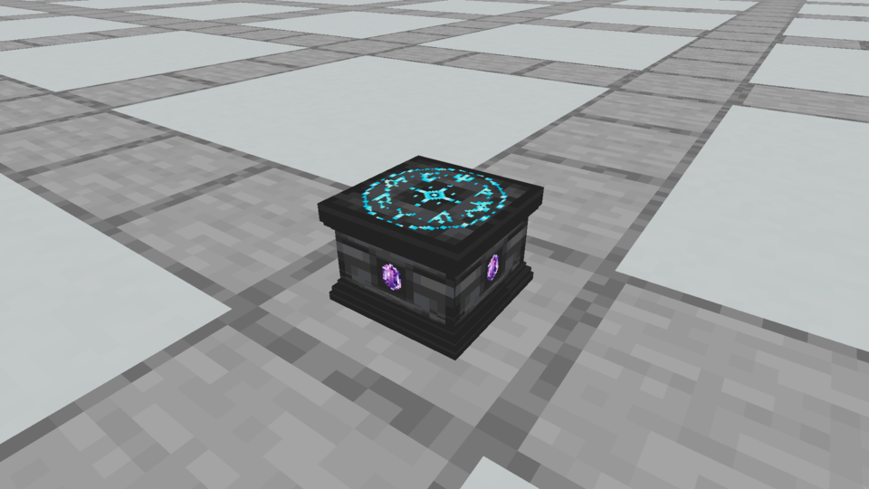
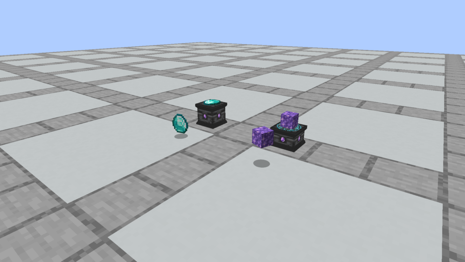
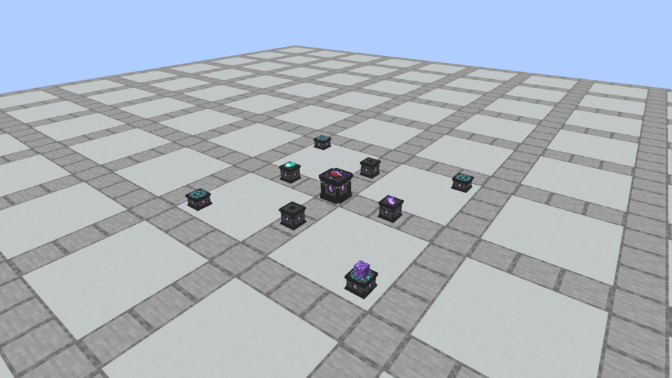

# Wider, flatter pedestals

October 3, 2026 owner revision after actual gameplay testing. Both pedestals now share an **8½-unit cap/foot and 7½-unit shaft**, retaining a half-unit overhang on each side. Stone is **8/16 (½ block)** high; Runic is **6/16 (⅜ block)**. Fitted Amethyst sockets grow proportionally to 1¾ units high. Existing accepted texture bytes and the redesigned Spellstone remain identical to the previous verified build.

Placed offerings, missing-ingredient shadows and the floating crafted scroll use the vanilla **GROUND** item-model transform with **no extra scale factor**. This is the same transform used by Minecraft's ItemEntityRenderer. Flat offerings lie down; ground translation offsets are canceled so each item stays centered on its surface. Items retain native dimensions without adopting dropped-item bobbing or spinning. One real dropped copy of each comparison item is rendered by Minecraft itself beside its offering.

The owner keeps moving pedestals for now; a possible future item-only movement approach is noted without implementing it. Collision, offering height, steady glow bounds and connection endpoints follow the new shapes. Construction recipes, ingredient recipes and retained references are unaffected.

These images are unmodified screenshots of Minecraft's actual rendered framebuffer:

[Spellstone](minecraft-spellstone.png) remains the selected second crown design. The adjacent `*-capture.json` files pin the exact models and textures. Current model JSON is preserved under `models/`. [Accepted texture source/provenance](../apparatus-v10/README.md) stays in its earlier archive; [current guide](../../design/apparatus-models.md) includes geometry and in-game operation. These are native client captures rather than the optional offline asset-review renders under `docs/previews/apparatus-v11`.

Updated native ritual clips preserve whole-pedestal movement:

- [Reference hints and placement movement](rituals/ritual_hints.mp4): 26 framebuffer frames, 111 server ticks; [capture metadata](rituals/ritual_hints.json).
- [Successful five-part crafting](rituals/ritual_success.mp4): 28 framebuffer frames, 113 server ticks, one native scroll produced; [capture metadata](rituals/ritual_success.json).

The final build packages all 214 ritual recipes. The [Prism installation record](prism-install.json) confirms the updated jar in **Kithkyn Testing**, with a recoverable backup of the previous jar outside `mods`. Installed/package SHA-256: `6a75aecb9a491eedd1053d529354770ad616d93fe457e4feb96f280494f4d738`. Restart Minecraft to load it. Client captures and 61 unit / 110 world tests pass on the pinned NeoForge 21.1.72 baseline; the actual Prism instance uses 21.1.248 and requires the owner's manual launch check.
