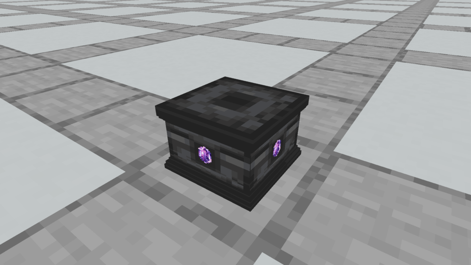
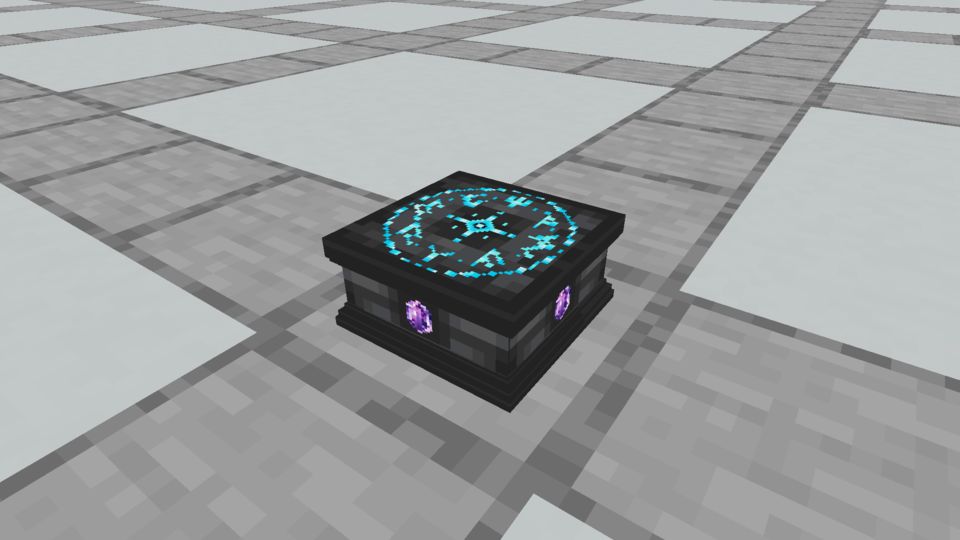
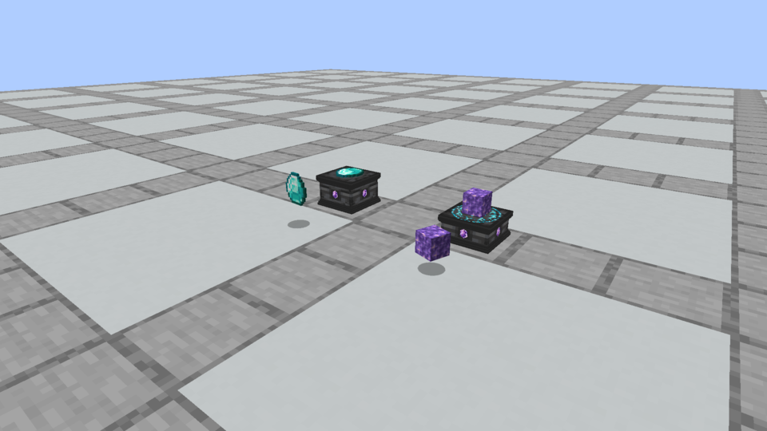
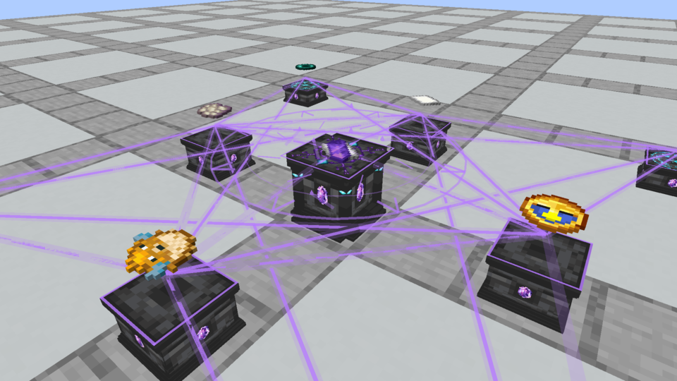
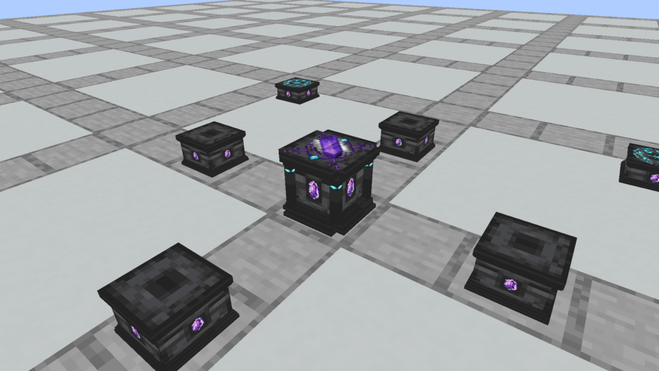

# Broader grounded pedestals and flat scroll collection

October 3, 2026 owner revision after further gameplay review. Stone and Runic Pedestals share a **10½-unit cap/foot and 9½-unit shaft**, with restrained half-unit overhangs. Stone is **7/16 block** high; Runic is **5/16**. The side Amethyst sockets are 2 units tall. Accepted texture bytes and the selected Spellstone model remain unchanged from the earlier verified builds.

Wrong ingredient placements shake the pedestal and offering sideways, including ingredients on the wrong pedestal type. The previous vertical up/down hints are removed. Successful rituals lift only the ingredients above grounded pedestal models; the center reference stays flat throughout.

Both the reference and finished scroll lie flat on the Spellstone with native dropped-item scale. A result over a reference has a small static stack offset so the reference edge remains visible. There is no floating or spinning center scroll. Empty-hand center use collects the result first, preserving the reference; the existing persistent result storage prevents accidental drift or despawning.

Current block and item model JSON is preserved under `models/`. [Selected texture provenance](../apparatus-v10/README.md) remains in its original archive. [The current apparatus guide](../../design/apparatus-models.md) and [ritual interactions](../../design/ritual-crafting.md) record the accepted behavior. Offline asset review images remain separate under `docs/previews/apparatus-v12`.

Model generation, bounds/UV/reference checks, unchanged-texture hashes and the final build pass. **61 unit tests and 111 Minecraft behavior tests** pass, including sideways feedback across pedestal types and result collection during the settling animation without removing the reference.

These are unmodified captures of the actual Minecraft main render target:

The archive also includes [Spellstone](minecraft-spellstone.png) and [the full arrangement](minecraft-apparatus_layout.png). Adjacent `*-capture.json` files record exact assets and selected frame times. The wider cap, lower bodies, native dropped-item comparison, ingredient-only lift and flat center scrolls were visually inspected in native client frames.

Native ritual recordings retain measured frame timing and contain no audio:

- [Sideways hints](rituals/ritual_hints.mp4): 38 frames, 103 server ticks; [metadata](rituals/ritual_hints.json).
- [Crafting without a reference](rituals/ritual_success.mp4): 39 frames, 101 ticks, one flat native scroll produced; [metadata](rituals/ritual_success.json).
- [Crafting with a flat reference](rituals/ritual_reference_success.mp4): 33 frames, 105 ticks, one native scroll produced while retaining its reference; [metadata](rituals/ritual_reference_success.json).

The verified package is installed into **Kithkyn Testing → minecraft/mods** in Prism Launcher, with the previous jar backed up outside `mods`. [Installation record](prism-install.json), installed/package SHA-256: `6fa6b757f165edbb152e15b88202147d7c3cc1a308a7c55fff46eea71f0116de`. Restart Minecraft to load it. Verification and recordings use Minecraft 1.21.1 / NeoForge 21.1.72; the user's Prism instance uses NeoForge 21.1.248 and remains the owner's manual launch/playtest boundary.
