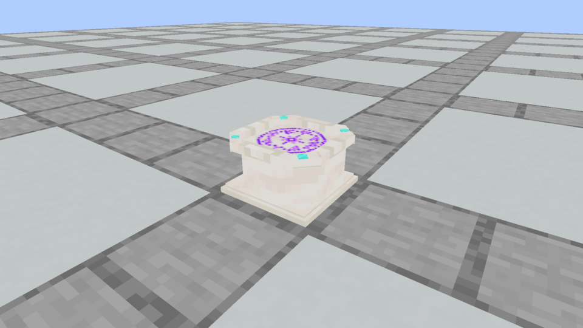
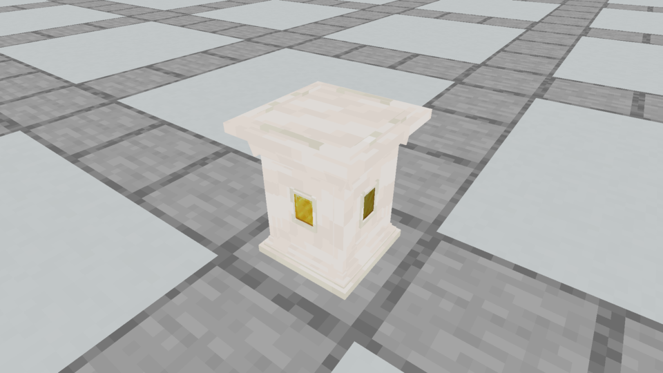
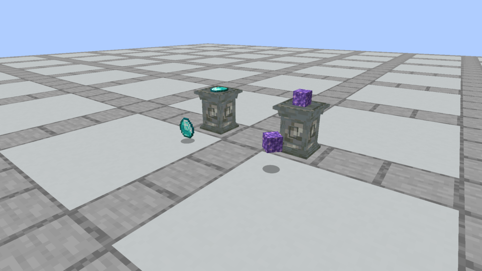

# Native apparatus finishes · October 5, 2026

These images and the ritual recording are actual Minecraft 1.21.1 / NeoForge 21.1.72 framebuffers, using Vestige's registered blocks and approved geometry. They are distinct from the browser model comparison. Captures use isolated fresh worlds and development control fixtures.

Tuff and Quartz pairs were inspected: full-bright intact purple glyph, flat recessed surfaces, four visible windows onto the Plinth's single installed Gold socket, and resting flat/3D offerings at native dropped-item model scale. Tuff's comparison includes actual dropped ItemEntity copies. Its reference-preserving ritual produced a shaped Flicker scroll, consumed the ingredients and retained the reference.

Each adjacent JSON records native frame times, scenario, fixture blocks, selected material, engine, and SHA-256 hashes of packaged models/rune texture. Still images are unchanged frame 12; recording frames retain their measured elapsed times when encoded. The video has no audio. The intact glyph is drawn once by the native renderer; the halo is a subtle repeated-alpha outline at the same height. It has no gameplay light source.

All 36 finishes/72 block-items are checked through native placement, collision, pickaxe/self loot, exact construction recipes/counts, offering interactions and storage/sync tests. Mixed-finish world tests verify crafting, retained reference/materials, identical shaping and attunement keys. The review comparison covers every finish; native captures directly inspect Tuff and Quartz, rather than claiming exhaustive visual inspection of every native appearance. Full verification and Prism installation are recorded in [development status](../../development-status.md).

The Tuff henge/pyramid images in this folder are decorative node-placement fixtures. They record the new models with the existing canonical geometry; they do not establish a separate monument bonus.
