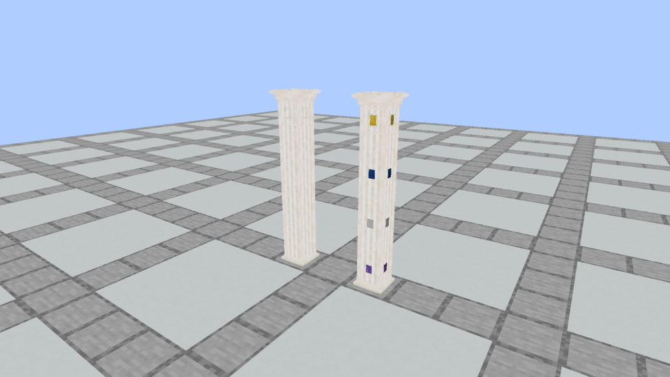
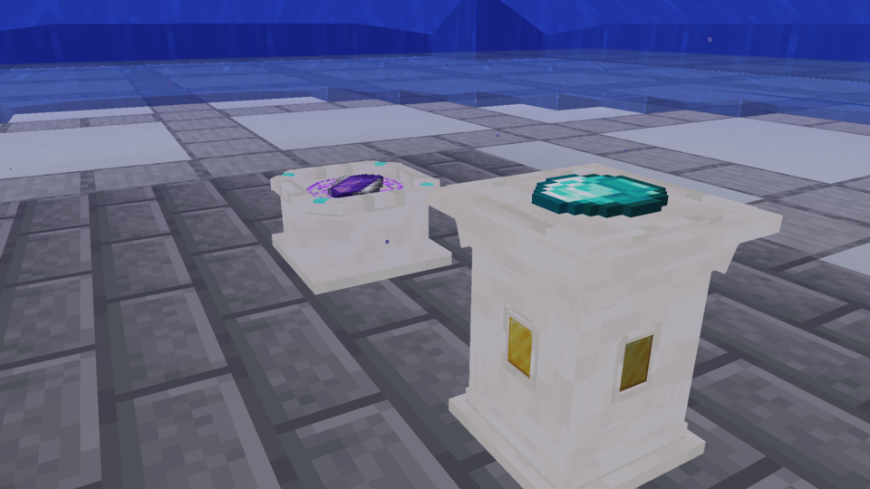

# Submerged apparatus and independent column imbuements

October 5, 2026. Every Plinth in a column can still hold its own side imbuement. Its ingredient surface requires air or unobstructed fluid above, so covered base/shaft segments cannot receive new ingredients. Covering a surface preserves its stored contents but removes it from ritual selection and cancels a reserved craft safely before consumption. Side sockets remain individually accessible and recoverable.

Both Spellstones and Plinths support vanilla waterlogging across all 36 finishes, including connected column forms. Placement into source/flowing water, water-bucket draining/refilling and column neighbor updates preserve the same offering block entity and stored contents. Submerged crafting uses the usual recipes, modifiers and atomic commitment.

## Actual Minecraft views

The first comparison exposed a capture-fixture issue: top block entities retained a standalone head with an extra foot. Corrected placement resolves neighbor-derived states first. Every exposed stacked head below is verified as `part=cap` in the server snapshot.

The two columns have identical stone geometry and texture. The left one is empty. The right one has Amethyst, Iron, Lapis and Gold installed separately, from bottom to top. Pale stripes and carved borders are fixed stone detail, rather than an imbuement effect. The upper frame is the detailed crown/socket panel; the lower shaft retains continuous stone without repeated shelves.

The Spellstone holds a flat Fireball reference; the Plinth holds a Gold side socket and Diamond offering under water. These images are unchanged Minecraft 1.21.1 / NeoForge 21.1.72 framebuffer PNGs using registered native blocks, with no preview pack. The native scene snapshot records each segment's actual block state, installed material and offering-space eligibility. See [capture evidence](capture-evidence.json).

## Verification

Five targeted Minecraft tests cover every finish's air/fluid/solid clearance, underwater source/flowing placement, buckets and content retention, independent wet/covered column sockets, successful submerged crafting and safe cancellation under an ordinary solid cover. Existing model/runtime/catalog and world tests remain required. Model geometry and texture bytes retain the [detailed foot-refinement revision](../apparatus-foot-refinement/README.md).

[Verification](verification.json) and [installation](prism-install.json) record the final jar and checks. The installed Prism **Kithkyn Testing** instance uses NeoForge 21.1.248; automated verification and these client captures use the pinned 21.1.72 baseline. Restart Minecraft to load the update; gameplay in the Prism instance remains the owner's manual check.

Final Java 21 checks pass: **85 unit tests and all 151 required Minecraft tests**, zero unit failures/errors/skips. All 180 packaged block models match current assets; apparatus authoring and the 36-finish seam/detail audit pass. The verified jar is installed into Kithkyn Testing, with source/destination hashes matched and the previous jar backed up.
