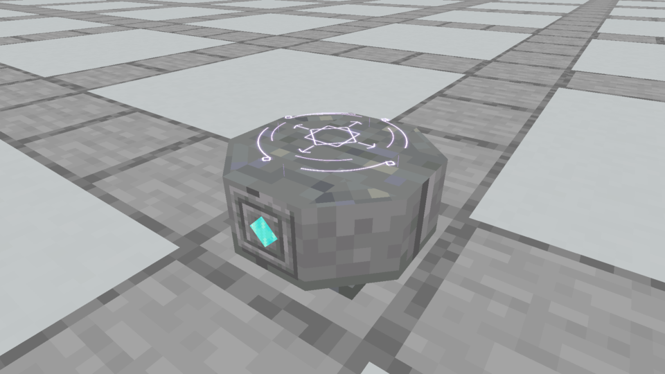
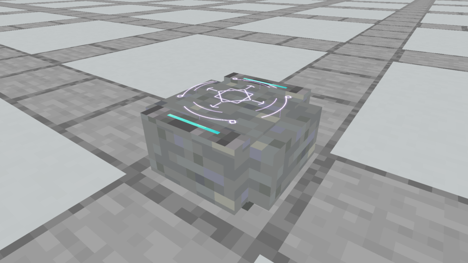
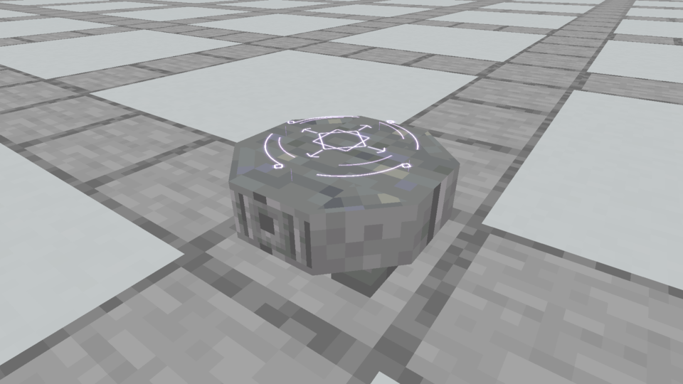
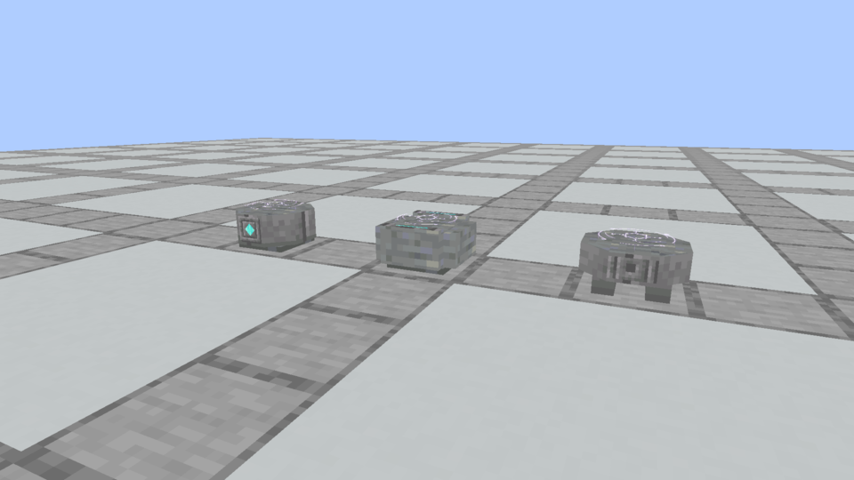

# Astral Spellstone · three stonework studies

**Later owner review:** none of these three bodies was preferred. The owner requested gilded trim and different stone textures; [subsequent material studies](../gilded-spellstone-finishes/README.md) hold one body and the accepted seal constant to compare those finishes.

**Body review, October 5, 2026.** The owner still likes the lowered Astral Seal, but rejected the installed body's thin border and four cyan corner ticks. These options reconsider the architecture beneath that accepted effect. They do not add another ring of tiny ornaments.

All three use one Stone Brick/Polished Andesite palette, actual vanilla 16×16 material assets, the same lowered production Astral renderer and a flat central scroll bed at y7/16. Existing registered variants act as capture carriers, with a development-only resource pack substituting the three bodies. This keeps the comparisons in the real Minecraft renderer.

## Inscribed Relic



An octagonal mass sits on a small inset foot. Two broad carved faces each contain one diamond-shaped focus. The rest of the stone remains quiet: no top border or four corner clips. **8 solid cuboids, 4 flat detail faces, 32 baked faces.**

[Native animation](native/astral_body_relic.mp4) · [Model](models/relic.json)

## Bound Tablet



Square-cut corners and two broad stone bindings give this version a more constructed silhouette. Fine cyan seams run across the bindings; the scroll bed sits between them. **7 solid cuboids, 2 flat detail faces, 44 baked faces.**

[Native animation](native/astral_body_tablet.mp4) · [Model](models/tablet.json)

## Vaulted Seal



The octagonal seal rests on two squat piers, with a real opening underneath. Broad carved end panels replace jewelry trim. The negative space supplies the character. **9 solid cuboids, 2 flat detail faces, 36 baked faces.**

[Native animation](native/astral_body_vault.mp4) · [Model](models/vault.json)

## Comparison and boundaries



These are visual candidates. Their preview carrier blocks retain production collision and interactions; new collision has not been promoted or gameplay-tested. Production apparatus models, recipes, Plinths, shaping and the Prism installation are unchanged. The previously installed corner-tick body is recorded in [the prior archive](../astral-spellstone/README.md); its Astral effect remains accepted.

[Capture evidence](capture-evidence.json) records unchanged Minecraft framebuffer PNGs, measured frame timing, loaded model/renderer hashes and decoded MP4 files. [Design ledger](designs.json) distinguishes the candidates and their bounded geometry.

Reproduce in a fresh capture folder:

```bash
python3 tools/author_astral_bodies.py
python3 tools/author_astral_bodies.py --check
./gradlew runEffectsCapture -Pcapture_kind=apparatus -Pcapture_spells=astral_body_relic,astral_body_tablet,astral_body_vault,astral_body_comparison -Papparatus_preview=astral-bodies -Pcapture_material=stone_bricks -Pcapture_seconds=6 -Pcapture_output=build/astral-body-options-fresh
python3 tools/archive_rune_captures.py build/astral-body-options-fresh --bodies
```
