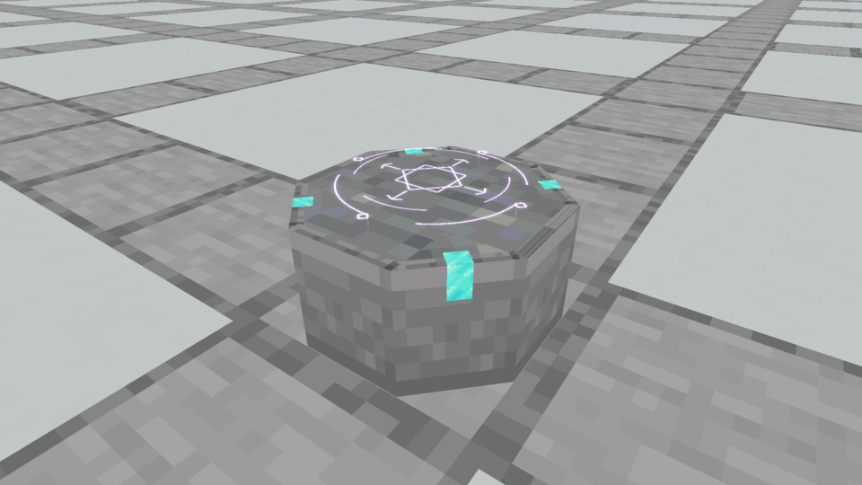
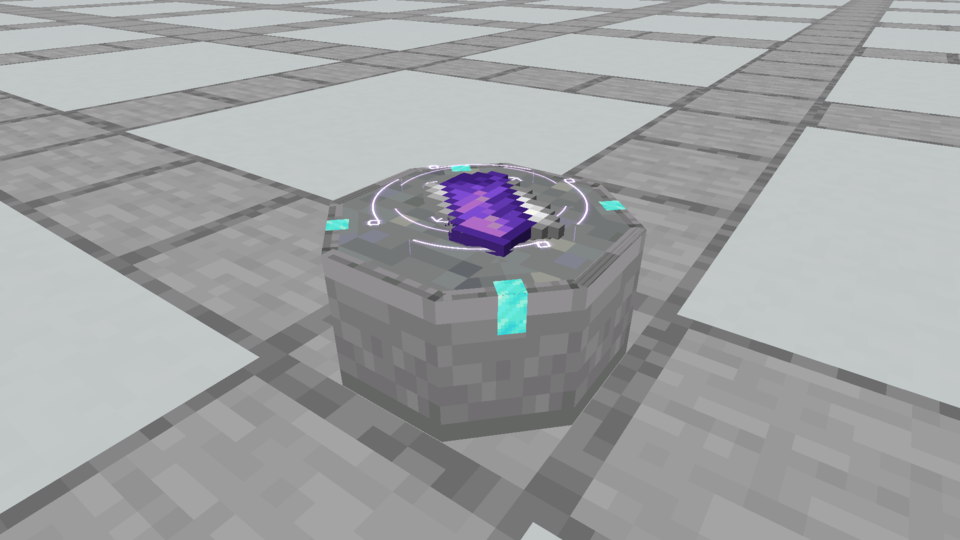
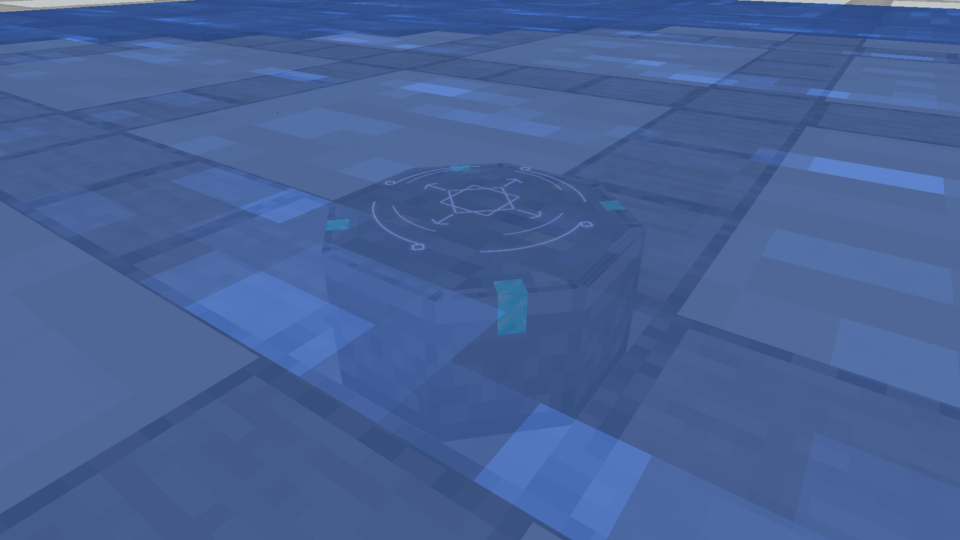
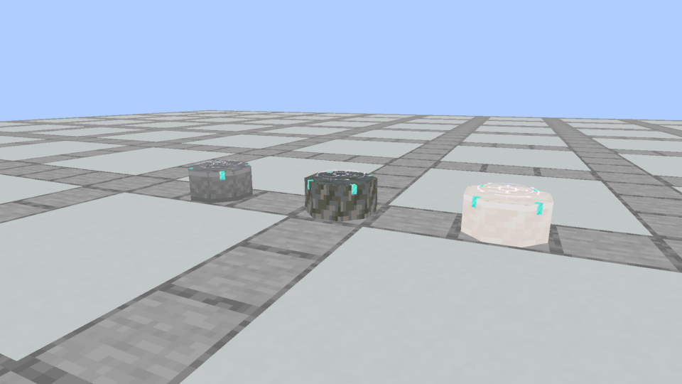

# Astral Spellstone · selected seal with a restrained stone body

**Later owner review:** only the lowered Astral Seal remains locked. The owner rejected this body's four cyan corner ticks and thin trim, the subsequent body/trim studies and the crystal-edge body. Shape, material and ornamentation were reset. The owner authorized [the fractured-relic study](../fractured-spellstone/README.md). This archive records the currently installed version, not final approval of its stonework.

The owner selected the Astral Seal and requested a slightly lower hover, small Diamond corner notches and texture trim influenced loosely by the Enchanting Table. The selected effect is now the native Spellstone presentation across all 36 finishes.



[Actual animation](native/spellstone_astral.mp4) · [night animation](native/spellstone_astral_night.mp4)

The body is one low octagonal stone, 14/16 wide and 7/16 tall. Seven plain cuboids create the clipped silhouette. Eight flat texture faces add a narrow carved border, and four small Diamond inlays wrap from the top onto the diagonal corners. They use the existing vanilla 16×16 material tiles; there is no new raster image, extruded jewel, bevel or stepped foot. Hidden internal side faces are omitted. The model totals seven solid cuboids plus sixteen flat detail faces: **23 elements / 38 static baked faces**, replacing 37 solids in the prior physical model.

The central interlocked glyph, counter-rotating broken rings, orbiting marks and faint anchors retain the selected Astral treatment. Its base hover changes from 0.085 to **0.045 block** above the inscription surface, approximately half the previous separation. The gentle ±0.006 breathing motion is retained. Native additive strokes and layered halos remain luminous without a shader pack; they do not change world light levels.

## Scrolls and water



The reference and result remain flat on the receiving surface. Their real item silhouettes naturally obscure the central glyph through depth testing; the surrounding rings stay visible. No extra floating item or change to collection rules is introduced.



Waterlogging retains the native seal and body underwater. The water surface tints and attenuates the glow naturally. This view uses real Minecraft fluid rendering, not an image overlay.



Three finishes were inspected in the actual client; all 36 share the audited geometry and same seal. Construction ingredients, material behavior, recipe matching, shaping and attunement identity remain unchanged. The item model shows the stone body; the floating effect appears on the placed block, like the Enchanting Table's placed-book distinction.

## Evidence and implementation

`astral_spellstone` in `tools/apparatus_columns.py` authors the selected body. `tools/author_apparatus_models.py` generates all finishes, inventory models and collision. `AstralSealRenderer` renders the selected effect; the rejected pixel glyph and its old production renderer/assets are removed. The earlier three-rune and body choices remain archived art evidence, with their opt-in comparison code outside ordinary presentation.

[Model and seam audit](model-and-seam-audit.json) checks every finish, flat-detail/solid counts, native texture references, bounds, octagonal footprint, Diamond placement and unchanged Plinth seams/sockets. [Capture evidence](capture-evidence.json) pins five unchanged framebuffer screenshots, their actual block-entity snapshots, loaded model hashes, compiled renderer and MP4 hashes. These captures use production resources with no preview resource pack. Clips encode at measured native frame times and decode successfully at their original 960×540.

Verification and installation are recorded in [development status](../../development-status.md). Earlier detailed bodies, rune variants and installation records remain historical.

Reproduce:

```bash
python3 tools/author_apparatus_models.py --check
python3 tools/audit_apparatus_detail.py --check
./gradlew runEffectsCapture -Pcapture_kind=apparatus -Pcapture_spells=spellstone_astral,spellstone_astral_night,spellstone_astral_scrolls,spellstone_astral_underwater,spellstone_astral_finishes -Pcapture_material=stone_bricks -Pcapture_seconds=6 -Pcapture_output=build/astral-spellstone-fresh
python3 tools/archive_rune_captures.py build/astral-spellstone-fresh --astral
```
