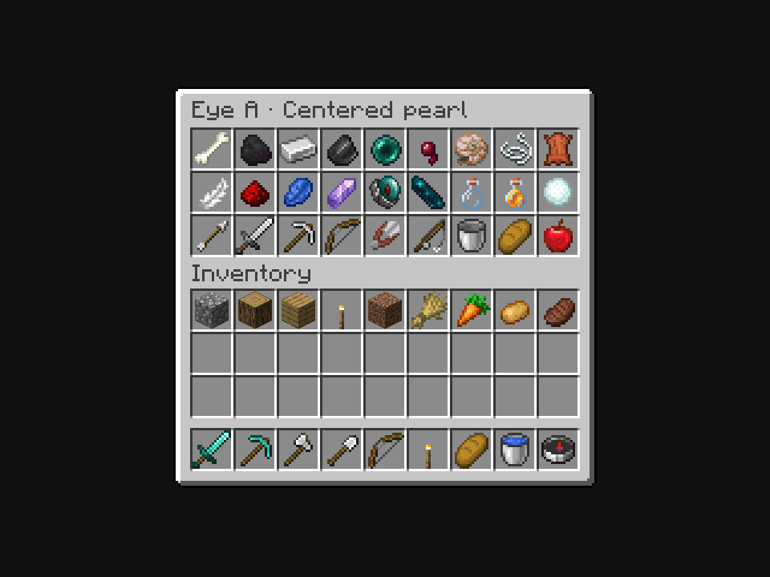
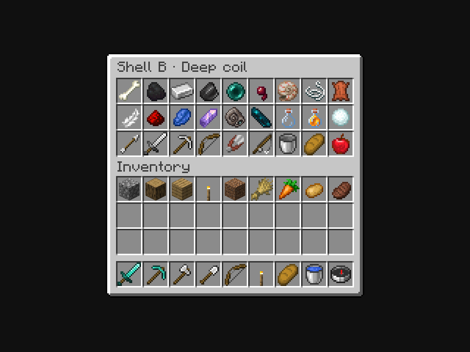

# Locked Homebound Eye and Whispering Shell artwork

**Approved October 6, 2026:** the owner explicitly locked **Eye A, Centered pearl**, and **Shell B, Deep coil**, from the [focused native menu review](../item-textures-native-v5/README.md). These are the final base-art selections. Unselected variants and older art remain historical evidence.

**Implementation closeout:** the [finished native Shell review](../whispering-shell-finished/README.md) now verifies the registered item, ritual crafting, bound presentation and private communication, with held Shell/Eye views. This archive retains the original art-only lock-in evidence below.

The [current chat situation gallery](../whispering-shell-chat-review/README.md) includes all final appearance views plus hotbar/inventory/offhand and multiple-channel scenarios, with the corrected Survival rune-pulse placement. Approved art pixels are unchanged.

## Homebound Eye · Centered pearl



The registered production Homebound Eye now uses [homebound_eye.png](../../../src/main/resources/assets/vestige/textures/item/homebound_eye.png) and [its model](../../../src/main/resources/assets/vestige/models/item/homebound_eye.json). This image renders the actual Eye item, unbound, so it has no binding marks or enchantment glint.

## Whispering Shell · Deep coil



[whispering_shell.png](../../../src/main/resources/assets/vestige/textures/item/whispering_shell.png) and [its model](../../../src/main/resources/assets/vestige/models/item/whispering_shell.json) are the production Shell resources. This archived image uses an appearance-only Paper carrier pointing at that model; the Shell was not registered during this art-only review. The [subsequent native closeout](../whispering-shell-finished/README.md) implements and verifies the registered Shell and communication without changing the approved pixels.

## Preserving the approved artwork

[selection.json](selection.json) records the owner's exact two choices and their source hashes. The original [Eye](approved/homebound_eye.png) and [Shell](approved/whispering_shell.png) outputs are retained byte for byte. They came from built-in imagegen edits; [the exact prompts and provenance](../item-textures-native-v5/imagegen-prompts.json) remain in the review.

The approved pictures are high-resolution pixel artwork, not literal 16×16 source files. Lock-in preserves every original RGBA pixel. [LockedTextureImport.java](LockedTextureImport.java) only copies them unchanged onto a **2048×2048 transparent canvas**; it does not downsample, recolor, redraw or change original alpha. The transparent canvas lets Minecraft retain its normal **mip level 4** instead of the earlier non-divisible review images forcing the block atlas to level 0. Both original sources and the independent RGBA audit confirm preservation.

[author_assets.py](author_assets.py) composes GUI, ground, head, first/third-person and item-frame transforms with the same normalization, fitting the visible artwork within fourteen menu pixels and preserving the approved natural aspect. Left-hand composition accounts for Minecraft's translation/rotation mirroring. [Asset details](asset-details.json) pin final PNG/model hashes and placement. Held/offhand, head, frame and dropped-item views are not visually captured in this review.

## Verification and package

The [native capture source](preview-source/com/quzzar/vestige/apparatus/client/LockedItemTextureCapture.java) uses an actual vanilla three-row `ChestMenu`/`ContainerScreen`, GUI scale 3, with exactly one custom item in the center slot. The two **960×720** screenshots are unedited Minecraft framebuffer images and were visually inspected. The surrounding vanilla pixels remain identical to the approved review. Very small mip/filtering differences are confined to the custom icons, averaging less than one RGB level; every source-art pixel is exact.

[verification.json](verification.json) records all **47 loaded asset hashes**, two correct native model resolutions, approved-art preservation, atlas mip level, loaded/packaged source parity and the tested production jar. [Native client](native-client.log), [production build](production-build.log) and [Kithkyn compatibility](kithkyn-compatibility.log) logs record successful completion. The production package excludes Paper overrides and capture classes; all Homebound Eye gameplay classes remain byte-identical to the prior reviewed build. No gameplay Java or recipe changes accompany this lock-in.

The build passes all **107 unit tests**, zero failures/errors/skips. World mechanics and multiplayer were not repeated for these art assets. No installed game files were replaced.

Reproduce with Java 21:

```sh
python3 docs/art/attuned-items-locked/author_assets.py --check
./gradlew --project-cache-dir run/attuned-items-locked-production-cache \
  -I docs/art/attuned-items-locked/production-build.gradle build verifyKithkynCompatibility \
  --offline --no-build-cache --no-configuration-cache -Dorg.gradle.parallel=false
./gradlew --project-cache-dir run/attuned-items-locked-cache \
  -I docs/art/attuned-items-locked/isolated-preview.gradle runEffectsCapture \
  -Pcapture_kind=locked_item_texture -Pcapture_directory=run/attuned-items-locked-client \
  -Pcapture_output=docs/art/attuned-items-locked/captures -Pwith_kithkyn=false \
  --offline --no-build-cache --no-configuration-cache -Dorg.gradle.parallel=false
python3 docs/art/attuned-items-locked/verify_assets.py
```
