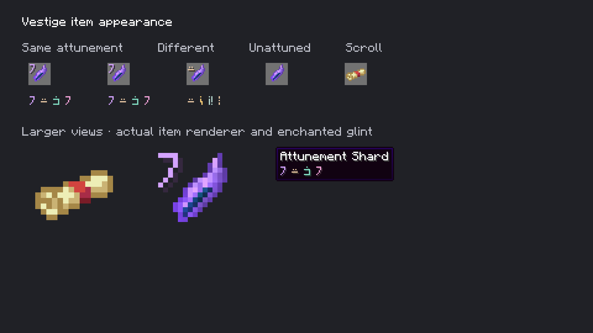

# Attunement Shard: two-line hover

October 6, 2026. The owner approved the native shard art, enchanted glint and inventory rune badge, and selected a simpler tooltip.

The hover now contains only **Attunement Shard** followed by its four colored runes. There is no attunement label, hexadecimal code, recreation hint or blueprint text. The same custom line is used with advanced tooltips; unattuned shards add no custom line. Minecraft's own advanced diagnostic lines retain their normal behavior.

This unchanged Minecraft framebuffer image was inspected from a fresh native item capture. The [capture metadata](capture.json) records 48 frames, loaded texture/model hashes, keys and glint flags. Those assets, keys and flags match the preceding [native item inspection](../attuned-items-native/README.md). The full key and blueprint remain stored and validated internally; the rune display is still only an abbreviation.

Java 21 `build` and `verifyKithkynCompatibility` pass with **87 unit tests**, zero failures/errors/skips. [Verification](verification.json) records the current packaged jar, screenshot hash and asset parity. World tests were not repeated for this tooltip-only change. Prism installation remains unchanged.

Reproduce with `./gradlew runEffectsCapture -Pcapture_kind=items -Pcapture_output=build/item-capture-review -Pwith_kithkyn=false` under Java 21, using a fresh output directory.
