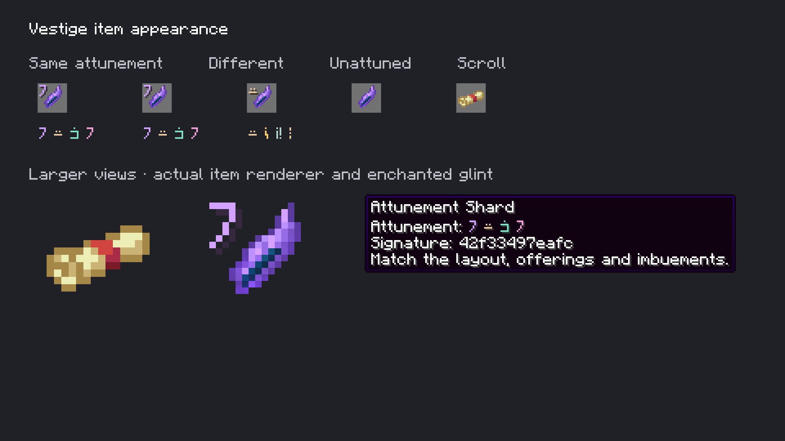

# Native attuned item appearance

**Historical tooltip:** the owner subsequently selected a two-line hover with only the item name and rune signature. See the [updated native inspection](../attuned-items-native-v2/README.md). These earlier images retain the superseded labels, code and helper text.

October 6, 2026. Implemented and packaged; Prism installation unchanged.

The selected S1a1 Attunement Shard sprite and Electroblob scroll with its red binding are now native item resources. The scroll keeps its exact 16×16 pixels and displays at **1.125× inventory scale**, filling more of a slot without extending its opaque silhouette outside it. Ground, held and Spellstone item transforms retain their normal generated-item defaults.

Every shard has Minecraft's enchanted glint, including the unattuned creative item. Valid crafted attunements show a small colored rune badge in inventory and a four-rune colored sequence in their tooltip. This uses the built-in **`minecraft:alt` enchantment-table alphabet**, confirmed from the pinned Minecraft 1.21.1 font provider. The same client also supplies `minecraft:default` and `minecraft:illageralt`. No font raster is imported or substituted.

[Native glint recording](glint.mp4) uses unchanged Minecraft framebuffer images and their measured times. The two left shards have identical physical attunements and marks. The next shard changes its occupied Copper socket to Gold and has a different key/mark. The fourth is unattuned, with glint and no signature badge.

## Display identity

`AttunementMark` derives four letters and twelve-color palette choices from four spaced sections of the existing key. It does not create a random ID, modify crafting, change saved keys, or replace the retained blueprint. The first colored rune serves as a compact inventory badge. The normal tooltip also retains the twelve-hex-digit code; advanced tooltips retain the complete SHA-256 key and blueprint nodes.

The rune sequence and short code are **visual abbreviations**, not a guaranteed collision-free identity. Exact device matching must continue to use the complete verified attunement key. A matching recipe and whole quarter-turn rotation still yield that same key and display. Invalid/unattuned display keys produce no badge. These are cosmetic marks, with no school, rarity or power meaning.

## Verification

Java 21 `build` and `verifyKithkynCompatibility` pass, with **87 unit tests**, zero failures/errors/skips. Mark tests cover deterministic glyph/color presentation, supported font letters, immutable results and malformed-key rejection. Existing attunement identity tests still pass. No server recipe/world behavior changed; the last complete mechanics run remains the previously recorded 151 Minecraft tests, not a new world-test claim.

The opt-in `items` capture renders through Minecraft's actual item, foil, font and tooltip pipelines. [Capture metadata](capture.json) records 48 native frames, measured times, duplicate/different keys, glint flags and loaded texture/model hashes. Representative native frames at different times were inspected. [Verification](verification.json) pins final jar/source/capture hashes, unit results and recording decode checks. The native item capture creates no world, changes no saved recipe/identity data and is disabled during ordinary runs.

Reproduce with `./gradlew runEffectsCapture -Pcapture_kind=items -Pcapture_output=build/item-capture-review -Pwith_kithkyn=false` under Java 21. Use a fresh output directory. The captured native framebuffer is 1920×1080 on this Retina display; it is not a browser sketch or imagegen render.

The source scroll artwork is credited to Electroblob in [the selected recolor archive](../scroll-red-binding-v5/README.md), with the original license retained. Both source sprites remain byte-identical to their accepted assets. The installed Prism jar still needs updating before owner testing; no in-game release installation is claimed here.
