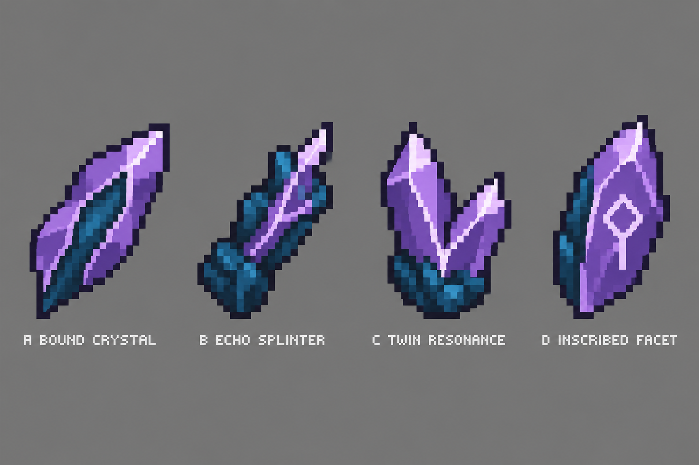

# Attunement Shard appearance study

**Superseded review:** the owner requested an appearance that actually fits Minecraft's textures; these enlarged directions were too detailed. See [the exact 16×16 drafts and vanilla comparisons](../native-item-textures/README.md). No option on this sheet was selected by the owner.

October 5, 2026. **Concepts for review; no production texture selected or installed.** The owner requested a dedicated Attunement Shard texture during the ongoing Spellstone/scroll art exploration. The current item model still uses the vanilla Amethyst Shard texture. These are four alternate appearances of that same item, not different attunements, tiers, rarities or new mechanics.

| Option | Direction |
| --- | --- |
| A — Bound Crystal | Broad purple shard surrounding a dark blue core, divided by a pale seam |
| B — Echo Splinter | Irregular dark blue mineral splinter with a purple inner crystal |
| C — Twin Resonance | Two unequal purple prongs joined through one dark blue base |
| D — Inscribed Facet | Broad purple shard with one pale angular inscription and a dark blue fractured edge |

D is the agent's recommendation: the visible inscription helps distinguish a deliberately attuned component from a raw Amethyst or Echo Shard. C offers the clearest paired-resonance silhouette. Neither is an owner selection. The violet crystal and dark blue mineral are original visual interpretations of the [accepted recipe](../../design/attunement-shards.md), not separate material bonuses. The art avoids drawing every ingredient literally onto the finished item.

## Authorship

The artwork was generated independently using the built-in image generation tool. No upstream artwork was supplied or imported. The complete prompt is preserved in [generation-prompt.txt](generation-prompt.txt). The contact sheet was copied unchanged from the tool output.

## Verification boundary

The generated sheet has four labeled shard silhouettes and has been visually inspected. It is an enlarged concept study, **not four exact 16×16 transparent PNG textures**. A chosen direction still needs a final exact 16×16 sprite, review at actual inventory size and an actual Minecraft client check. The sheet's highlights suggest facet lighting; it does not implement emissive rendering or animation. No native texture/model, attunement key, blueprint, recipe or item glint behavior changed. No build or gameplay validation is claimed for this appearance study.
