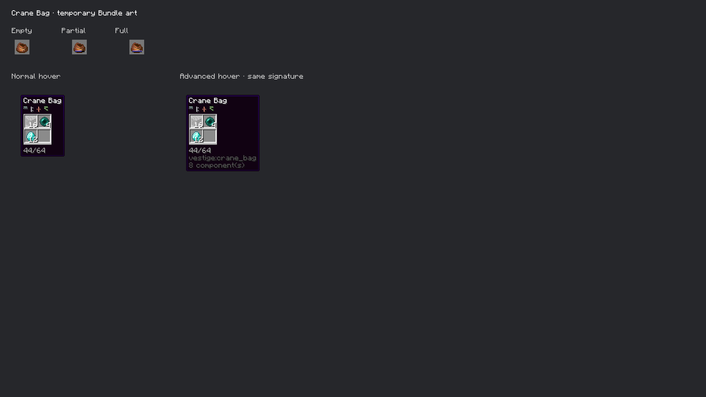

# Crane Bag native runtime inspection

October 6, 2026. Gameplay is implemented; the owner explicitly deferred the survival recipe and final image. The item currently references vanilla Bundle art.

This is an unedited **1920×1080 Minecraft framebuffer capture** from the actual item/bar/BundleTooltip renderer at GUI scale two. Empty, partially filled and full access points show the native fullness bars. Both normal and advanced hover states place the same four colored runes directly below **Crane Bag**, before the contents grid and fullness. The displayed fixture contains 16 Cobblestone, 4 Ender Pearls and 12 Diamonds, weighing **44/64**. The client capture also asserts the gathered name → runes → contents order in both modes. [Capture metadata](crane-bag/capture.json).

The first [diagnostic capture](diagnostic-vanilla-order/native-tooltips.png) exposed vanilla's insertion of the bundle image between name and runes. It is excluded from final presentation verification. Crane Bag's client tooltip event now moves only its own contents image after the rune line. The final capture also separates captions from the tooltip boxes.

**Gameplay verification:** Java 21 build and Kithkyn compatibility pass with **105 unit tests and all 11 Crane Bag Minecraft tests**, zero failures. Server tests exercise real survival players and native menu/click-packet handlers, weighted/partial transfers, shared-key isolation, component preservation, forged/repeated packets, changed bindings, cross-dimension/stored-bag previews, nesting/payload limits, normal save/reload, protected malformed storage, destroyed access points and canceled/reentrant drops. The corrupted-file test deliberately logs a loader error and confirms the file is preserved. A repeated-world fixture initially retained a prior diamond; the reproducible-key fixture is now reset before its isolation check. The full unrelated world suite was not repeated.

[Verification](verification.json) pins the tested jar, ten compiled Crane Bag classes, source hashes and the loaded model matching the jar. The native screen uses fixture snapshots, not a live shared-inventory client session; multiplayer gameplay is verified separately by the server tests. Held/offhand appearance and process-crash persistence across separate save files are outside these checks. No Prism/server installation occurred.

This pinned prototype build included `/vestige_magic crane_bag` for creating a matching test bag from a held shard. The owner subsequently requested its removal, and current source no longer registers it; this verification record retains the original build's hashes. Secondary-click inserts/extracts; right-click in hand drops shared contents. See [the design](../../design/crane-bag.md) for the starting policies and recipe/art follow-up.
