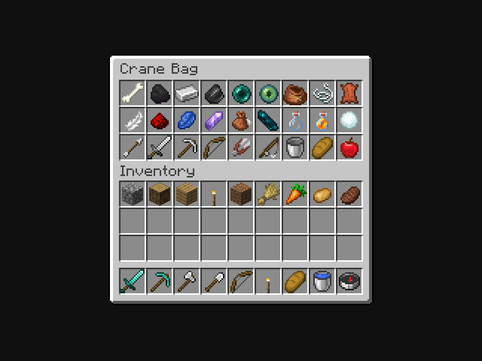

# Crane Bag · approved Gathered artwork

**Owner approved A, Gathered and authorized shipment, October 6, 2026.** The registered Crane Bag now uses the approved native 16×16 PNG through the standard generated-item model, without resampling, recoloring or a GUI scale override.



The [approved editable design](../crane-bag-native-variants-v9/pixel-sources.json) and [selected PNG](../crane-bag-native-variants-v9/textures/crane_bag_native_a_gathered.png) are retained. Production copies that PNG byte-for-byte to `src/main/resources/assets/vestige/textures/item/crane_bag.png`; `assets/vestige/models/item/crane_bag.json` selects `vestige:item/crane_bag`. Its SHA-256 is `2c8eeebdd4bf6c555d829ff99d0d9694da7f82e3254db7aa42a16628349212e8`. It has ten opaque pinned vanilla colors, binary transparency and 105 occupied native cells.

## Verification

The frozen-source Java 21 build and Kithkyn compatibility check pass in **2m 18s**. All **118 snapshot JUnit tests** pass with zero failures/errors/skips. The full shared-checkout build is verification evidence, not the installed release; other chats' in-flight features are excluded from this asset-only installation.

The isolated native client passes in **2m 6s**. Its unedited **960×720** inventory framebuffer was visually inspected. The real registered `vestige:crane_bag` resolves the production model and native 16×16 sprite. All **44 loaded asset hashes** match production or pinned vanilla resources. Every opaque texture cell matches its exact **3×3 framebuffer block**, and the entire bag slot matches the owner-approved A review. Surrounding vanilla pixels remain identical. No Paper appearance or texture override is used in this final capture.

[Verification manifest](verification.json), [native metadata](captures/capture.json), [selection](selection.json), [build log](production-build.log), [client log](native-client.log) and [frozen input hashes](frozen-input.json) retain the evidence. Initial isolated-build setup used an invalid metadata CopySpec API and was corrected. A snapshot taken during another chat's edit also caught an uncompilable lambda; the already corrected offering-seat lookup was applied to the verification snapshot only. Both failed logs and repair provenance are retained. Neither repair changes installed runtime classes.

## Installation

[Installation record](prism-install.json) confirms the update to **Kithkyn Testing** at `2026-10-06T23:35:39.328315+00:00`. Only the Crane Bag model changed and the PNG was added; all **3,296 other installed ZIP members** remain byte-identical. The current Standing Stone/menu/HUD and other installed features are preserved.

Installed JAR SHA-256: `de262f9fe8cbbff6343e2837075ff6849cc7106f40d044da2ccfd57c7b53c2f0`. The previous JAR was backed up outside the mods folder before atomic replacement. No game instance was restarted; restart Minecraft to load the artwork.

## Scope and reproduction

This shipment changes appearance only. The accepted Eye of Ender + Attunement Shard + Feather + Leather survival recipe remains pending. No gameplay, command or new world-test changes accompany this pass. An unbound real item was used for the appearance fixture; held/offhand views and live shared-inventory interactions were not repeated.

Use Java 21 to reproduce the build and client capture:

```sh
./gradlew --project-cache-dir run/crane-bag-shipped-cache \
  -I docs/art/crane-bag-shipped-v10/production-build.gradle \
  build verifyKithkynCompatibility --offline --no-build-cache \
  --no-configuration-cache -Dorg.gradle.parallel=false
./gradlew --project-cache-dir run/crane-bag-shipped-preview-cache \
  -I docs/art/crane-bag-shipped-v10/preview.gradle \
  runEffectsCapture -Pcapture_kind=crane_bag_final \
  -Pcapture_directory=run/crane-bag-shipped-preview-client \
  -Pcapture_output=docs/art/crane-bag-shipped-v10/captures \
  -Pwith_kithkyn=false --offline --no-build-cache \
  --no-configuration-cache -Dorg.gradle.parallel=false
# Inspect the native framebuffer before acknowledging appearance verification.
python3 docs/art/crane-bag-shipped-v10/verify_release.py --visually-inspected --installed
```

The isolated builds depend on the ignored snapshot in `run/crane-bag-shipped-input`, pinned by the manifest. The approved texture remains reproducible from the v9 editable source after that snapshot is removed. The installer operates on the freshest installed base and preserves all members except the two approved assets; it does not copy this full verification JAR into the pack.
