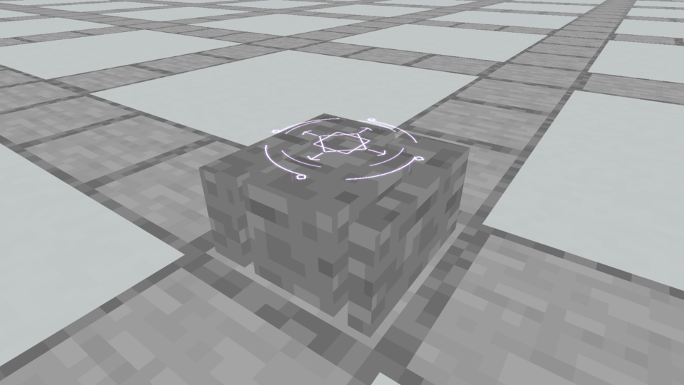
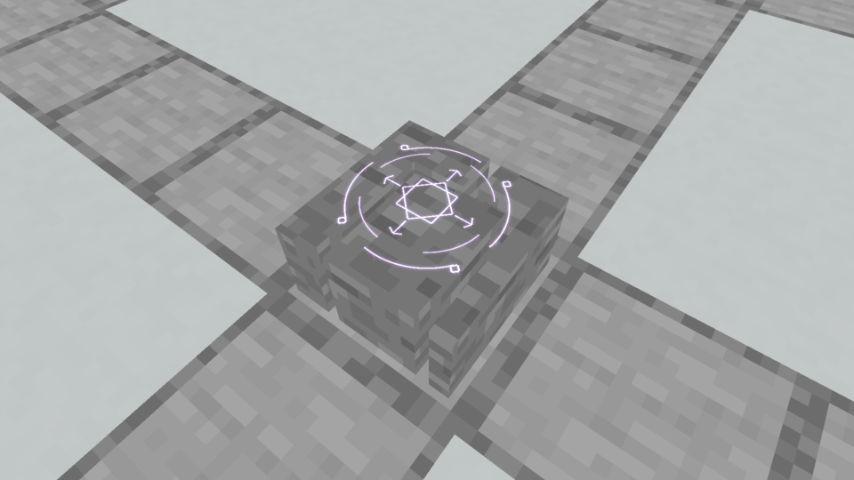
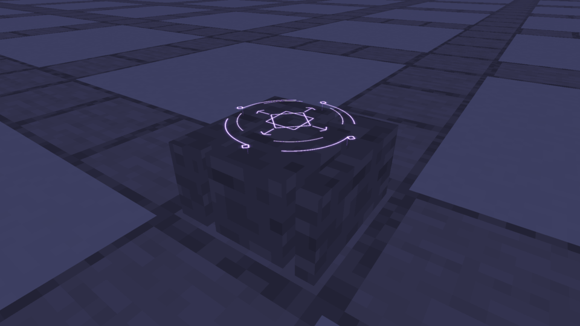
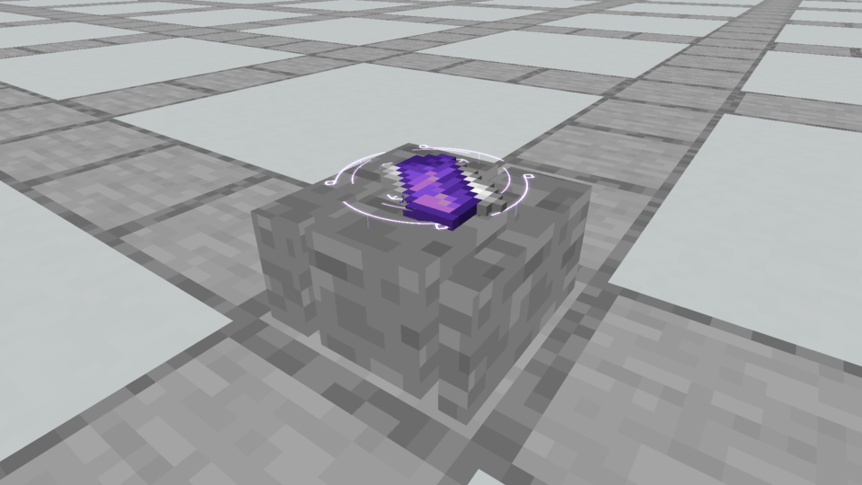

# Spellstone · fractured relic

**October 5, 2026.** The owner reset the whole Spellstone body, retaining only the top runes, then authorized a fractured relic. This study starts from three heavy, interlocking stone fragments. The accepted lowered Astral Seal spans their narrow breaks.

Six broad cuboids form three fragments: the main receiving tablet and two substantial L-shaped fragments. The main tablet stays flat at y7/16 and supports the centered reference/result scrolls. The other two upper surfaces sit slightly lower, at y6.7/16 and y6.85/16. One model unit separates fragments, and a small step in the main fracture avoids uniform parallel strips. All fragments rest on terrain. The overall footprint is 13/16 square.

The model uses **six solids / 36 static baked faces**, with no ornaments or separate foundation. Stone is the original vanilla **16×16** tile, mapped at one texel per model unit in a consistent phase. Its quiet surface lets the native runes remain the focal point. The accepted Astral renderer, hover, colors and animation are unchanged.

The first internal capture used Smooth Basalt and half-unit fractures. Inspection showed that the strong tile pattern hid the breaks. The final model uses plain Stone, one-texel fractures and a larger front/right fragment, making all three pieces visible without introducing decorative geometry. Only the final captures are published below.

## Actual Minecraft views



[Native animation](native/relic_stone.mp4)



[Animation from above](native/relic_top.mp4)



[Night animation](native/relic_night.mp4)



[Scroll placement animation](native/relic_scrolls.mp4)

These are actual native framebuffer captures, with real block entities and native scroll item models. The reference and result keep their existing flat placement, native dropped-item scale and small stack offset. They naturally obscure the glyph through depth testing.

## Scope and evidence

This is a native art preview carried by the existing Stone Brick Spellstone through an opt-in resource pack. Production collision and interactions remain in place for the review. The body has not been approved or installed. Construction recipes, Plinths, crafting, shaping and the current Prism jar are unchanged. A promoted body will require generated production collision and gameplay verification; these screenshots verify appearance and native scroll placement.

[Model](model.json) · [Design ledger](designs.json) · [Capture evidence](capture-evidence.json) · [Verification](verification.json)

The [crystal-edge study](../spellstone-crystal-core/README.md), previous trim/gem options and octagonal bodies are rejected historical evidence. The only locked visual element is the top Astral Seal.

Reproduce:

```bash
python3 tools/author_fractured_spellstone.py
python3 tools/author_fractured_spellstone.py --check
./gradlew runEffectsCapture -Pcapture_kind=apparatus -Pcapture_spells=relic_stone,relic_top,relic_night,relic_scrolls -Papparatus_preview=fractured -Pcapture_material=stone_bricks -Pcapture_seconds=5 -Pcapture_output=build/fractured-spellstone-fresh
python3 tools/archive_rune_captures.py build/fractured-spellstone-fresh --fractured
```
