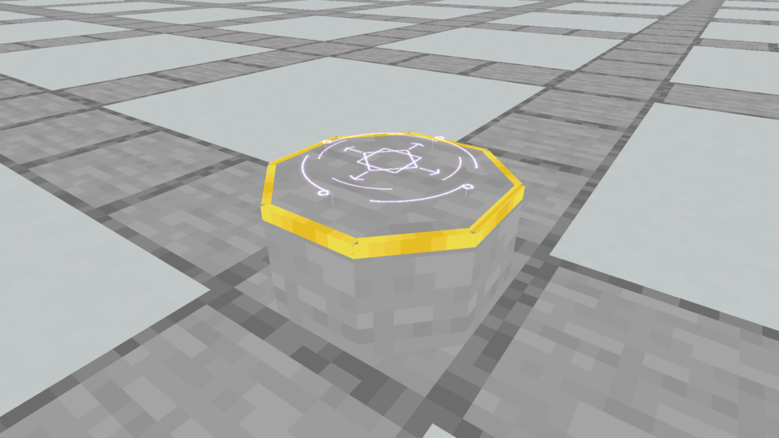
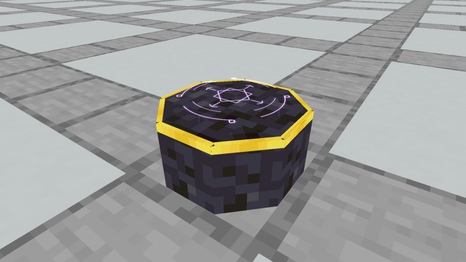
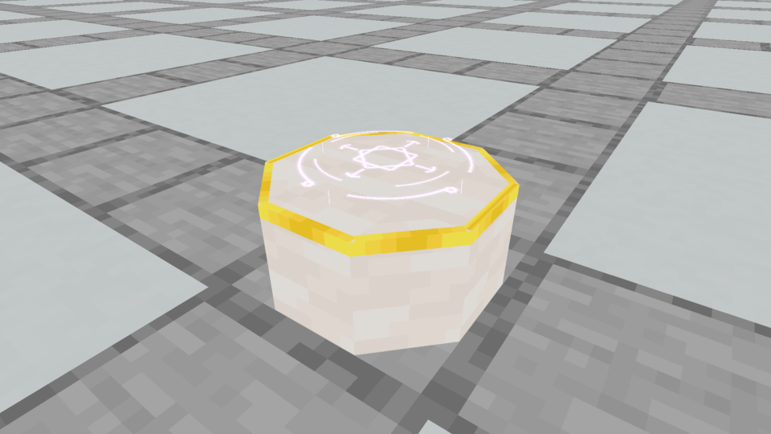
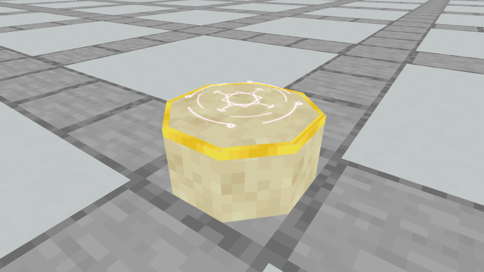
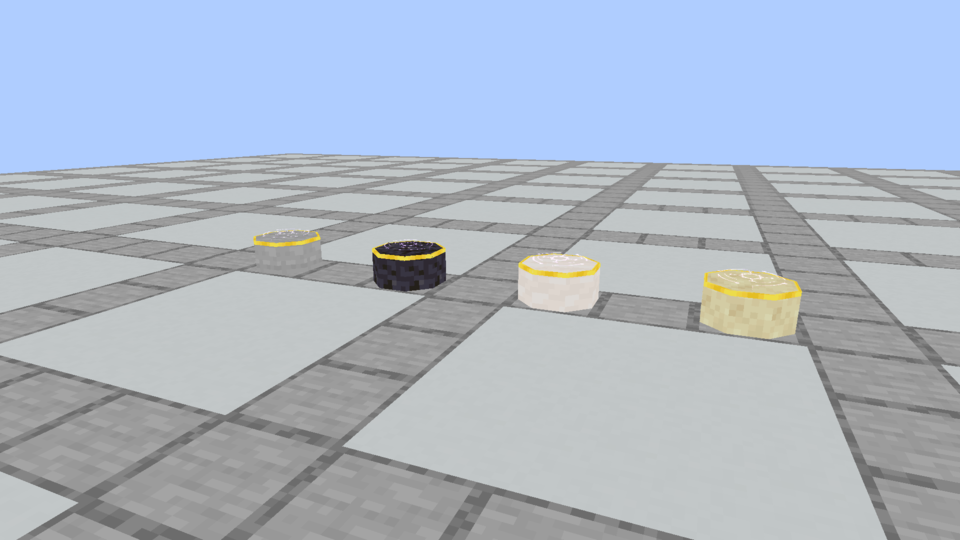

# Spellstone · gilded material studies

**Later owner clarification:** Gold was not intended; the request was for ordinary trim and some Diamond on top. [The subsequent stone-border study](../spellstone-diamond-trim/README.md) keeps the material comparison and accepted seal. These Gold versions remain unselected historical previews.

**October 5, 2026.** The owner did not like the preceding three bodies and suggested that the busy stone texture might be part of the problem. They requested a gilded treatment and different material textures. These studies hold the body and Astral effect constant while changing only the stone finish.

The shared body is a low, solid octagon, 14/16 wide and 7/16 tall. A continuous Gold edge folds from the top onto the upper sides. It has no corner ticks, gemstone panels, new foot or separate piers. Seven solid cuboids and sixteen flat gilding faces make **23 elements / 38 baked faces**. Reference/result placement keeps the same central y7/16 receiving surface. The accepted native Astral Seal keeps its lowered hover.

All five referenced material tiles are the original Minecraft 1.21.1 **16×16 PNGs**. No new raster texture or illustration substitutes for the game model. Side UVs preserve the normal texel scale on the short faces. The four individual captures use the same fixed camera and daylight.

## Smooth Stone and Gold



Neutral matte gray, with a quieter texture than the preceding brick/Polished Andesite mixture.

[Native animation](native/gilded_stone.mp4) · [Model](models/stone.json)

## Polished Blackstone and Gold



A dark body makes the warm edge and pale violet seal more prominent.

[Native animation](native/gilded_blackstone.mp4) · [Model](models/blackstone.json)

## Smooth Quartz and Gold



A light, softly patterned surface for a more formal altar.

[Native animation](native/gilded_quartz.mp4) · [Model](models/quartz.json)

## Smooth Sandstone and Gold



A warm, lightly grained finish for an ancient desert ruin or temple.

[Native animation](native/gilded_sandstone.mp4) · [Model](models/sandstone.json)

## Comparison and evidence



[Comparison animation](native/gilded_comparison.mp4). The individual views above are the closer, matched-camera comparisons.

This is an opt-in Minecraft resource pack used only by the development capture client. Existing registered variants carry the preview models; their collision and interactions retain the production implementation. No replacement body or recipe ingredient has been selected. The installed Prism jar, all 36 production finishes, Plinths, recipes and shaping retain their existing implementation.

[Design ledger](designs.json) records identical geometry and hashes/dimensions for the original material tiles. [Capture evidence](capture-evidence.json) pins unchanged native framebuffer images, measured-time MP4s, loaded model hashes, the accepted renderer and the actual loaded vanilla texture hashes. [Verification](verification.json) records the checks and production boundary. Earlier [three body studies](../astral-body-options/README.md) remain historical, unselected options.

Reproduce in a fresh capture folder:

```bash
python3 tools/author_gilded_spellstone.py
python3 tools/author_gilded_spellstone.py --check
./gradlew runEffectsCapture -Pcapture_kind=apparatus -Pcapture_spells=gilded_stone,gilded_blackstone,gilded_quartz,gilded_sandstone,gilded_comparison -Papparatus_preview=gilded-finishes -Pcapture_material=stone_bricks -Pcapture_seconds=5 -Pcapture_output=build/gilded-spellstone-fresh
python3 tools/archive_rune_captures.py build/gilded-spellstone-fresh --finishes
```
