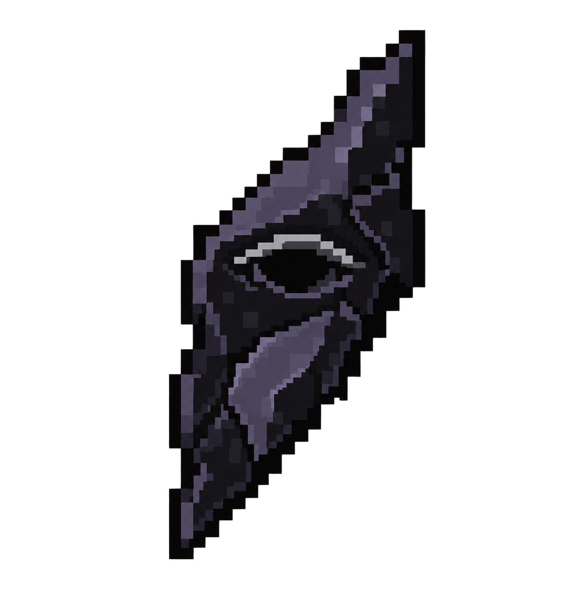
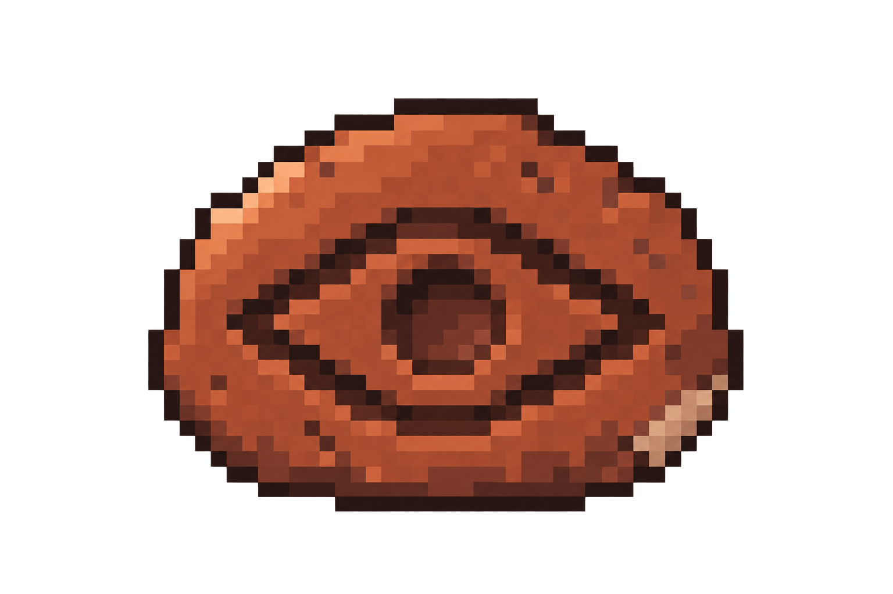
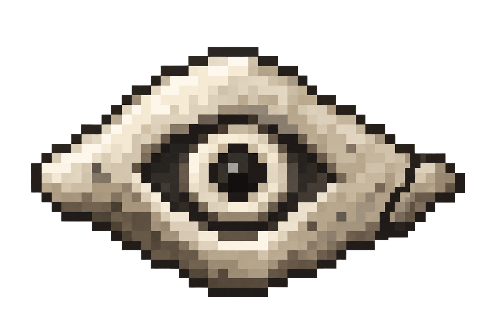
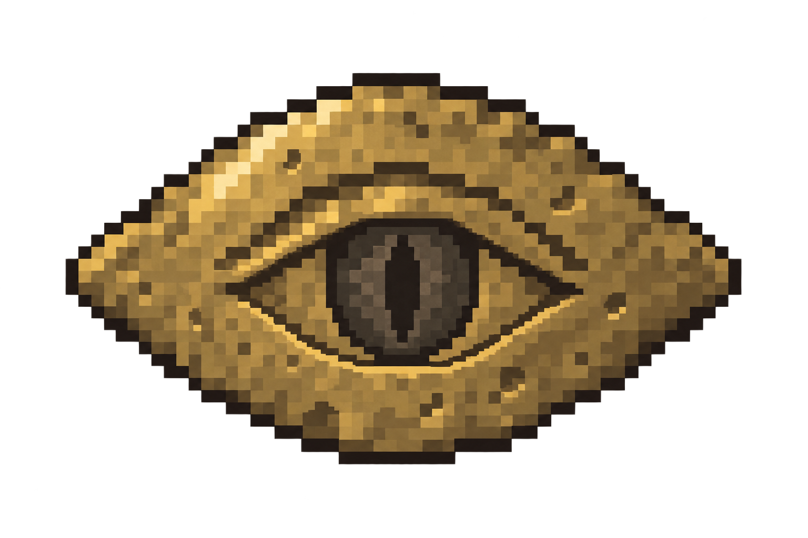

# Homebound Eye · eight material directions

**Selection:** the owner chose H (Chipped Flint), accepted Flint as the fourth ingredient and requested a simpler Minecraft-style treatment with a red center and Ender Pearl colored eye area. See the [selected refinement](../homebound-eye-flint-v2/README.md). The other concepts remain historical alternatives.

**Review concepts, October 6, 2026.** Eight independent built-in imagegen calls explore the Homebound Eye as a manufactured or carved talisman. The owner reopened its visual design and the Gold Ingot offering; Spider Eye, Ender Pearl and Attunement Shard remain the recipe direction. A finished object does not need to visibly reproduce those ingredients.

[Open the comparison gallery](gallery.html) for all eight images and a light/dark background switch. [Exact generation prompts](prompts.json) and [image verification](verification.json) are saved alongside the originals.

| Concept | Possible fourth ingredient | Direction |
| --- | --- | --- |
| A · Carved Stone | Chiseled Stone Bricks | An excavated stone tablet. Quiet, weathered and closely related to the Spellstone. |
| B · Forged Iron | Iron Ingot | A forged iron plate. Strong eye silhouette with broad, readable metal edges. |
| C · Obsidian | Obsidian | A jagged obsidian splinter. Dark, mysterious and recognisable by its long diagonal outline. |
| D · Fired Clay | Clay Ball | A stamped terracotta charm. Warm, handmade and less precious than a jewel. |
| E · Bone | Bone | A carved bone token. Pale and eerie, with a hollow socket and an uneven rim. |
| F · Rootwood | Oak Log | A twisted wooden knot. Organic, folkloric and almost grown into an eye. |
| G · Hammered Gold | Gold Ingot | A hammered gold votive. A way to retain gold without building the design around a pearl. |
| H · Flint | Flint | A chipped flint talisman. A rough stone fragment bearing an eye mark. |

**Recommendation:** A (Carved Stone) best supports the ancient, unearthed feeling and its return to a Spellstone. B (Forged Iron) is the clearest alternative if the Eye should feel deliberately forged. F (Rootwood) offers the strongest organic direction. All materials are proposals; no selection is implied.

The PNGs are preserved exactly as generated. They are high-resolution pixel-art concepts with more shading and detail than a final 16×16 inventory sprite. No native texture, recipe or gameplay change was made by this exploration, and no Minecraft presentation claim is made. The chosen direction needs a dedicated production texture pass.

## A · Carved Stone

Possible fourth ingredient: **Chiseled Stone Bricks**. An excavated stone tablet. Quiet, weathered and closely related to the Spellstone.

## B · Forged Iron

Possible fourth ingredient: **Iron Ingot**. A forged iron plate. Strong eye silhouette with broad, readable metal edges.

## C · Obsidian

Possible fourth ingredient: **Obsidian**. A jagged obsidian splinter. Dark, mysterious and recognisable by its long diagonal outline.

## D · Fired Clay

Possible fourth ingredient: **Clay Ball**. A stamped terracotta charm. Warm, handmade and less precious than a jewel.

## E · Bone

Possible fourth ingredient: **Bone**. A carved bone token. Pale and eerie, with a hollow socket and an uneven rim.

## F · Rootwood

Possible fourth ingredient: **Oak Log**. A twisted wooden knot. Organic, folkloric and almost grown into an eye.

## G · Hammered Gold

Possible fourth ingredient: **Gold Ingot**. A hammered gold votive. A way to retain gold without building the design around a pearl.

## H · Flint

Possible fourth ingredient: **Flint**. A chipped flint talisman. A rough stone fragment bearing an eye mark.

