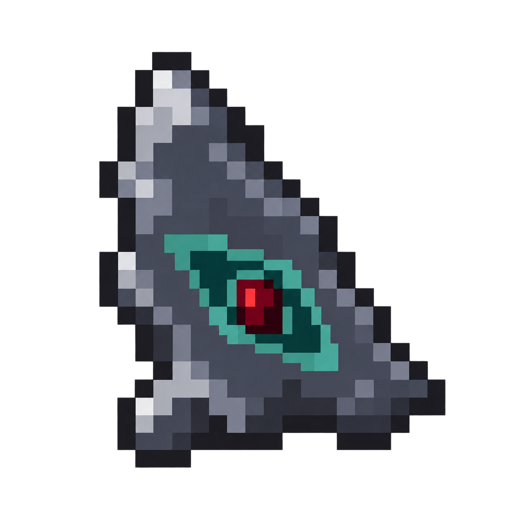

# Homebound Eye · selected Flint refinement

**Superseded production draft, October 6:** the owner locked **Eye A, Centered pearl**, from the later refinements. The [new canonical asset and native review](../attuned-items-locked/README.md) replace this old flint sprite. This folder preserves historical art, recipe and gameplay/package evidence. Flint remains the accepted recipe ingredient.

**Owner-selected direction, October 6, 2026.** This refines H (Chipped Flint) from the [eight material concepts](../homebound-eye-concepts-v1/README.md). The owner selected Flint as the fourth offering, requested simpler Minecraft-style pixels and a Spider Eye red center, then selected Ender Pearl teal-green for the eye-shaped area around that red center.

The outer talisman remains an irregular slate-grey flint fragment. A dark teal-green recess and lighter pearl-green edge surround a compact crimson eyepiece. The shape is retained from H while the shading and engraved eye use larger pixel clusters.

[Open the pixel-size review](review.html) to see the final 16×16 sprite enlarged sharply. The generated large artwork is preserved below as the source.

## Implemented recipe

Use the four inner Plinths, one offering per surface, in any order, with an empty Spellstone reference surface:

| Quantity | Offering |
| --- | --- |
| 1 | Valid Attunement Shard |
| 1 | Spider Eye |
| 1 | Ender Pearl |
| 1 | Flint |

Flint supersedes Gold Ingot. The Spider Eye's Plinth still selects the stored payment route; outer offerings and the other sockets do not select it. Durability, costs, attunement identity and origin binding retain their accepted behavior.

## Asset and prompts

Built-in imagegen produced both edits. The [first prompt](prompt.txt) simplified H and added the red center; the [final prompt](prompt-red-teal.txt) changed the surrounding eye area to Ender Pearl colors. [The first red/grey version](homebound-eye-flint-red.png) and [previous gold/purple production sprite](previous-gold-purple-texture.png) are retained as history.

The final [16×16 sprite](homebound-eye-16.png) is a faithful nearest-neighbor export of the generated 1254×1254 artwork, copied into `src/main/resources/assets/vestige/textures/item/homebound_eye.png`. Imagegen authored the shape and colors; the export only prepares their native game-resource resolution, without manual recoloring, redrawing or palette edits. The original generated PNG is preserved. [Image details](image-details.json) record dimensions, transparency and the packaged hash. Local Minecraft 1.21.1 Flint, Spider Eye and Ender Pearl textures supplied palette/style references, retained unmodified alongside the prompts and excluded from the mod's production resources.

## Verification

Java 21 `build` and Kithkyn compatibility pass with all **105 unit tests** and **six focused Homebound Eye Minecraft tests** passing. The world checks cover crafting with Flint, selector cancellation, payments/default wear, denied and occupied arrivals, XP cancellation and cross-dimension returns. The full native suite was not repeated for this ingredient/art revision. [Verification](verification.json) and [packaged file checks](package-checks.json) pin the tested jar at `build/homebound-eye-flint/vestige-0.1.0.jar`.

Both final **1920×1080 actual Minecraft framebuffer captures** were inspected: [GUI scale four](native/flint-scale-four.png) and [GUI scale two](native/flint-scale-two.png). The bound Eye appears beside vanilla Flint, Spider Eye, Ender Pearl and Attunement Shard in the hotbar and is visible in hand. Its existing bound-item enchantment glint remains, tinting the held grey stone purple during the shimmer. The final 16×16 texture loads without the Homebound Eye mip-level warning found in the first high-resolution inspection; those earlier diagnostic frames are preserved in `native-high-resolution/`. No Prism or remote multiplayer installation was performed.
