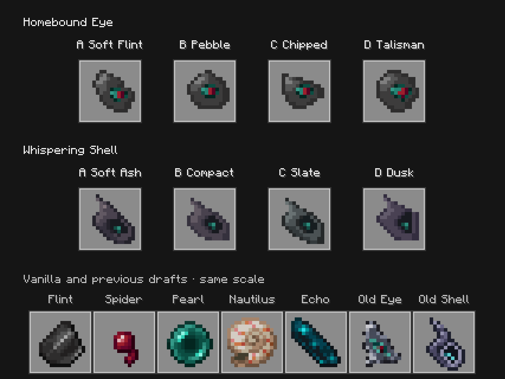
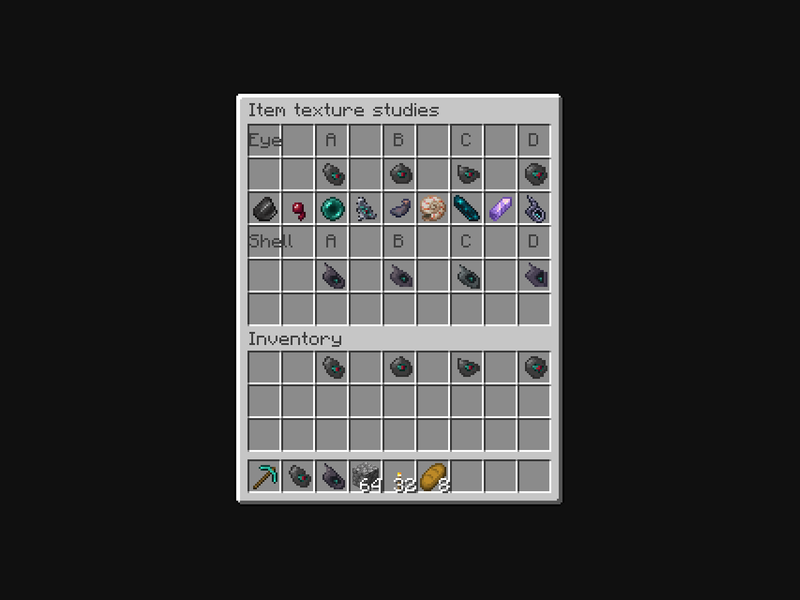

# Homebound Eye and Whispering Shell: vanilla-style texture review

**Owner review, October 6:** this set was rejected as too smooth and blob-like, losing the flint and shell shapes. [The following eight studies](../item-textures-native-v3/README.md) restore flint fracture planes and the old conch's ridges. This folder remains comparison evidence.

**October 6, 2026. Eight native options, awaiting owner selection.** After reviewing the items in Minecraft, the owner found the existing Flint Eye and Shell too noisy and outside vanilla's style. They requested four Flint alternatives, lighter revisions of the close Shell direction, coherent shading and transparent padding. Flint, the teal eye recess and crimson center remain the Eye's material/color direction; the Shell remains a dark hollow conch.

## Native close-ups



This is an **unedited Minecraft framebuffer screenshot**, using the actual native item renderer. Every new item and reference uses the same enlargement in this view. The bottom row contains vanilla Flint, Spider Eye, Ender Pearl, Nautilus Shell and Echo Shard, followed by the previous Eye and Shell. The gallery is an appearance-review screen, not a gameplay menu.

| Homebound Eye | Direction |
| --- | --- |
| [A · Soft Flint](textures/eye_a_soft_flint.png) | Diagonal chip, broad gray planes and a compact eye. |
| [B · Dark Pebble](textures/eye_b_dark_pebble.png) | Rounded triangular body and a small inset eye. |
| [C · Chipped Face](textures/eye_c_chipped_face.png) | Short angular wedge and a narrow eye. |
| [D · Simple Talisman](textures/eye_d_simple_talisman.png) | Squat oval and a larger readable teal/crimson eye. |

| Whispering Shell | Direction |
| --- | --- |
| [A · Soft Ash](textures/shell_a_soft_ash.png) | Original conch direction with warmer gray/plum bands and a subdued lip. |
| [B · Compact Conch](textures/shell_b_compact_conch.png) | Shorter point, rounder opening and more generous outer space. |
| [C · Slate](textures/shell_c_slate.png) | Cooler neutral gray shell with broad shading planes. |
| [D · Deep Dusk](textures/shell_d_deep_dusk.png) | Muted violet, dark lip and compact shape. |

## Ordinary Minecraft menus



The labeled options appear in an actual vanilla six-row `ChestMenu` / `ContainerScreen`, followed by ordinary player inventory and hotbar slots. Also inspected: [GUI scale 2](captures/gui-2.png), [Eye tooltip](captures/eye-hover.png) and [Shell tooltip](captures/shell-hover.png). The middle comparison row includes seven vanilla items and the two earlier texture drafts.

These native captures demonstrate simpler contiguous shade bands, lower rim contrast and visible outside padding. They preserve the small colored focal details without the earlier pale traced frame. They provide review evidence, not a claim of final aesthetic approval.

## Pixel source and creative studies

All eight exports are literal **16x16** RGBA images, with **binary transparency** and at least **one fully transparent pixel around every side**. Eye options use ten opaque colors; Shell options use six to eight. Shading uses connected stepped tones instead of partial alpha or scattered highlight marks. [texture-sources.json](texture-sources.json) contains the original editable grids and palettes; [author_textures.py](author_textures.py) exports and checks both the review PNGs and isolated preview resources. [Pixel details](texture-details.json) record each output's occupied bounds, palette size and SHA-256.

The Eye's four initial simplification studies were made with four separate built-in **image_gen edits**, with the previous Eye as target and vanilla Flint, Spider Eye and Ender Pearl as style/color references. [Exact prompts, generated paths and hashes](imagegen-prompts.json) retain all four requests. Their unchanged outputs are [A](concepts/eye-a-soft-flint.png), [B](concepts/eye-b-dark-pebble.png), [C](concepts/eye-c-chipped-face.png) and [D](concepts/eye-d-simple-talisman.png). These large images remain creative references. The native options are independently authored literal grids, not resampled or manually edited generated PNGs. The Shell already had editable native pixel source; its four variants are authored directly in that format. The [previous Eye](references/current-homebound-eye.png), [previous Shell](references/current-whispering-shell.png) and three vanilla reference PNGs are retained unchanged.

## Verification and scope

[Capture metadata](captures/capture.json) records **28 loaded asset hashes** and native model-resolution assertions for all eight options plus both historical references. [Verification](verification.json) retains pixel checks, source and compiled capture hashes, five screenshot hashes and exact limitations. [The isolated client log](native-client.log) confirms compilation/resource processing and capture completion. The texture-author drift check passes.

The first run exposed a preview-only identifier collision: CustomModelData integers near 202 million exceed exact float precision, so multiple overrides selected the same icon. Its [diagnostic captures](captures-preview-id-collision/capture.json) and [log](native-client-preview-id-collision.log) are preserved. The corrected identifiers `261070–261079` are exactly representable, and runtime model-resolution assertions verify every displayed option. The diagnostic run does not count as texture presentation verification.

[isolated-preview.gradle](isolated-preview.gradle) adds the study-only [capture source](preview-source/com/quzzar/vestige/apparatus/client/ItemTextureStudiesCapture.java) and resources to a separate build/cache/client folder. Preview carriers are Paper CustomModelData with native `item/generated` models. A plain Screen host delegates vanilla menu rendering without opening a world or requiring a player tick. The enlarged gallery uses the same native item renderer at equal scale for all references.

Reproduce with Java 21:

```bash
python3 docs/art/item-textures-native-v2/author_textures.py --check
./gradlew --project-cache-dir run/item-textures-native-v2-cache \
  -I docs/art/item-textures-native-v2/isolated-preview.gradle \
  runEffectsCapture -Pcapture_kind=item_texture_studies \
  -Pcapture_directory=run/item-textures-native-v2-client \
  -Pcapture_output=docs/art/item-textures-native-v2/captures \
  -Pwith_kithkyn=false --offline --no-build-cache --no-configuration-cache \
  -Dorg.gradle.parallel=false
```

Production textures and installed game files are not replaced while the alternatives are being reviewed. This pass changes no recipe, costs, binding, teleportation or chat mechanics. Preview carriers omit bound-item glint and native attunement marks; held/offhand forms and effects are not inspected. No world or multiplayer gameplay tests were needed or claimed for this isolated art study. [Eye gameplay](../../design/attuned-devices.md) and [Shell design](../../design/whispering-shell.md) remain separate.
