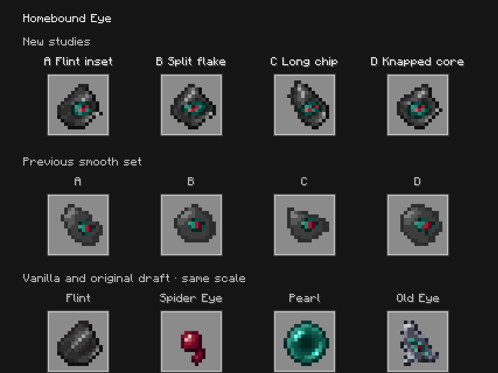
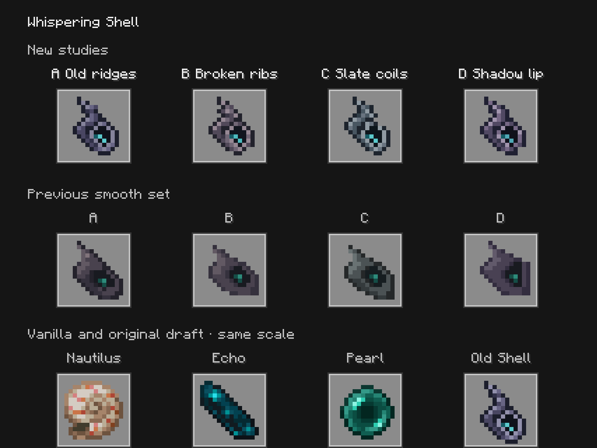

# Chipped Flint Eyes and ridged Whispering Shells

**Retired art review, October 6:** the owner rejected these directions and discarded the previous art basis. The current [four fresh directions per item](../item-textures-native-v4/README.md) show each option separately surrounded only by vanilla items. The accepted Echo Shard recipe and its passing verification below remain current.

**Historical October 6 study. Eight subsequently rejected options.** The owner rejected the preceding smooth set because the Eyes lost their flint character and the Shells looked like blobs. These studies restored chipped gray faces, Ender Pearl green eye whites and a Spider Eye crimson pupil, and return the Shell to the old pointed hollow conch with overlapping coils. All eight have a transparent outside border.

## Native comparison





The top row is the new A–D set. The middle row is the preceding smooth A–D set. The bottom row contains vanilla reference items and the original draft, all rendered at the same scale. Ordinary menus are available at [GUI scale 2](captures/gui-2.png) and [GUI scale 3](captures/gui-3.png), with [Eye](captures/eye-hover.png) and [Shell](captures/shell-hover.png) hover views.

| Option | Eye | Shell |
| --- | --- | --- |
| A | [Flint inset](textures/eye_a_flint_inset.png): familiar flint proportions and fractured gray planes, with a small inset eye. | [Old ridges](textures/shell_a_old_ridges.png): closest to the original conch, with a padded bottom edge. |
| B | [Split flake](textures/eye_b_split_flake.png): angular broken face and a wider almond eye. | [Broken ribs](textures/shell_b_broken_ribs.png): warmer ash-gray ribs and a chipped mouth rim. |
| C | [Long chip](textures/eye_c_long_chip.png): narrow diagonal fragment and sharp upper point. | [Slate coils](textures/shell_c_slate_coils.png): cool slate shades and a long stepped spine. |
| D | [Knapped core](textures/eye_d_knapped_core.png): broader fractured face and prominent inset. | [Shadow lip](textures/shell_d_shadow_lip.png): dark layered mouth and stronger violet-gray ridges. |

## Editable assets and capture

[texture-sources.json](texture-sources.json) is the editable literal source for all eight exact **16×16** sprites. [author_textures.py](author_textures.py) exports those original source grids without reading, resampling or filtering a PNG. This pass edits code-native pixel sources; it does not use a new imagegen pass. Prior generated concepts and prompts remain in the historical studies. Eyes use fourteen opaque colors from the pinned vanilla Flint, Ender Pearl and Spider Eye palette; Shells use eight. [texture-details.json](texture-details.json) records bounds, counts and hashes.

The [capture source](preview-source/com/quzzar/vestige/apparatus/client/ItemTextureStudiesCapture.java) uses a real vanilla `ChestMenu`/`ContainerScreen` for ordinary views and the native item renderer for larger comparison galleries. Paper carriers use exactly representable CustomModelData **261100–261117**. Native model assertions cover all eighteen new, smooth and original icons. The [isolated build](isolated-preview.gradle) excludes these study sources/assets from ordinary builds. Production Eye and old Shell PNGs remain unchanged; preview carriers omit attunement marks and bound-item glint. Held/offhand forms, effects and Shell gameplay are outside this review.

## Accepted Echo Shard recipe

**1 Amethyst Shard + 1 Soul Sand + 1 Ghast Tear → 1 Echo Shard**, shapeless in a normal crafting grid. The [production recipe](../../../src/main/resources/data/vestige/recipe/echo_shard.json) produces the ordinary vanilla item. The [recipe-book advancement](../../../src/main/resources/data/vestige/advancement/recipes/echo_shard.json) unlocks it when a player obtains a Ghast Tear. This ingredient acquisition route is separate from the Shell's still-proposed ritual recipe.

The [native crafting fixture](preview-source/com/quzzar/vestige/gametest/EchoShardCraftReview.java) is included only in the isolated review. It checks all six ingredient permutations, rejects an extra offering and the superseded Pearl recipe, verifies real 2×2 player and 3×3 table menus consume exactly one of each ingredient, and checks the Ghast Tear unlock before any crafting. The [production build configuration](production-build.gradle) excludes all preview assets and fixtures.

## Verification

Capture, native crafting and production packaging results are recorded in [verification.json](verification.json), with [native client](native-client.log), [crafting](native-recipe-check.log) and [production build](production-build.log) logs. All six native views were visually inspected; all **44 loaded assets** match their sources and all **18 distinct native model resolutions** match the intended icons. Source-grid export, connected silhouettes, exact dimensions, binary transparency and border padding pass. The focused Minecraft crafting check passes, including ingredient consumption in both vanilla menus and a fresh player's recipe-book unlock. No installed game files are replaced by this review.

Java 21 production `build` and all **105 unit tests** pass. The [production jar](../../../run/echo-shard-production-build/libs/vestige-0.1.0.jar) contains the accepted recipe/unlock and excludes every art-only carrier and fixture. [verify_review.py](verify_review.py) reproduces asset, source, package and completed-log checks. The full world suite and multiplayer were not rerun for this pass.

Reproduce with Java 21:

```sh
python3 docs/art/item-textures-native-v3/author_textures.py --check
./gradlew --project-cache-dir run/item-textures-native-v3-cache \
  -I docs/art/item-textures-native-v3/isolated-preview.gradle \
  runEffectsCapture -Pcapture_kind=item_texture_studies \
  -Pcapture_directory=run/item-textures-native-v3-client \
  -Pcapture_output=docs/art/item-textures-native-v3/captures \
  -Pwith_kithkyn=false --offline --no-build-cache --no-configuration-cache \
  -Dorg.gradle.parallel=false
./gradlew --project-cache-dir run/item-textures-native-v3-cache \
  -I docs/art/item-textures-native-v3/isolated-preview.gradle \
  runGameTestServer -Pgametest_filter=echo_shard_craft_review \
  -Pgametest_directory=run/echo-shard-review-world -Pwith_kithkyn=false \
  --offline --no-build-cache --no-configuration-cache -Dorg.gradle.parallel=false
./gradlew --project-cache-dir run/echo-shard-production-cache \
  -I docs/art/item-textures-native-v3/production-build.gradle build \
  --offline --no-build-cache --no-configuration-cache -Dorg.gradle.parallel=false
python3 docs/art/item-textures-native-v3/verify_review.py
```
