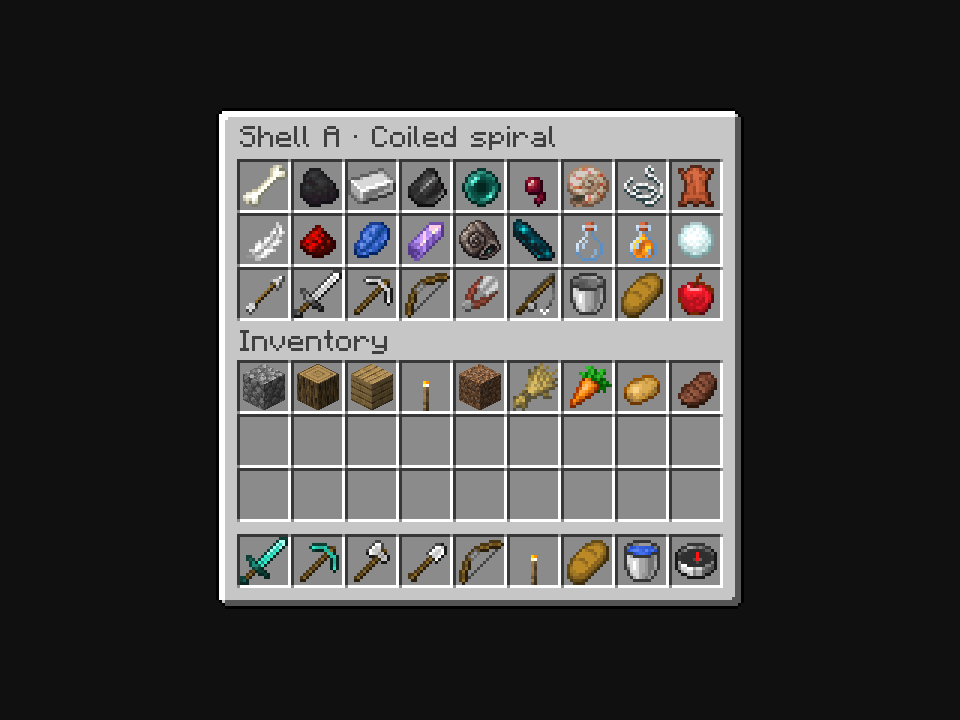
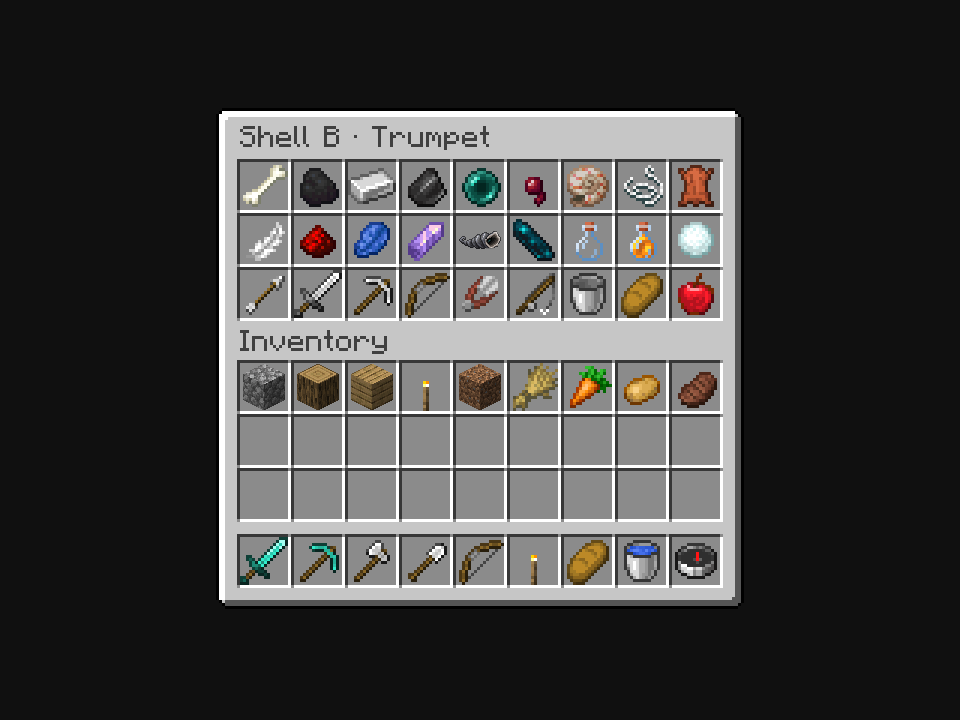

# Fresh item directions in vanilla surroundings

**Owner-selected iteration bases:** Shell A, the coiled spiral, fits Minecraft fairly well but needs less fine detail. None of the Eye textures is approved; Eye B, Pearl heart, is the starting point for further work. The [current focused refinements](../item-textures-native-v5/README.md) retain those two bases and show each option separately among vanilla items.

**October 6, 2026. Eight initial fresh directions.** The owner discarded the preceding Eye and Shell art and requested four fresh directions for each item. Each image contains exactly **one** new item, in the center slot of a normal vanilla chest, surrounded by vanilla items. Every image uses the same neighbors, inventory, menu size and GUI scale. Prior variants are absent.

## Homebound Eye

A · Stone lids


B · Pearl heart


C · Split flakes


D · Crimson eye


## Whispering Shell

A · Coiled spiral



B · Trumpet



C · Open clam


D · Broken whorl


## Sources and scope

The eight directions were made with **eight separate built-in imagegen calls**. [Exact prompts](imagegen-prompts.json), [original PNG provenance and hashes](concept-files.json), and unchanged files in [concepts](concepts/) are saved here. The generated concepts are high-resolution pixel-art studies, **not final literal 16×16 textures**. The menu images use the original generated PNG bytes and alpha in native item rendering; no PNG was cropped, resampled, filtered or painted. [prepare_review.py](prepare_review.py) copies those unchanged files and authors preview-only model GUI transforms, preserving their natural aspect ratio and fitting the solid body within fourteen native menu pixels. [Model details](preview-details.json) record dimensions, bounds and transforms. Final pixel discipline, alpha edges, selected texture, binding marks and held/offhand appearance remain a later selection/refinement step.

The [isolated capture](preview-source/com/quzzar/vestige/apparatus/client/SoloItemTextureCapture.java) uses a real vanilla three-row `ChestMenu` and `ContainerScreen`, GUI scale 3, and unedited screenshots of the Minecraft framebuffer. Exactly one Paper appearance carrier is present, at chest slot 13. All other chest and inventory items are vanilla. Each variant has a distinct exactly representable CustomModelData identifier (261200–261207), verified against the native renderer. This is an art review: production item registries, recipes, payments, chat, installed game files and gameplay are unaffected. The accepted Amethyst Shard + Soul Sand + Ghast Tear Echo Shard craft remains implemented and verified in the preceding recipe pass.

## Reproduction

Use Java 21:

```sh
python3 docs/art/item-textures-native-v4/prepare_review.py --check
./gradlew --project-cache-dir run/item-textures-native-v4-cache \
  -I docs/art/item-textures-native-v4/isolated-preview.gradle \
  runEffectsCapture -Pcapture_kind=item_texture_solo \
  -Pcapture_directory=run/item-textures-native-v4-client \
  -Pcapture_output=docs/art/item-textures-native-v4/captures \
  -Pwith_kithkyn=false --offline --no-build-cache --no-configuration-cache \
  -Dorg.gradle.parallel=false
python3 docs/art/item-textures-native-v4/verify_review.py
```

[Capture metadata](captures/capture.json), [client log](native-client.log) and [verification](verification.json) retain the native resolution, loaded hashes, one-custom-item assertions and source parity. No gameplay unit/world suite is repeated for this appearance-only review.

**Completed verification:** all eight 960×720 native views were visually inspected. All 59 loaded asset hashes and eight distinct model resolutions pass. Native assertions confirm exactly one custom item per menu; pixel comparison confirms the vanilla surroundings are identical across all eight images. Isolated Java 21 compilation/capture passes.
