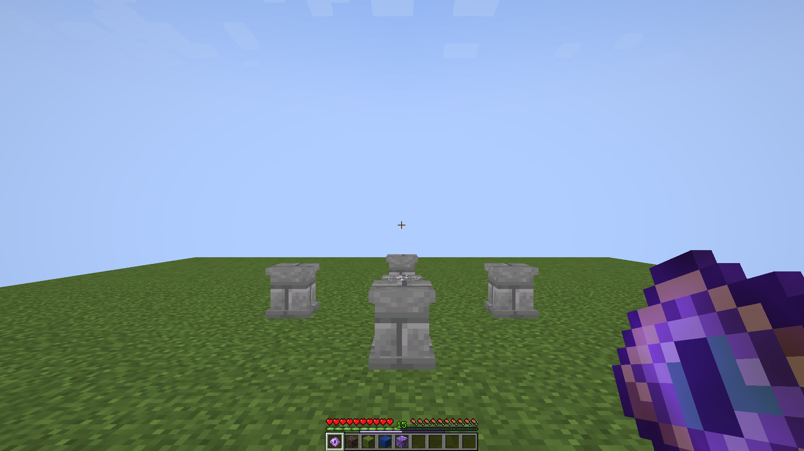

# Native mana HUD and Homebound Eye

October 6, 2026. These six images are actual Minecraft 1.21.1 / NeoForge 21.1.72 framebuffer captures, inspected at both GUI scales. Each is 1920×1080 from the isolated native client. The player holds a bound Homebound Eye; the central Spellstone and four Plinths provide the scene. The Eye’s original 16×16 sprite is visible in hand and inventory.

The thin violet gauge occupies the two GUI-pixel gap below vanilla XP and above the hotbar. The XP gauge, level number, hearts, hunger and hotbar remain visible. At GUI scale 1 it is correspondingly smaller; no other HUD is shifted.

| Capture | Server mana observed by client | Mana gauge |
| --- | --- | --- |
| [First spawn](full-first-spawn.png) | 100 | Hidden |
| [Empty](empty.png) | 0 | Empty track remains visible during the delay |
| [Half](half.png) | 50 | Half filled |
| [Recovering](recovering.png) | 12.1 | Filling after five-second delay |
| [Full, scale 1](full-scale-one.png) | 100 | Hidden again |
| [Half, scale 1](half-scale-one.png) | 50 | Half filled |

[Capture metadata](capture.json) records the synchronized values and visibility assertions. [Pixel checks](pixel-checks.json) read the actual gauge row: full-state frames retain world colors, the empty track is RGB 69/52/88, and partially filled tracks include RGB 219/192/252. The screenshot bytes are unchanged.

The [native client log](native-capture.log) records successful completion. The [Minecraft behavior log](world-tests.log) records all 186 required tests passing. Those tests exercise real 100-mana spending/recovery/lifecycle, atomic Eye crafting, local imbuement selection, all five payment routes, five default returns, cancellation/refunds, cross-dimension Eye returns, random open arrivals and the deliberate occupied fallback shared with Standing Stones. Model tests additionally validate saved bindings, XP arithmetic, recipe display and payload bounds.

[Recipe and payment rules](../../design/attuned-devices.md) record the accepted starting prices. Broader survival balance playtesting remains outstanding. Whispering Shell and Crane Bag remain planned. Standing Stone payments remain a separate unfinished system. No Prism installation is performed by this implementation pass.
