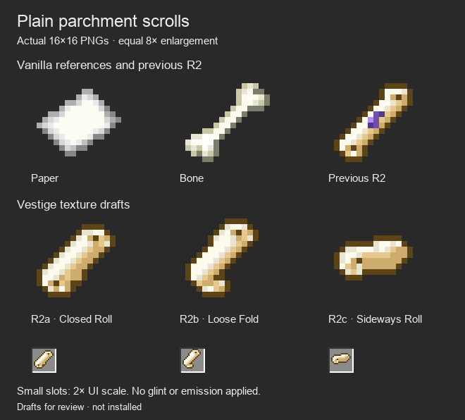
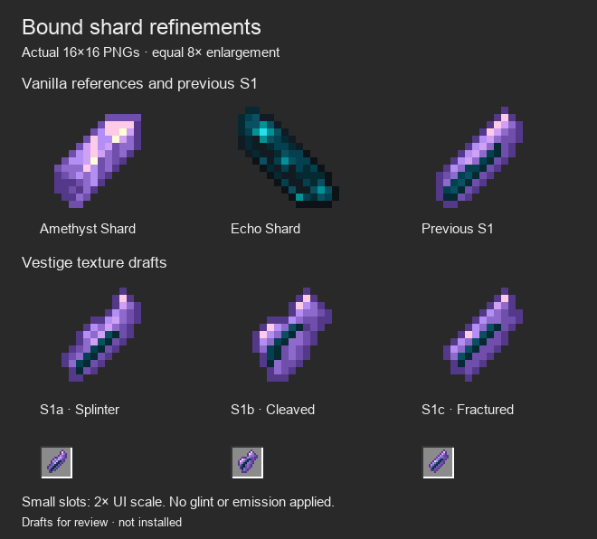

# Plain rolled scroll and bound-shard refinements

The owner subsequently selected **R2a — Closed Roll** and **S1a — Splinter** for further iteration. [Their next refinements](../native-item-textures-v3/README.md) preserve both selected base sprites unchanged.

October 5, 2026. **Exact 16×16 texture drafts; no new texture installed.** The owner preferred the previous R2 parchment scroll and S1 bound-shard direction, with changes: remove all purple from the scroll and improve its shape, and make S1 a more convincing, creative shard. These are refinements of those two directions, not a final selection.

The spoken bone comparison was ambiguous. A clarification was requested; while awaiting a response, the working interpretation is that the previous roll resembled a bone and should read more clearly as curled parchment. That interpretation is not recorded as an explicit owner decision. All three scrolls are warm paper without a purple binding, inscription or accent.

| Draft | PNG | Shape |
| --- | --- | --- |
| R2a — Closed Roll | [scroll_closed.png](textures/scroll_closed.png) | Broader diagonal parchment cylinder with visible spiral ends |
| R2b — Loose Fold | [scroll_loose.png](textures/scroll_loose.png) | Wider exposed paper face with a curled top and loose lower fold |
| R2c — Sideways Roll | [scroll_sideways.png](textures/scroll_sideways.png) | Short horizontal roll with one visible curled end |

| Draft | PNG | Shape |
| --- | --- | --- |
| S1a — Splinter | [shard_splinter.png](textures/shard_splinter.png) | Narrow tapered splinter, pointed end and uneven chipped edge |
| S1b — Cleaved | [shard_cleaved.png](textures/shard_cleaved.png) | Broader asymmetrical broken crystal, two fracture faces and exposed dark seam |
| S1c — Fractured | [shard_fractured.png](textures/shard_fractured.png) | Angular long fracture with jagged edge notches and an off-center dark seam |

Purple crystal and the Echo-colored inner mineral remain the shared shard theme. There are no rune stamps, sockets or ingredient collages added to the shards. Shape and broad facets supply the differences.

## References and authorship

The reference row contains unchanged original vanilla 1.21.1 sprites plus the unchanged prior R2 or S1 draft. These are clearly labeled separately. All large icons use the same 8× nearest-neighbor scale. Small inventory-like slots show the same PNGs at 2× UI scale. The sheets are texture comparisons, not Minecraft screenshots. [Light scroll view](scroll-light.png) and [light shard view](shard-light.png) were also inspected.

[Native pixel authoring source](../../../tools/author_item_texture_refinements.py) contains the independent explicit grids. [Pixel source and hashes](pixel-source.json) records every palette, grid, exact dimensions, used color count and file hash, plus hashes of the original vanilla and previous-draft references. Warm paper colors come from Name Tag/Bone; shard colors come from Amethyst/Echo Shards. No reference silhouette is copied and no generated raster illustration is edited or downsampled into the textures.

## Verification boundary

Authoring `--check` passes for six exact 16×16 RGBA sprites, binary alpha, at most ten opaque colors, reference palette membership, file/grid/hash drift and the specific requirement that scrolls contain only their five parchment colors. The dark and light sheets were visually inspected at large and small slot scales. The original texture study remains intact.

These remain review assets. No native model, texture, glint, recipe, attunement identity, ritual system or Prism jar changed. Client appearance and Spellstone placement still need verification after a final texture is selected. No game build or gameplay test is claimed for this art-only pass.
