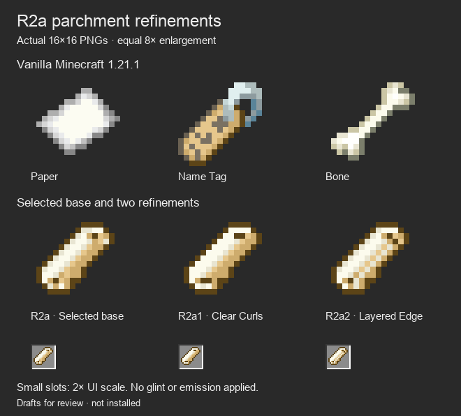
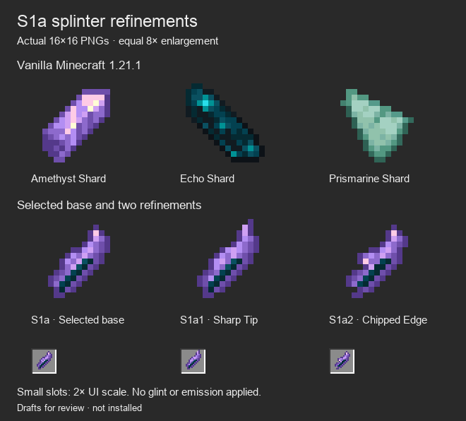

# R2a scroll and S1a shard refinements

**Integrated October 6:** S1a1's exact bytes are now packaged with glint and a deterministic attunement mark. See [native item inspection](../attuned-items-native/README.md). Earlier pending-integration notes below describe the review stage. Scrolls now use the selected Electroblob recolor.

**Owner decision, October 6:** **S1a1 — Sharp Tip** is the final Attunement Shard design. The R2a scroll family is rejected for not reading as a scroll; [fresh silhouettes](../scroll-rebuild-v4/README.md) supersede it. The approved shard remains unchanged; production integration is pending.

October 5, 2026. Review sprites; not installed.

The owner requested further iteration on **R2a — Closed Roll** and **S1a — Splinter**. Each comparison keeps that selected base on the left, unchanged, and shows two refinements beside it. No final refinement has been selected.

| Draft | PNG | Change from selected base |
| --- | --- | --- |
| R2a — Selected base | [scroll_r2a_base.png](textures/scroll_r2a_base.png) | Exact prior Closed Roll pixels |
| R2a1 — Clear Curls | [scroll_clear_curls.png](textures/scroll_clear_curls.png) | Brighter broad paper face and deeper visible curl openings |
| R2a2 — Layered Edge | [scroll_layered_edge.png](textures/scroll_layered_edge.png) | Light overlapping parchment edge and restrained curl changes |

All scrolls retain the diagonal closed roll and five warm parchment colors. None contains purple. The owner selected R2a for iteration after the earlier bone comparison; its curled-paper direction is now the working baseline, without inventing an answer to that earlier clarification.

| Draft | PNG | Change from selected base |
| --- | --- | --- |
| S1a — Selected base | [shard_s1a_base.png](textures/shard_s1a_base.png) | Exact prior Splinter pixels |
| S1a1 — Sharp Tip | [shard_sharp_tip.png](textures/shard_sharp_tip.png) | Longer pointed tip, broader light fracture face and a sharper facet ridge |
| S1a2 — Chipped Edge | [shard_chipped_edge.png](textures/shard_chipped_edge.png) | Broken contour, small exposed pale facet and irregular dark mineral seam |

The shard retains purple Amethyst faces and an Echo-colored inner seam. The same icon remains applicable to every attunement; these variants do not introduce state, rarity or recipe-dependent icons.

## Source and inspection

These are independently authored literal **16×16 RGBA pixel grids**, rendered by [the existing refinement author](../../../tools/author_item_texture_refinements.py) with `--pass-number 3`. [Pixel source](pixel-source.json) stores the complete grids, palettes, individual edits and hashes. [Texture archive](texture-drafts.zip) contains all six PNGs and their pixel source.

The reference row shows unchanged vanilla 1.21.1 Paper, Name Tag and Bone, or Amethyst, Echo and Prismarine Shards. Every enlarged icon uses the same 8× nearest-neighbor scale; small inventory-like slots use 2×. Both dark and [light scroll](scroll-light.png) / [light shard](shard-light.png) comparisons were inspected. These are sprite comparisons, not in-game captures. No generated raster concept has been edited or reduced into these assets.

## Verification boundary

Both native refinement passes pass their authoring checks: exact 16×16 sprites, binary transparency, at most ten opaque colors, vanilla palette membership, parchment-only scroll colors, pixel-grid/file/hash consistency, and byte-identical selected baselines. Python compilation and whitespace checks pass.

Only draft art and its authoring/documentation changed. Production item models/textures, the accepted Spellstone body direction and Astral Seal, native gameplay, recipes, glint and the Prism installation remain unchanged. No game build or client appearance verification is claimed for this review pass.
