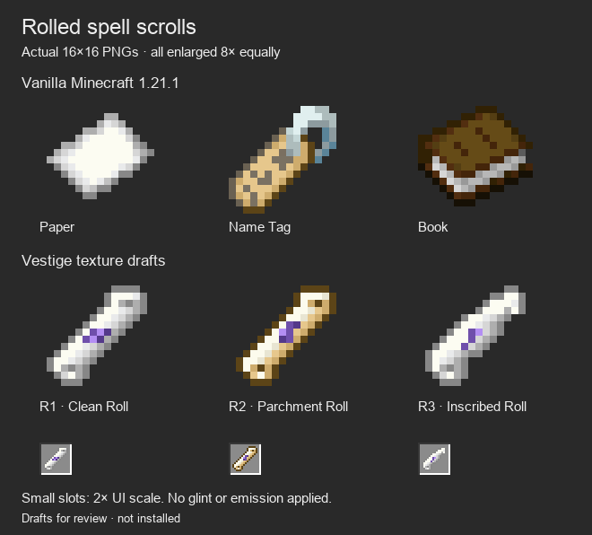
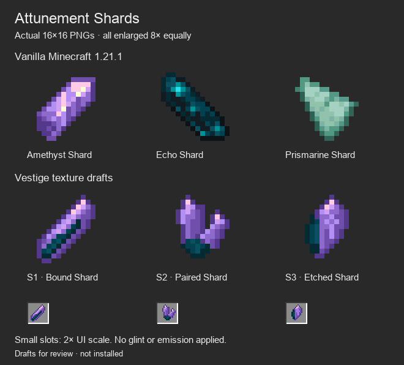

# Native item texture drafts

**Latest refinement:** the owner preferred R2's parchment and S1's bound-shard theme, requesting a scroll without purple and a better shard silhouette. See [the second exact 16×16 pass](../native-item-textures-v2/README.md). The variants below remain the preserved first native review; none is installed.

October 5, 2026. **Exact 16×16 review assets; no final item texture selected or installed.** The owner chose the rolled-scroll appearance, requested further texture variations, and rejected the preceding enlarged scroll/shard concept sheets as insufficiently Minecraft-like. They asked for comparison against real vanilla item textures. The new drafts are authored from explicit pixel grids rather than resampled concept illustrations.

The top rows are original Minecraft 1.21.1 textures displayed unchanged. The bottom rows are the new transparent 16×16 PNG drafts. Every large icon is enlarged by the same exact 8× nearest-neighbor factor. Small inventory-like slots display the same assets at 2× UI scale; these are comparison boards, not client screenshots. [Light scroll comparison](scroll-light.png) and [light shard comparison](shard-light.png) were also inspected.

| Draft | Pixel asset | Direction |
| --- | --- | --- |
| R1 — Clean Roll | [scroll_clean.png](textures/scroll_clean.png) | Paper's white/gray ramp, clearly curled ends and a small purple band |
| R2 — Parchment Roll | [scroll_aged.png](textures/scroll_aged.png) | Warmer Name Tag/Bone colors, the same rolled silhouette and a small purple binding mark |
| R3 — Inscribed Roll | [scroll_inscribed.png](textures/scroll_inscribed.png) | A looser exposed fold and sparse violet inscription on white parchment |
| S1 — Bound Shard | [shard_bound.png](textures/shard_bound.png) | Single violet shard with a dark teal inner seam |
| S2 — Paired Shard | [shard_paired.png](textures/shard_paired.png) | Two unequal violet prongs joined into one small teal base |
| S3 — Etched Shard | [shard_inscribed.png](textures/shard_inscribed.png) | Broad violet facet with a tiny diamond/stem rune and one dark edge |

## Authorship and reproducibility

[Authoring source](../../../tools/author_item_texture_studies.py) contains the exact independent 16×16 grids. [Pixel source and hashes](pixel-source.json) record each grid, palette, dimensions, used color count and file hash. Every opaque color occurs in a vanilla reference palette: Paper/Name Tag/Bone inform the rolls; Amethyst and Echo Shards inform the crystals. Vanilla outlines use their actual gray, brown or purple shades rather than adding the heavy black borders of the rejected concepts. Original vanilla reference PNGs are stored under `vanilla/` with source hashes from the pinned local 1.21.1 resources. No vanilla silhouette is copied into the drafts. No Electroblob, Iron or other third-party artwork is imported. The earlier built-in imagegen sheets remain historical direction studies; they are not used as pixel sources for this pass.

## Checks and inspection

`python3 tools/author_item_texture_studies.py --check` passes. All six sprites are exactly 16×16 RGBA with binary alpha, at most ten opaque colors and exact palette membership in the vanilla reference set. File/grid/palette/hash drift and changed vanilla reference bytes fail validation. The dark and light comparisons were visually inspected, including the small slots. The first roll draft was broadened and its curled ends clarified after inspection.

These textures are ready to select and integrate as native generated item textures. They have not been loaded into an actual Minecraft client, tested on Spellstone or installed in Prism. Item models, knowledge states, attunement identity, glint, gameplay and recipes are unchanged. Glow is not baked into the sprites. Final in-game appearance remains to be inspected after selection.
