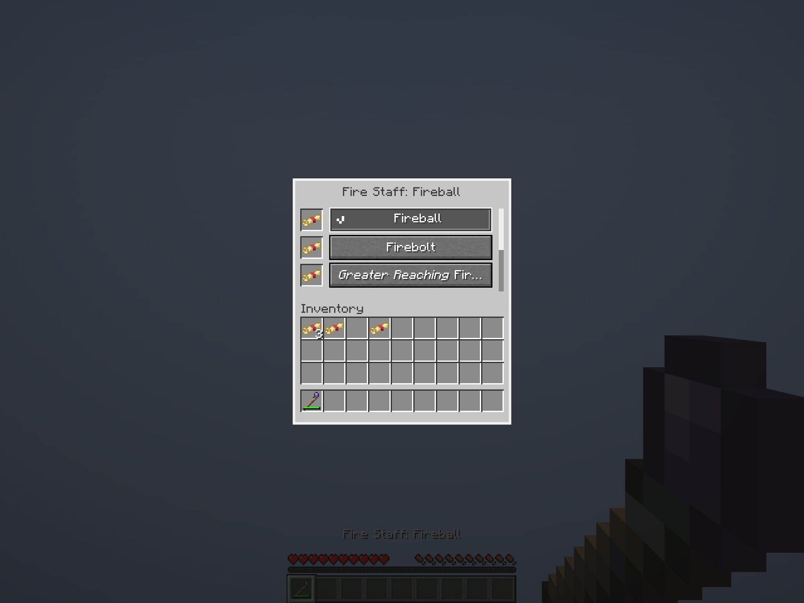
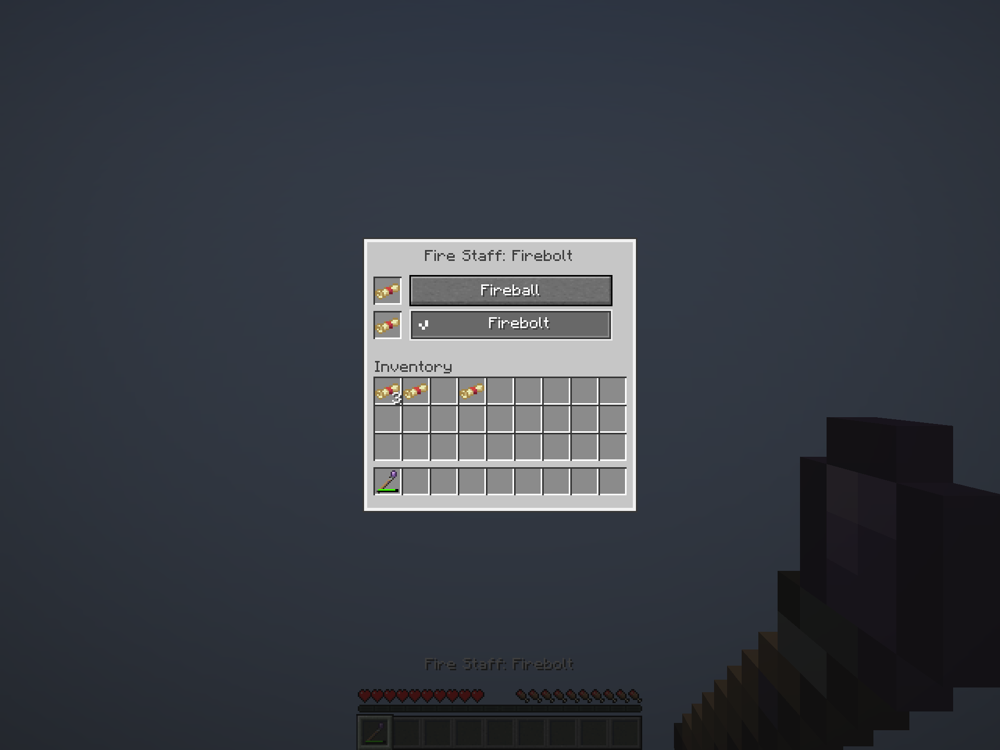

# Identified Staff scrolls and selected button · October 7, 2026

**Historical checkpoint:** the identification gate and selected styling remain current; the flat one-point wear shown here is superseded by [rarity-based wear and empty-slot verification](../native-staff-rarity-wear/README.md).

Staff insertion now requires the inserting player to have identified the scroll's spell, in addition to matching the staff's positive native base affinity and valid shaping. The same server check covers clicks, replacement, dragging, hotbar swapping and Shift-click. The client also rejects unknown-scroll prediction using its private knowledge snapshot. Rejection leaves the item where it was and adds no instructional UI, chat or actionbar text. Saved or borrowed bindings remain removable; this changes no saved-item or protocol format.

The selected spell button now stays inset with a bright outline and pixel checkmark. Ordinary unselected buttons retain the native Minecraft texture, hover/focus and disabled treatment. Selection still updates both menu and item names, spends no resources and keeps the menu open. The previous bullet-only selected treatment was too subtle; the persistent button shape and checkmark now distinguish it without relying on hover. Both GUI scales 3 and 2 were visually inspected, including known spell selection and long italic augment names. The check has space beside its text, rows remain the same height and the outline stays visible at the smaller scale.

The [client manifest](verification.json) records **50 passing actual client/server checks and nine unedited Minecraft framebuffers**. It verifies an unknown Fire Arrow scroll cannot enter a Fire Staff even through a real Shift-click packet, and an identified Heal scroll also rejects because it lacks the affinity. Known matching sources still transfer exactly, including augments, scrolled slot indexes, stack distribution and carried-item cleanup. Active styling follows selection, item/menu names agree, and a real cast uses ordinary mana and one wear without identifying the rejected spell.

The [build manifest](build-verification.json) pins the jar and relevant source hashes. **173 unit tests and 19 focused Staff Minecraft tests passed**, alongside production packaging, both Staff authoring checks and Kithkyn platform compatibility. The new world test checks unknown-scroll clicks/replacement, drag, hotbar swap, Shift-click, separate players' knowledge and identifying a spell while the same menu stays open. The known transfer, wrong-affinity, offhand, stale/forged menu, unavailable-definition, construction, payment and continuation fixtures still pass. [Staff design](../../design/staff-crafting.md) records the accepted rule.

The [previous inventory-menu captures](../native-staff-menu/README.md) are historical evidence from before the identified-only correction. This run uses a fresh world, exercises no optional viewer dependency, and verifies no remote human multiplayer or full shared world suite. It builds the shared checkout locally; it does not publish or replace the Prism artifact.
