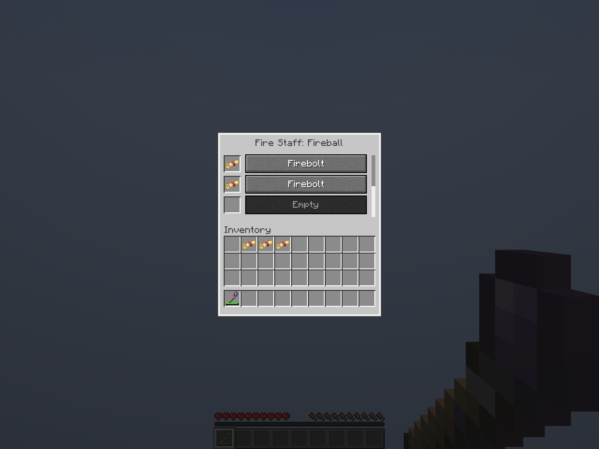

# Staff rarity wear and empty slot · October 7, 2026

Staff durability now decreases by the trusted native spell rarity: **Common 1, Uncommon 2, Rare 3, Mythic 4** per paid initial cast. These are starting playtest values. The current maximum durability is **40/80/120** for two/four/six slots. Payment and wear commit together before the volatility roll, so a paid chaotic forfeit spends the same rarity-based amount, once. Failed payment and canceled preparation use none; paid continuations and selection add none. Final use still resolves even with fewer remaining durability points than the spell needs, breaking only the held staff. The immutable source snapshot, normal spell costs, identification restrictions, item art and saved/protocol formats retain their existing behavior.

An empty menu row has a blank ordinary Minecraft item square and a dimmed, disabled **Empty** selection button. Clicking that button leaves the current active spell unchanged. Its item square still accepts identified scrolls with the staff affinity. This records the existing appearance rather than adding explanatory UI.

**Verified:** production package, **173 unit tests**, **22 focused Staff world tests**, both Staff authoring checks and Kithkyn platform compatibility passed. [Build evidence](build-verification.json) pins source/package hashes and tuning. The three added world cases exercise actual Common Shield, Uncommon Shield, Rare Counterspell and Mythic Abyssal Shroud casting; a temporary trusted Volatile contribution forces a real Mythic chaotic outcome; failed payment preserves wear; final chaotic offhand use with only two durability remaining breaks that staff while preserving a spare. No loaded catalog definition or probability policy is modified for the tests. Existing preparation, continuation, source locking, transfer, identification and ritual tests remain passing.

The [native client manifest](verification.json) has **52 passing client/server checks and ten unedited Minecraft framebuffers**. It verifies the empty row and its disabled click, exact two-point wear on real Uncommon Fireball use, both GUI scales 3/2, persistent selected styling, exact transfers and matching/identification restrictions. The empty-slot framebuffer was visually inspected. The native client exits normally.

The earlier [fixed-wear menu checkpoint](../native-staff-known-scrolls/README.md) remains historical evidence. This builds the shared checkout locally without publication or Prism installation; it does not claim another full shared world suite, Kithkyn co-loading or remote human multiplayer. [Staff design](../../design/staff-crafting.md) records the current rules.
