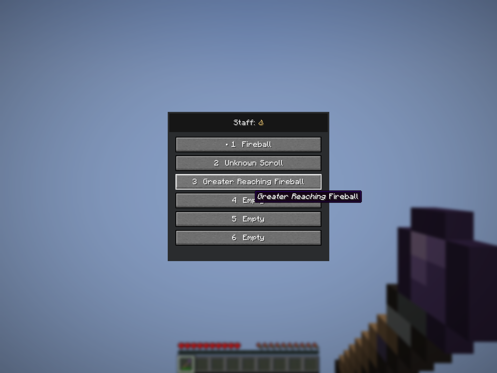
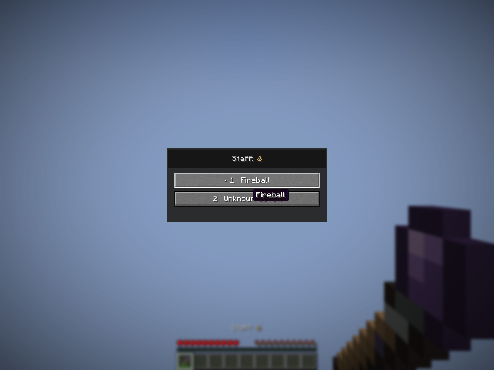
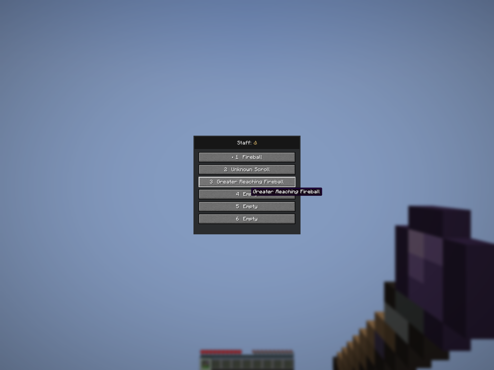
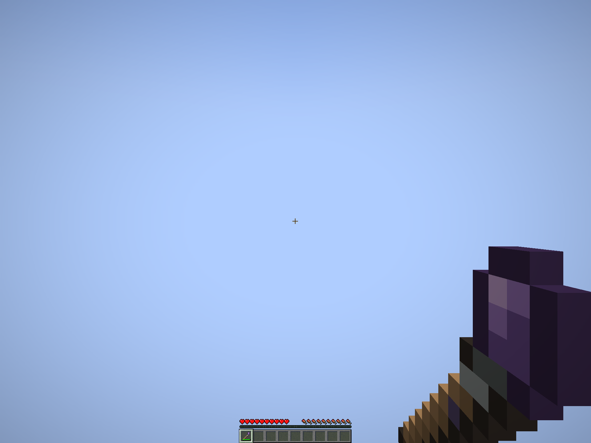
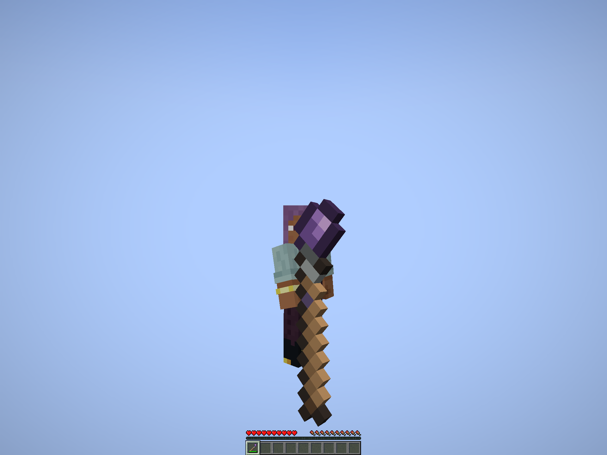
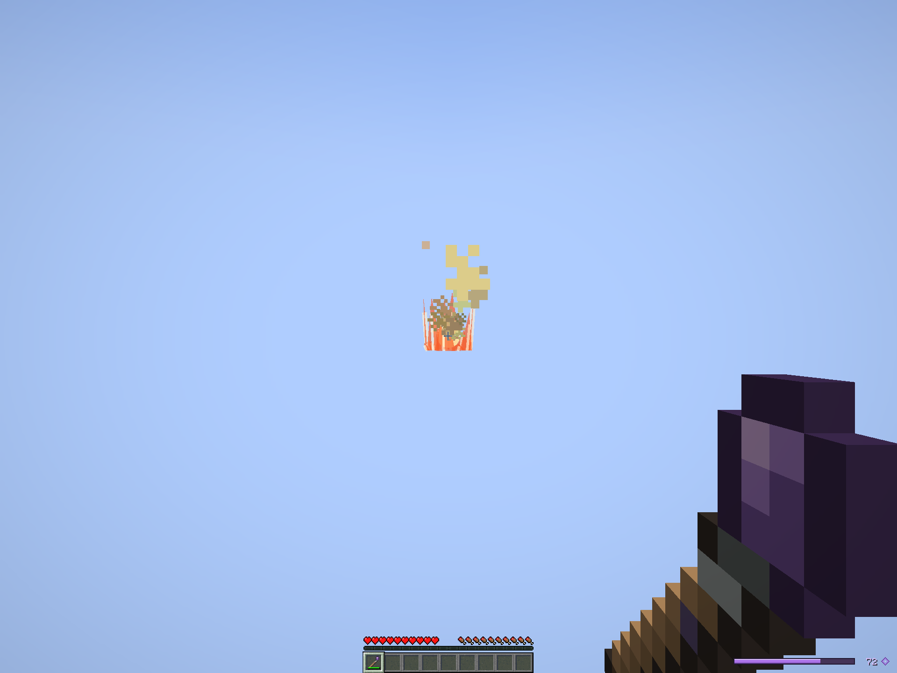

# Native staffs · final client review

These six images are unedited Minecraft 1.21.1 / NeoForge 21.1.72 framebuffers from a completed native client run on October 7, 2026. They show the actual staff item, selection menu and normal casting, rather than a browser illustration. All six were visually inspected. The [capture manifest](verification.json) records 17 passing checks, image dimensions and hashes of the loaded model and texture.

The integrated server supplies the staff, sends the real menu payload and receives real slot-selection and use-item packets. Selecting a slot spends no durability. A normal Fireball cast changes mana from 100 to 72 and used durability from five to six. The unknown Firebolt binding remains unidentified. Both two-slot and six-slot menus retain fixed-height buttons; known augments, unknown names and empty destinations remain distinct.

## Six slots

The cursor's hover tooltip shows the full italic augment name. Long button labels use an ellipsis. The corrected header is crisp and the panel is drawn only once.

## Two slots and smaller menu scale

The game window is 960×720 logical pixels, with a 1920×1440 framebuffer. GUI scale three yields a 640×480 interface; scale two yields a 960×720 interface. These are native GUI-scale comparisons, not mobile browser previews.

## Held item

The item uses an original 16×16 wood, iron/thread and Amethyst texture. First-person framing keeps the crystal head visible. The third-person transform holds the longer shaft upright. The floating capture player makes its full extent visible above the flat ground. The owner has not selected this initial art as a final design.

## After normal casting

The [gameplay verification](../../verification/native-staffs-2026-10-07/README.md) separately covers recipes, atomic commitment, normal payment/recovery, deterministic wear, cancellation, final uses and paid recasts. The earlier [menu iteration](../native-staffs-final/README.md) and [interrupted appearance iteration](../native-staffs-held/README.md) are historical evidence; this completed run is the current presentation record.

This is the shared development checkout. Staff recipes, 40/80/120 durability and artwork remain playtest tuning. No staff release has been published or installed in Prism by this chat. Optional recipe-viewer entries, Kithkyn co-loading and remote human multiplayer are outside this verification.
