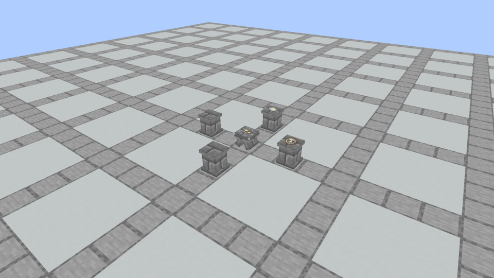

# Missing outer Plinths · native inspection

October 7, 2026. Minecraft 1.21.1, NeoForge 21.1.72, Java 21; 960×540 actual native framebuffer before GUI rendering. The separate fresh capture world has a Flicker reference on a Spellstone, four inner Cross Plinths, Paper and Clock, and no outer ring. Production activation returns `NEEDS_PLINTHS`.

The pale rune-colored ring reaches beyond the existing four Plinths, contracts, then disappears. The center remains stationary, the reference stays flat, and offerings do not lift or shake. The capture records 51 native frames over 4.04 seconds, with no output or consumption. `expanding.png`, `extended.png`, `collapsing.png` and `settled.png` preserve native frames 5, 14, 21 and 35. `preview.gif` is a direct frame sequence; the original PNGs were not recolored, repainted or resized. [Capture metadata](capture.json) preserves geometry, outcome, source/asset hashes and timestamps.

The visual was inspected at those four phases. Remote multiplayer and a running Prism instance were not inspected or replaced. [Verification](../../verification/ritual-capacity-2026-10-07/README.md) records the unit/world checks and staged review build.
