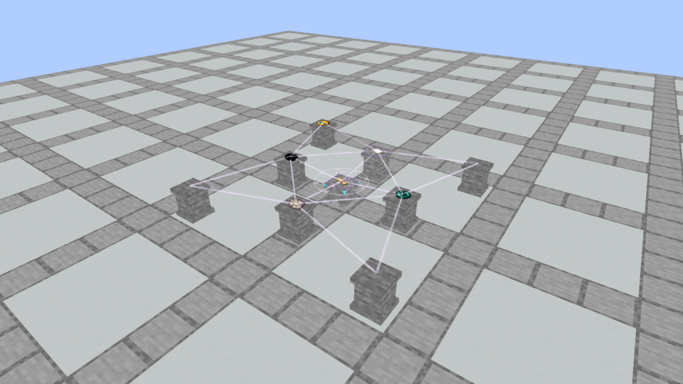

# Visual ritual feedback · October 6, 2026

Approved refinement: ritual connections, activation sigils and motes use the Spellstone rune core’s pinkish-white `#f4e5ff`. Missing-item hints retain the native baked shape and texture cutout, rendered opaque black; sampled item color and gradients are removed. Ordinary offerings retain their real colors.

Rituals no longer print instructions, authored placement clues, safety notices, shaping/cost calculations, success/status messages or errors. Scroll casting, identification, recasts, cooldowns and rejections are silent. Travel-device error messages and mana-restoration notices are removed too. Native sensing uses private visual rings or health-colored outlines with condition motes instead of text. Operator commands still return development information.

Scroll tooltips contain exactly one line: their name. Identification remains per player; unknown scrolls keep **Unknown Scroll**, identified scrolls expose their name, and named augments retain italic adjectives. Normal and advanced tooltips conceal all additional data. Recipes, risk, resources, reservation/consumption, knowledge, mana synchronization and dropped-result behavior are preserved.

## Actual Minecraft views

These are Minecraft framebuffer exports, not browser mockups. The final ritual captures ran beyond 160 game ticks: hints produced no output; success produced one normal dropped scroll while retaining the reference. The first `native/` pass retains the preceding purple activation ring; `native-final/` is the approved uniform palette.

The actual JEI client verifies eight tooltip cases: normal/advanced flags for unknown shaped, identified base, identified shaped and component-free scrolls. Recipe memory and identification remain separate, and viewer lookup checks pass. [Tooltip evidence](tooltips/jei/capture.json), [final hints](native-final/vestige-ritual_hints-ritual-0/capture.json) and [final success](native-final/vestige-ritual_reference_success-ritual-0/capture.json) retain the native metadata.

## Verification and install

- Build, Kithkyn compatibility and all 104 unit tests pass.
- All 72 selected apparatus/ritual/scroll/shaping/device world tests pass. Their ritual players reject any emitted chat, actionbar or system text.
- The final cooldown/invalid-scroll and magic-sensing tests pass together, giving 73 unique world tests across the two selections. The first combined run found a temporary shield left active by the new test; explicit fixture cleanup corrected that test interference.
- Author checks pass for all 36 finishes/72 apparatus models and recipes, plus 214 explicit ritual recipes.
- Packaged code and resources match both final ritual captures: 14 hashes per capture. [Package verification](package-verification.json) records the artifact hash.

The verified jar is installed in **Kithkyn Testing**, with the prior jar backed up outside `mods`. Other mods, including JEI, are unchanged. Minecraft must restart to load it. The existing 21.1.248 profile was not relaunched; native tests/captures use the pinned 21.1.72 development engine. Sensing states are covered by world tests; the new private sensing ring/status overlays were not separately captured. [Verification](verification.json) and [installation record](prism-install.json) document the actual limits.
