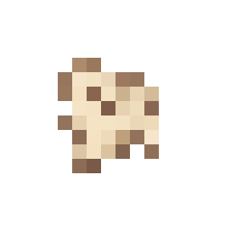
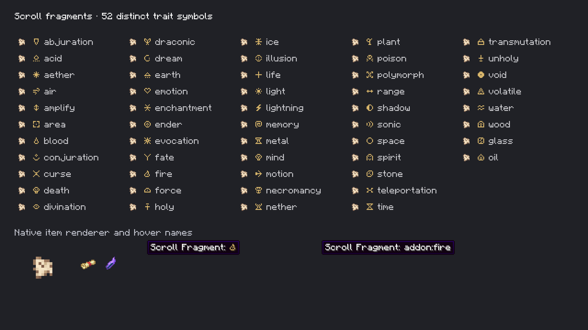
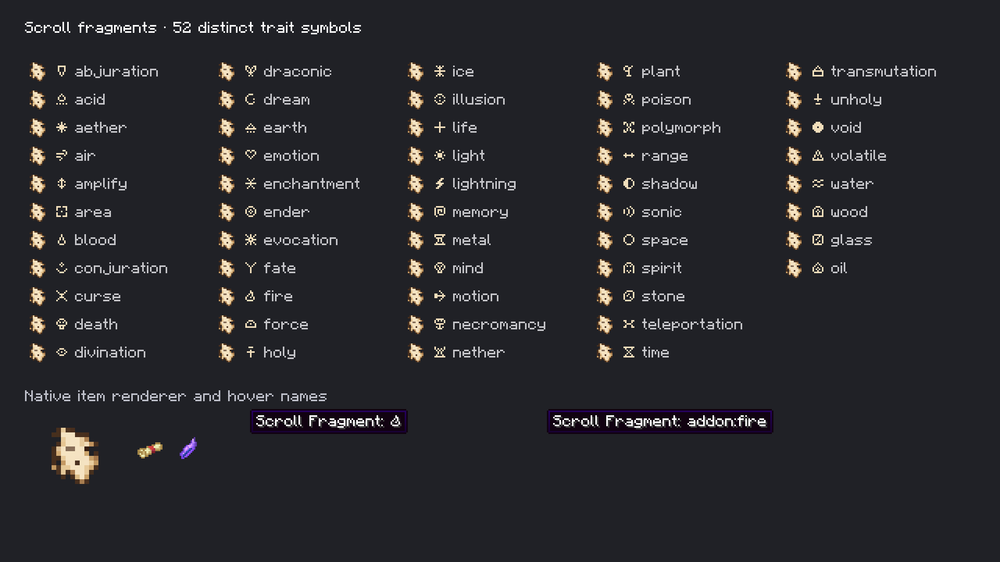

# Native scroll fragments

**Final presentation approved and locked October 6, 2026:** the tiny irregular torn-corner scrap, 52 distinct trait glyphs and muted-gold symbol after **Scroll Fragment:**. The [approval record](selected-v2/approval.json) pins the accepted assets and verified package.

October 6, 2026. The owner's torn-paper direction replaces the temporary vanilla Paper/Amethyst overlay with one transparent 16×16 parchment scrap.



The [packaged texture](../../../src/main/resources/assets/vestige/textures/item/scroll_fragment.png) uses the owner's approved [irregular torn-corner revision](options-v1/02-torn-corner-v2.png), independently generated and edited with OpenAI's built-in image generation tool. Its [exact editing prompt and mode](options-v1/02-torn-corner-v2-prompt.txt), the [four original options](options-v1/README.md), and the first [prompt](imagegen-prompt.txt)/[generated source](generated-source.png) are retained. `tools/prepare_scroll_fragment_texture.py` thresholds only the generated alpha fringe, measures the opaque bounds, adds a transparent margin and imports the approved revision with nearest-neighbor sampling. It verifies binary alpha and exact output bytes with `--check`. The current opaque bounds are 7×8 pixels (41 opaque pixels) inside a 16×16 texture, preserving a tiny scrap rather than a page-sized item. This preview shows actual final pixels, not Minecraft rendering.

Resolved items display **Scroll Fragment: [symbol]**. All 50 documented built-in traits and the Glass/Oil traits used in shipped Pathfinder spells have distinct original 7×7 pixel glyphs. They share the custom `vestige:fragment_symbols` bitmap font, with stable explicit private-use characters. Only the symbol argument uses that font and muted gold (`#d6b46a`); ordinary text retains the usual Minecraft font and color. The names on the inspection sheet are development legends and do not appear in ordinary fragment tooltips.

`tools/fragment-symbols.json` is the editable glyph source. `tools/author_fragment_symbols.py --check` validates the union of the documented catalog and actual shipped spell traits, unique character assignments, unique visible masks and generated font/catalog/texture bytes. It pads unused atlas cells with null characters. No Minecraft font artwork is copied.

Unassigned/pending fragments retain **Scroll Fragment**. Traits without an authored glyph fall back to their name; foreign namespaces retain their full ID so `addon:fire` never borrows the built-in Fire mark. Persisted full trait IDs, dismantling probabilities, stacking, discovery matching and recipes are unchanged. No registry or saved-data migration is required.

## Owner-selected fragment and colored names



The current [native framebuffer](selected-v2/native.png) shows all 52 muted-gold trait glyphs, the small fragment silhouette, and the actual **Scroll Fragment: [Fire symbol]** hover. Prefix text stays white; the symbol uses `#d6b46a`. The foreign `addon:fire` fallback remains ordinary text. These are actual Minecraft item/font/tooltip renders, with native scroll and Attunement Shard sprites alongside the enlarged fragment for scale comparison. [Loaded resource metadata](selected-v2/capture.json) records the color and exact hashes of all five fragment resources. The original full-frame pixels are archived unchanged.

The [current verification archive](selected-v2/README.md) records successful Java 21 packaging, Kithkyn compatibility and all 104 unit tests. The final jar's fragment resources and four class files match the inspected client. It also records the compilation-only generated collision initializer repair needed to unblock the shared project's build, and the resolved initial concurrent Standing Stone test failures. Current package: `run/scroll-fragments-package-selected-v2/vestige-0.1.0.jar`.

## Native inspection of the first implementation

The opt-in `fragments` client capture renders every symbol, actual fragment items, normal fragment hover names and the foreign-name fallback through Minecraft. It creates no world and does not alter existing saves. Run under Java 21:

```bash
./gradlew --project-cache-dir run/scroll-fragments-cache -I docs/art/scroll-fragments/isolated-build.gradle test --tests com.quzzar.vestige.apparatus.FragmentSymbolsTest build verifyKithkynCompatibility
./gradlew --project-cache-dir run/scroll-fragments-cache -I docs/art/scroll-fragments/isolated-build.gradle runEffectsCapture -Pcapture_kind=fragments -Pcapture_directory=run/scroll-fragments-capture -Pcapture_output=run/scroll-fragments-native -Pwith_kithkyn=false
```

Keep both the build directory and project cache separate from other jobs. Output-directory isolation alone does not isolate Gradle's stale-output cleanup: another build using the same project cache can remove the prior compilation directory. Do not rebuild the same output while its client is running. Verification for this task uses a private temporary build/cache/client directory and archives the results below.



This historical [native screenshot](native.png) is the unchanged 1920×1080 Minecraft framebuffer from the first texture implementation, before the owner selected the smaller torn-corner revision and colored name symbols. All 52 glyphs and original paper items were visually inspected, alongside the actual Fire fragment hover and foreign-name fallback. The two bottom hovers confirm ordinary text uses Minecraft's default font and only the authored symbol uses the custom font. The [capture metadata](capture.json) records the exact resource hashes loaded by that client. The capture requires this screen to render in the current frame, avoiding an earlier screenshot taken during the loading-overlay transition.

Java 21 packaging and Kithkyn platform compatibility pass. The two focused [fragment tests](fragment-tests.xml) verify every packaged glyph's distinct visible raster and font assignment, plus unknown/foreign namespace fallbacks. Authoring checks pass for all catalog/shipped trait coverage and exact font/texture drift. [Package verification](package-verification.json) compares the inspected resources and fragment class bytes with the jar. Raw [build](validation.log) and [client](native-client.log) logs are retained. The broader unit/world suites were not rerun to completion for this presentation-only change; no mechanics or world-behavior verification is claimed. This task does not install a jar into Prism.
