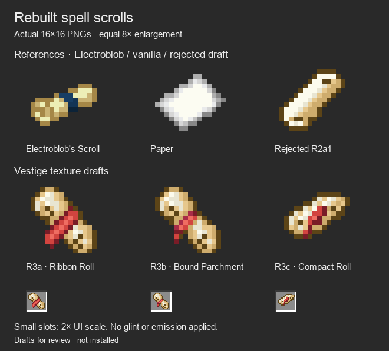

# Spell scroll silhouette rebuild

**Superseded October 6:** the owner selected [Electroblob's original parchment with a red binding](../scroll-red-binding-v5/README.md). These independent R3 silhouettes remain historical drafts; they are not selected production art.

October 6, 2026. Native 16×16 review assets; not installed.

The owner selected **S1a1 — Sharp Tip** as the final Attunement Shard design and rejected the R2a scroll family because it did not read as a scroll. The shard is frozen at [its selected PNG](../native-item-textures-v3/textures/shard_sharp_tip.png); it is not revised in this pass.

The owner supplied a pixel-art reference with broad rolled ends and a red ribbon, and asked what Electroblob's scroll looks like. [Electroblob's original item sprite](https://github.com/Electroblob77/Wizardry/blob/fe5d05a7a134836dd972e3680a900619c7e9c134/src/main/resources/assets/ebwizardry/textures/items/scroll.png) is also 16×16. Its broad parchment silhouette and contrasting blue band were inspected from the original unchanged PNG. Its native alpha is preserved. That artwork belongs to Electroblob's Wizardry and is included only as a labeled comparison reference, outside packaged resources.

| Draft | PNG | Direction |
| --- | --- | --- |
| R3a — Ribbon Roll | [scroll_ribbon.png](textures/scroll_ribbon.png) | Diagonal broad rolled ends, dark curl openings and a red ribbon with a trailing end |
| R3b — Bound Parchment | [scroll_cord.png](textures/scroll_cord.png) | Same rolled-paper direction with a narrower tie and less ribbon coverage |
| R3c — Compact Roll | [scroll_wide_roll.png](textures/scroll_wide_roll.png) | Shorter broad roll, shallower diagonal and small binding |

These are fresh independently authored silhouettes. The reference's tied-parchment cues guide the work; its pixels are not copied, resampled or traced. The attachment's stone, watermark and exact colors are not extracted. Red is a cosmetic ribbon, not a school/element/rarity indicator. All scrolls remain free of purple.

## Sources and checks

[The existing native pixel author](../../../tools/author_item_texture_refinements.py) emits these with `--pass-number 4`. [Pixel source](pixel-source.json) records complete literal grids, nine-color palettes, dimensions, hashes and the pinned upstream reference. Colors are drawn from vanilla Name Tag, Bone and Red Dye. Each sprite is exact 16×16 RGBA with binary alpha and no more than ten opaque colors. The author verifies the upstream reference's Git blob hash, as well as native pixel/file/metadata drift.

The sheets use equal 8× nearest-neighbor enlargement and small 2× inventory-like slots. Both the dark sheet and [light sheet](scroll-light.png) were inspected. These are texture comparisons, not Minecraft captures. [Texture archive](texture-drafts.zip) contains the three new sprites and their source grids; it excludes upstream reference artwork.

**Verified:** all three refinement passes (`--pass-number 2`, `3`, `4`) pass their authoring checks; Python compilation and whitespace checks pass. Selected S1a1 remains byte-identical to its approved draft. No final scroll is selected. Production item resources, gameplay, Spellstone body, Astral Seal and Prism installation are unchanged; client appearance verification remains due after integration.
