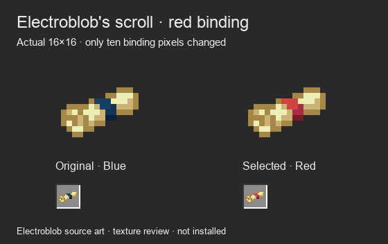

# Selected scroll: Electroblob parchment with red binding

**Integrated October 6:** this exact sprite is now a native item resource with 1.125× inventory display scale. [Native item captures](../attuned-items-native/README.md) verify the packaged scroll and selected shard. The earlier pending-integration notes below describe the recolor review boundary; Prism installation is still pending.

October 6, 2026. Owner-selected art; native game integration pending.

The owner requested Electroblob's actual scroll with its blue binding replaced by red. [The selected native texture](textures/spell_scroll.png) retains the original **16×16** silhouette, parchment and transparency. Exactly ten opaque binding pixels change across three shades; every other RGBA cell, including invisible source RGB values, remains identical.

The [source artwork](https://github.com/Electroblob77/Wizardry/blob/fe5d05a7a134836dd972e3680a900619c7e9c134/src/main/resources/assets/ebwizardry/textures/items/scroll.png) is by Electroblob, pinned to Git blob `13d56d1bad50f42b6283d9041ad4eacd01c3a572`. This is a credited recolor, not independently authored scroll artwork. The original repository [license](../../../LICENSE.md) remains unchanged. See [credits](../../../CREDITS.md).

| Original opaque color | Red replacement | Pixels |
| --- | --- | --- |
| `#173e65` | `#d2443f` | 5 |
| `#133455` | `#a82c47` | 3 |
| `#0c2338` | `#791c27` | 2 |

The owner's earlier red-ribbon image remains an alternate visual reference; it has not been imported, traced or stripped of its watermark. The native Electroblob recolor is the selected direction, superseding the independent R2/R3 scroll studies. **S1a1 — Sharp Tip** remains the selected Attunement Shard without pixel changes.

## Authoring and verification

[The existing native author](../../../tools/author_item_texture_refinements.py) reproduces the selected scroll with `--pass-number 5`. [Pixel source](pixel-source.json) records every native RGBA cell, the recolor palette, source/output hashes and the ten changed coordinates. A source-hash check and full pixel comparison enforce the exact recolor. Both [dark](comparison-dark.png) and [light](comparison-light.png) boards show the actual PNG at equal 8× enlargement plus 2× inventory-like slots. Both were visually inspected. These boards are sprite comparisons, not client captures.

The built-in imagegen edit was tried using [this exact prompt](imagegen-prompt.txt). Its [enlarged output](generated-preview-not-native.png) altered parchment/detail and therefore is archived only as an excluded preview. It was not reduced into the native sprite. The final game-resolution asset is reproduced from the literal native RGBA source grid with only the requested palette substitution.

**Verified:** authoring checks pass for 16×16 size, binary alpha, six visible colors, pinned source artwork, exact ten-pixel recolor and PNG/grid/hash consistency. Earlier pass checks still pass. Python compilation and whitespace checks pass. Production item models/textures, native gameplay and Prism remain unchanged; packaging and native client appearance verification remain due when these selected textures are integrated.
