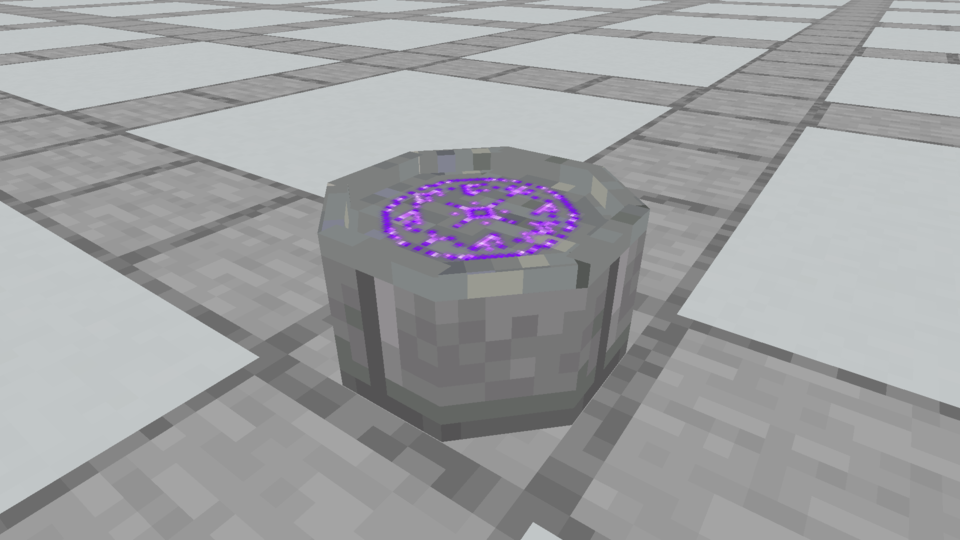
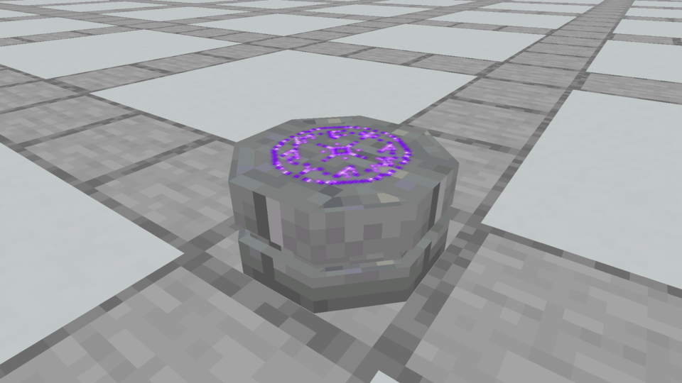
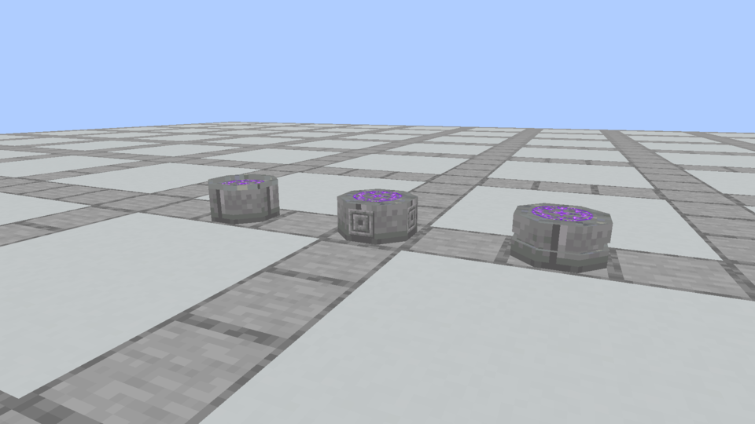

# Sealstone · add character with one clear detail

The owner roughly preferred the Sealstone silhouette, but found the bare octagonal monolith too basic. These refinements retain that body and introduce one addition each. They explore a middle ground between the plain preview and the rejected many-piece altar.

**Later review:** the purple raster rune shown here was also rejected. [Three continuous native rune treatments](../spellstone-rune-options/README.md) now compare illuminated lines, a floating seal and a moving trace, with daytime/nighttime recordings. The body details below remain unchosen alternatives.

## Rimmed



A narrow, eight-sided stone lip frames the inscription. Its scroll bed stays flat at y7/16, while the rim reaches y8/16. Fifteen solid cuboids: seven for the body and eight plain border pieces. No foot tiers, corner jewels or bevels.

## Engraved


Four carved medallions on the long side faces give the stone a worked, ancient appearance. This retains the original seven solid body cuboids and adds four flat texture plaques. The existing vanilla Chiseled Stone Brick tile gives them an inset-looking border; there is no new gemstone or raised ornamental frame.

## Banded



One shallow recessed belt divides the body into two connected stone masses. The belt is 1.25 model units tall and inset 0.75 units per side. Twenty-one simple cuboids form the three octagonal sections. This costs more geometry than the other options, but creates a clear profile without the old stepped foot and crown settings.

## Actual native comparison



All three use the same vanilla Stone Brick body, Polished Andesite top and original native purple rune. Individual views use identical cameras, lighting and scale. Vanilla material tiles remain 16×16; the existing separate rune overlay is preserved. Images are unchanged Minecraft framebuffer captures, not illustrations.

These are capture-only alternatives. Production models, collision, recipes and the Prism installation remain unchanged. The isolated pack uses three registered Spellstone variants as carriers with the same preview finish; those carrier identities are documented in [the ledger](designs.json). Full collision/material-variant integration follows the owner's visual choice. The new carved faces are visual suggestions, not imbuement sockets.

`tools/author_sealstone_refinements.py` authors the models and isolated resource pack. `--check` verifies deterministic generation, bounds, legal rotations, UV/texture references and the unchanged rune. [Native evidence](capture-evidence.json) pins model and frame hashes. The native capture build compiled and completed; the four final views were inspected. No gameplay or production shape change was made, so world behavior tests were not rerun.

## Review trail

- The first three designs established the owner's preference for the Sealstone. Its plain surface lacked a distinguishing detail.
- Each refinement adds one visual idea instead of restoring all the rejected moldings and gemstone settings. The rim changes the outline, the engravings change the surface, and the belt changes the profile.
- The original plain model and earlier rejected models remain archived. No candidate has replaced the installed jar during this review.

Reproduce:

```bash
python3 tools/author_sealstone_refinements.py
./gradlew runEffectsCapture -Pcapture_kind=apparatus -Pcapture_spells=spellstone_design_tablet,spellstone_design_altar,spellstone_design_seal,spellstone_designs -Papparatus_preview=seal-refinements -Pcapture_material=stone_bricks -Pcapture_seconds=2 -Pcapture_output=build/sealstone-refinements-fresh
```
