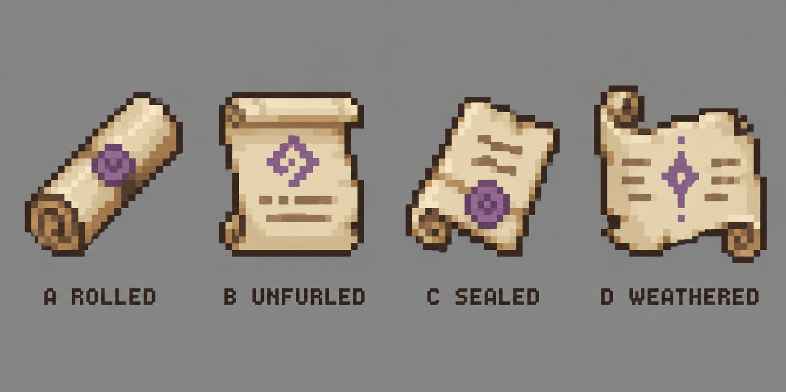

# Spell scroll appearance study

**Superseded review:** the owner preferred A's rolled silhouette, requested further texture variations and rejected these sheets' level of detail as insufficiently Minecraft-like. See [the exact 16×16 drafts and vanilla comparisons](../native-item-textures/README.md). B was only an agent recommendation, not the owner's choice.

October 5, 2026. **Concepts for review; no production texture selected or installed.** The owner requested a proper spell-scroll texture and cited Electroblob's scrolls as a visual reference. The current native item model still layers vanilla Paper with Amethyst Shard. These four directions replace that placeholder in the concept study only.

| Option | Direction |
| --- | --- |
| A — Rolled | Compact diagonal parchment roll with a small violet sealing mark |
| B — Unfurled | Broad parchment face, opposing curls and an angular violet inscription |
| C — Sealed | Partly opened scroll with a violet wax impression |
| D — Weathered | Unequal curls, selective damaged edges and ancient inscription |

B is the agent's recommendation because its broad inscription surface should read clearly resting flat on the Spellstone. This is not an owner selection. Shapes, marks and coloring remain open for iteration. The Spellstone's current preferred silhouette is the notched monolith; no proportion variant is selected. Its existing native Astral Seal remains accepted.

## Reference and authorship

[Electroblob's original scroll texture](https://github.com/Electroblob77/Wizardry/blob/1.12.2/src/main/resources/assets/ebwizardry/textures/items/scroll.png) and [Scrolls documentation](https://github.com/Electroblob77/Wizardry/wiki/Scrolls) were reviewed. The source texture was viewed on GitHub, not imported into Vestige or supplied to the generator. The new artwork was produced independently with the built-in image generation tool. Its complete prompt is preserved in [generation-prompt.txt](generation-prompt.txt). The generated contact sheet was copied unchanged from the tool's output.

## Verification boundary

The generated sheet has four labeled, visually distinct parchment directions and has been visually inspected. It is an enlarged art study, **not four exact 16×16 PNG textures**. The selected direction must still be authored into an exact transparent 16×16 item sprite, checked at inventory scale, and inspected in the actual client in hand and flat on the Spellstone. This study changes no native assets, models, scroll knowledge states, rarity behavior or gameplay. No packaging or gameplay test is claimed.
