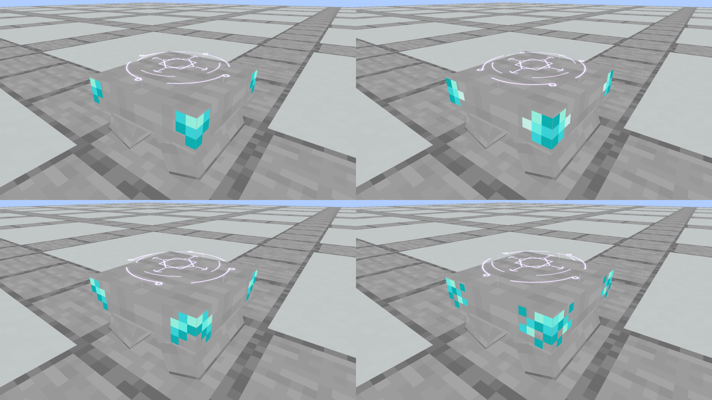
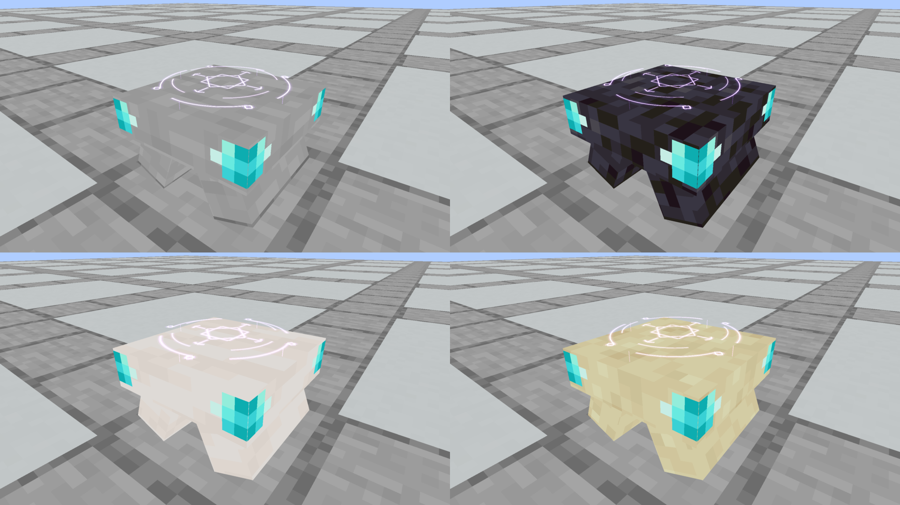

# Spellstone vertical corner studies

**Selected:** the owner locked [the smaller A corner chip](locked-a/README.md). It is now the production treatment across all 36 stone finishes. This page retains the earlier comparison studies.

**Latest revision:** the owner liked these patterns and requested smaller Diamond details. The [updated seven views](smaller-corners/README.md) keep the patterns and reduce their width and height by 35%. This page preserves the original larger patches as comparison evidence.

The owner clarified that the four details belong at the **vertical edge corners** of the smaller top stone, wrapping onto the two adjacent side faces. Side-center gemstone icons and connected edge lines were rejected. These four alternatives use coarse pixel patches made from the original 16×16 Minecraft Diamond tile colours. There is no generated bitmap or item sprite. All four first views use Smooth Stone, so the corner patterns can be compared directly.

| Option | Detail | Native view |
| --- | --- | --- |
| A | Small irregular corner chip | [Smooth Stone](native/corner_chip.png) |
| B | Compact stepped inset | [Smooth Stone](native/corner_notch.png) |
| C | Broken diagonal vein | [Smooth Stone](native/corner_vein.png) |
| D | Scattered crystal flecks | [Smooth Stone](native/corner_crust.png) |

The same B pattern is also shown on [Polished Blackstone](native/corner_blackstone.png), [Smooth Quartz](native/corner_quartz.png) and [Smooth Sandstone](native/corner_sandstone.png). These use unmodified native material tiles at their original pixel scale.

All seven views share the current three structural stones: two 3.5-unit-thick supports leaning at native 22.5 degrees, and a 12×12 top, 3.25 units thick, ending at y8/16. The existing Astral Seal is unchanged. Each of four vertical corners has a matching pattern on both adjacent side faces. The center of each side and the whole top surface remain bare stone. Decorative planes add no collision or additional structural cuboids.

**Review scope:** these are isolated native resource-pack studies. No corner treatment or replacement finish has been selected or installed. Registered material IDs act as preview carriers only; production models, recipes, collision, scroll placement and Prism installation retain their existing bytes. The earlier side-center sprite remains a rejected implementation baseline pending selection of its replacement.

[Design ledger](designs.json) records every pattern, carrier, dimension and native texture hash. [Capture evidence](capture-evidence.json) pins the actual loaded models, vanilla tiles and renderer. Native images are unchanged framebuffer captures; recordings retain measured frame timing. Comparison sheets simply tile those unchanged frames.

**Verified:** Java 21 build and Kithkyn compatibility pass with 95 passing unit tests. All seven native views were visually inspected, and their videos encode/decode at 960×540. Author checks and the production apparatus audit pass. Each study's first three structural elements exactly match production. [Verification](verification.json) records these checks and confirms every pixel of each comparison panel matches its original poster. World tests were not repeated for these isolated art previews.





Reproduce the current smaller revision (the original larger models and captures above remain archived):

```bash
python3 tools/author_spellstone_corners.py
python3 tools/author_spellstone_corners.py --check
./gradlew build verifyKithkynCompatibility
./gradlew runEffectsCapture -Pcapture_kind=apparatus -Papparatus_preview=corner-details -Pcapture_spells=corner_chip,corner_notch,corner_vein,corner_crust,corner_blackstone,corner_quartz,corner_sandstone -Pcapture_seconds=3 -Pcapture_output=build/spellstone-smaller-corners-fresh
python3 tools/archive_rune_captures.py build/spellstone-smaller-corners-fresh --small-corners
```
