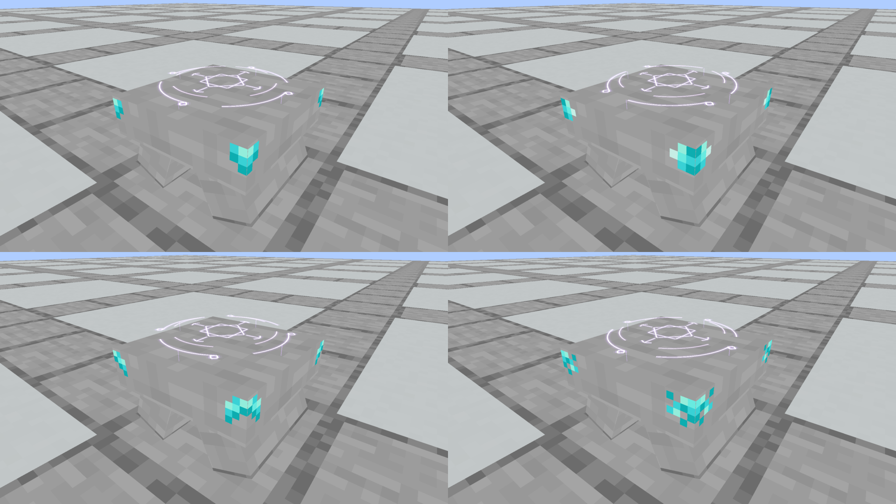
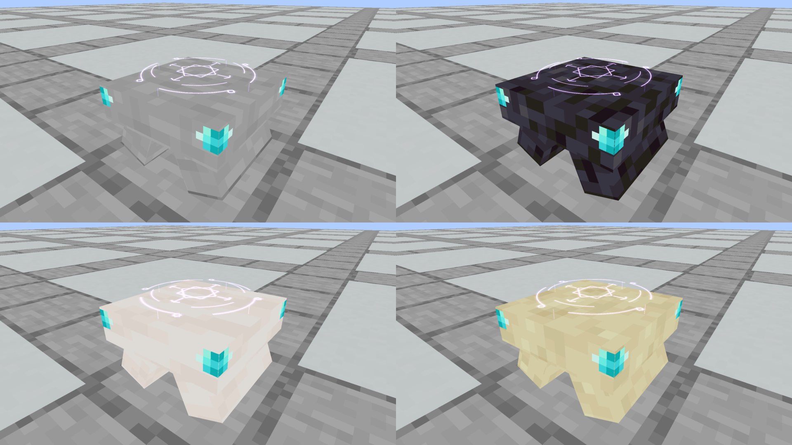

# Smaller Spellstone corner details

**Selected:** the owner locked A and requested native installation and ritual recordings. [Current production A and the review scene](../locked-a/README.md) supersede the unselected status below. This page preserves all four smaller studies as review evidence.

The owner liked the four native corner studies and requested smaller Diamond details. This revision scales every Diamond patch to **65% of its former width and height**, reducing coloured area by **57.75%**. The patterns, native Diamond colours, four vertical corner positions, upper anchors, stone body, camera and Astral Seal remain identical. More bare stone now surrounds each patch.

| Option | Detail | Native view |
| --- | --- | --- |
| A | Small irregular corner chip | [Smooth Stone](native/corner_chip.png) |
| B | Compact stepped inset | [Smooth Stone](native/corner_notch.png) |
| C | Broken diagonal vein | [Smooth Stone](native/corner_vein.png) |
| D | Scattered crystal flecks | [Smooth Stone](native/corner_crust.png) |

The B pattern is also shown on [Polished Blackstone](native/corner_blackstone.png), [Smooth Quartz](native/corner_quartz.png) and [Smooth Sandstone](native/corner_sandstone.png). The [larger first studies](../README.md) remain archived unchanged for comparison.

These are native capture resource-pack previews. No individual pattern or replacement finish has been selected for production or installed into Prism. The three structural stones, recipes, collision, scroll placement and Astral renderer have not been changed. No unit or world tests are needed for this isolated decorative scaling; model bounds, UVs, texture provenance and exact preservation of the shared body are checked during authoring and capture archiving.

[Design ledger](designs.json), [capture evidence](capture-evidence.json) and [verification](verification.json) record the revision and the actual loaded assets. Comparison sheets tile unchanged framebuffer posters.

**Verified:** the Java 21 native capture run passed. All seven fresh Minecraft views were visually inspected and all recordings encode/decode at 960×540. Loaded model, original vanilla texture and renderer hashes match. Independent model comparison confirms unchanged body, colours, patterns and renderer, exactly 65% patch dimensions and 42.25% coloured area. The original posters remain intact, and every comparison panel matches its new original framebuffer poster pixel for pixel.





Reproduce:

```bash
python3 tools/author_spellstone_corners.py
python3 tools/author_spellstone_corners.py --check
./gradlew runEffectsCapture -Pcapture_kind=apparatus -Papparatus_preview=corner-details -Pcapture_spells=corner_chip,corner_notch,corner_vein,corner_crust,corner_blackstone,corner_quartz,corner_sandstone -Pcapture_seconds=3 -Pcapture_output=build/spellstone-smaller-corners-fresh
python3 tools/archive_rune_captures.py build/spellstone-smaller-corners-fresh --small-corners
```
