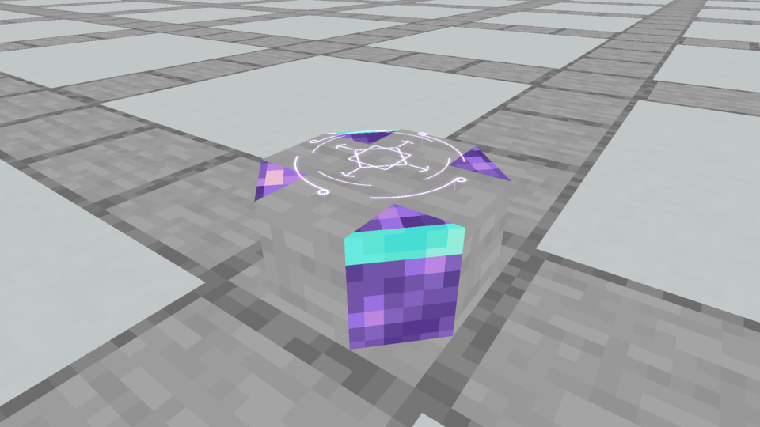
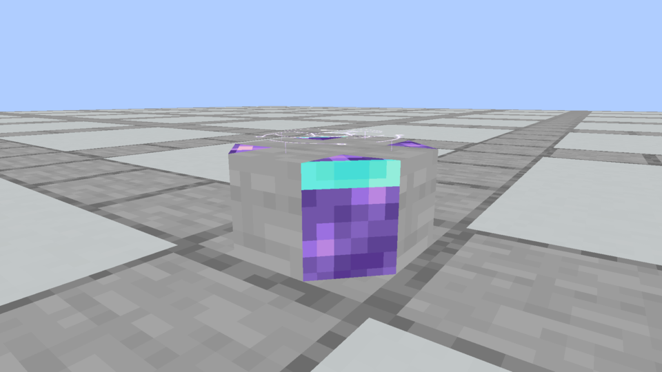
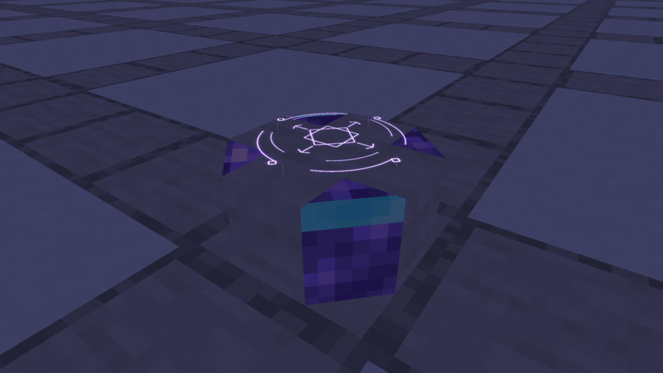

# Spellstone · crystal worked into the edges

**Rejected by the owner:** the crystal-edge body was disliked. The owner reset all body assumptions and retained only the top runes. The next authorized direction is the [fractured relic](../fractured-spellstone/README.md). This archive is historical evidence, not an accepted material/shape decision.

**October 5, 2026.** The owner rejected the continuous trim and separate Diamond settings, then selected the direction “a magical stone with crystal worked into its edges.” This is one fresh native model study beneath the accepted lowered Astral Seal.

One uninterrupted body rests directly on terrain, with quiet Smooth Stone faces and a flat receiving surface at y7/16. Faceted Amethyst forms the diagonal edge sections of the body. Diamond is cut into two opposing upper crystal edges, continuing from the top onto the side face. The crystal replaces sections of the mass itself. There is no continuous decorative border, gemstone collar, underbody band or separate bottom slab.

Eleven solid sections expose **26 static baked faces**. Two crystal edges are divided into lower Amethyst, upper Amethyst and a shallow upper Diamond facet. Hidden internal faces are omitted. The four remaining crystal/stone sections and central stone mass share the original low clipped silhouette. All three original vanilla texture tiles are **16×16**, with consistent texel scale on the short side faces. The accepted Astral renderer and its hover remain unchanged.

## Native Minecraft views



[Actual animation](native/crystal_stone.mp4)



[Lower-view animation](native/crystal_side.mp4)



[Night animation](native/crystal_night.mp4)

Two internal captures tested a crystal core underneath a stone cap, first with a separate dressed-stone foot and then without one. Inspection showed that both still read as stacked components; broad cyan stripes dominated the first. The published study moves crystal into the actual edges of one stone body and limits Diamond to shallow facets. Earlier internal captures remain in the build folder; the published evidence pins only the final model.

## Scope and evidence

These are actual Minecraft framebuffer captures. The development-only resource pack overrides the existing Stone Brick Spellstone model. It retains production collision and interactions for visual review. This body is not selected or installed; construction recipes, Plinths, shaping, the accepted Astral Seal and the current Prism jar are unchanged. Collision/scroll/water behavior for a promoted body still requires production integration and gameplay verification.

[Model](model.json) · [Design ledger](designs.json) · [Native capture evidence](capture-evidence.json) · [Verification](verification.json)

Reproduce in a fresh output folder:

```bash
python3 tools/author_spellstone_crystal.py
python3 tools/author_spellstone_crystal.py --check
./gradlew runEffectsCapture -Pcapture_kind=apparatus -Pcapture_spells=crystal_stone,crystal_side,crystal_night -Papparatus_preview=crystal-core -Pcapture_material=stone_bricks -Pcapture_seconds=5 -Pcapture_output=build/spellstone-crystal-fresh
python3 tools/archive_rune_captures.py build/spellstone-crystal-fresh --crystal
```
