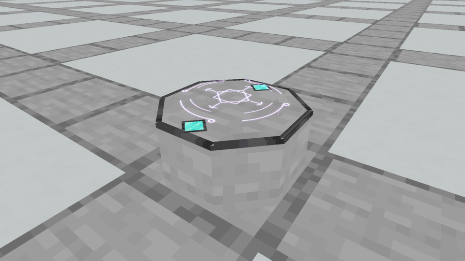
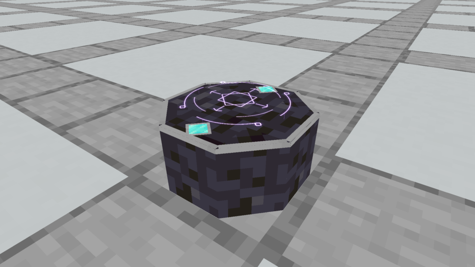
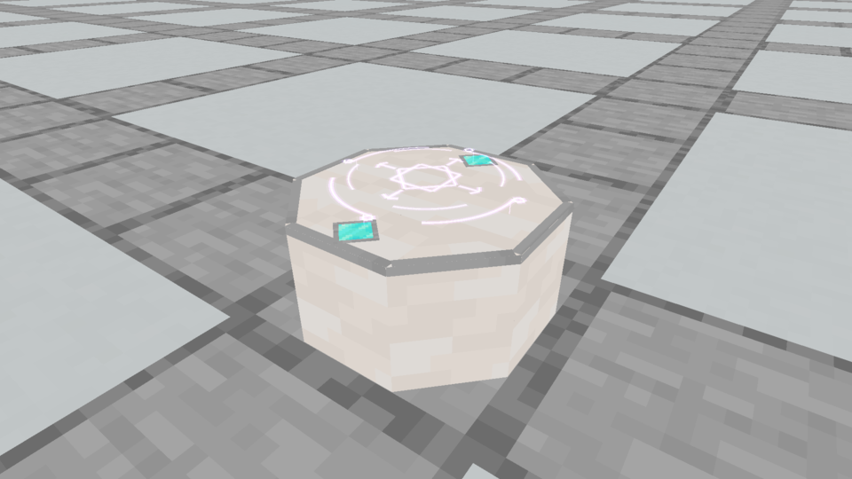
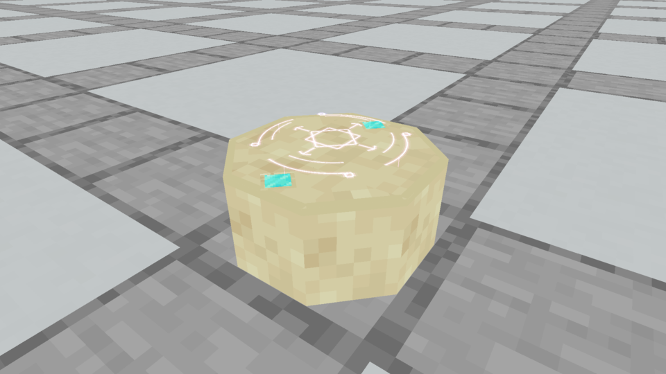
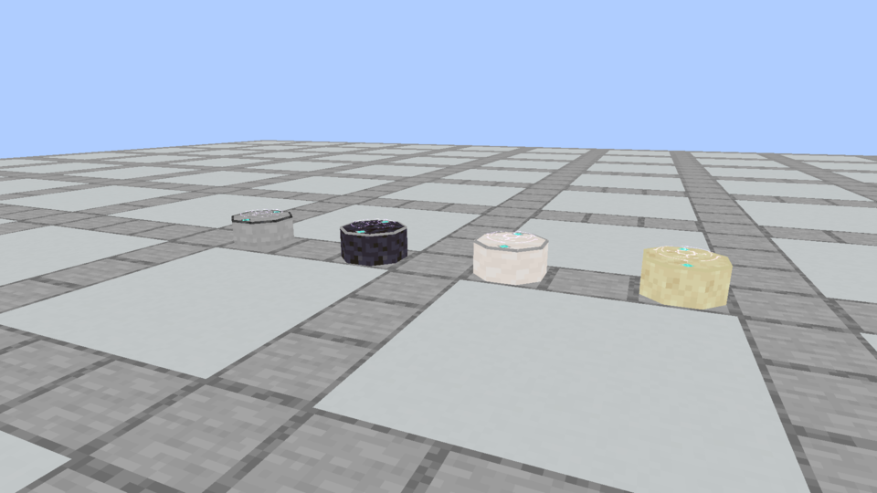

# Spellstone · stone trim and Diamond top inlays

**Rejected by the owner:** these four finishes and their continuous trim/separate Diamond inlays were disliked. The owner selected a fresh direction: a magical stone with crystal worked into its edges. Keep this archive as evidence of the rejected study, rather than a candidate to install.

**October 5, 2026.** The owner clarified that they meant ordinary trim, not gilding, and pointed out the Diamond contribution on top. These native previews keep the smoother material comparison, with a narrow stone edge and two fitted Diamond inlays on the top surface. The accepted lowered Astral Seal is retained.

The body is the same seven-solid low octagon, 14/16 wide and 7/16 tall. Sixteen flat faces form the stone edge; four flat faces make two Diamond settings. The model totals **27 elements / 42 baked faces**, with no extra solid tiers. The edge is half a model unit wide on top and 0.45 unit tall on the sides. Opposed Diamond shapes rest within the perimeter, with a stone collar around each. The center retains its flat y7/16 receiving surface.

All textures are the original vanilla **16×16 assets**. There is no Gold texture in any of these models. Four material finishes share the same geometry, effect, daylight and fixed close camera; border materials complement each finish.

## Smooth Stone



Smooth gray body with a dark Polished Deepslate edge.

[Native animation](native/trim_stone.mp4) · [Model](models/stone.json)

## Polished Blackstone



Dark body with a cool gray Smooth Stone edge.

[Native animation](native/trim_blackstone.mp4) · [Model](models/blackstone.json)

## Smooth Quartz



Soft white body with a gray Smooth Stone edge.

[Native animation](native/trim_quartz.mp4) · [Model](models/quartz.json)

## Smooth Sandstone



Warm sandstone body with a Cut Sandstone edge.

[Native animation](native/trim_sandstone.mp4) · [Model](models/sandstone.json)

## Comparison and verification



[Comparison animation](native/trim_comparison.mp4). Individual views above use the same closer camera.

These are opt-in native Minecraft art previews. Existing registered variants carry the resource-pack models; their collision and interactions retain production behavior. No replacement has been selected or installed. The existing construction recipe, Plinths, native crafting and accepted shaping rules remain unchanged. The earlier [Gold study](../gilded-spellstone-finishes/README.md) records a rejected interpretation of trim.

[Design ledger](designs.json) records the models, stone/trim pairings and original texture hashes/dimensions. [Capture evidence](capture-evidence.json) pins unchanged framebuffer images, measured-time recordings, loaded model and texture hashes, fixed cameras and the accepted renderer. [Verification](verification.json) records completed checks and the production boundary.

Reproduce in a fresh capture folder:

```bash
python3 tools/author_spellstone_trim.py
python3 tools/author_spellstone_trim.py --check
./gradlew runEffectsCapture -Pcapture_kind=apparatus -Pcapture_spells=trim_stone,trim_blackstone,trim_quartz,trim_sandstone,trim_comparison -Papparatus_preview=diamond-trim -Pcapture_material=stone_bricks -Pcapture_seconds=5 -Pcapture_output=build/spellstone-trim-fresh
python3 tools/archive_rune_captures.py build/spellstone-trim-fresh --trim
```
