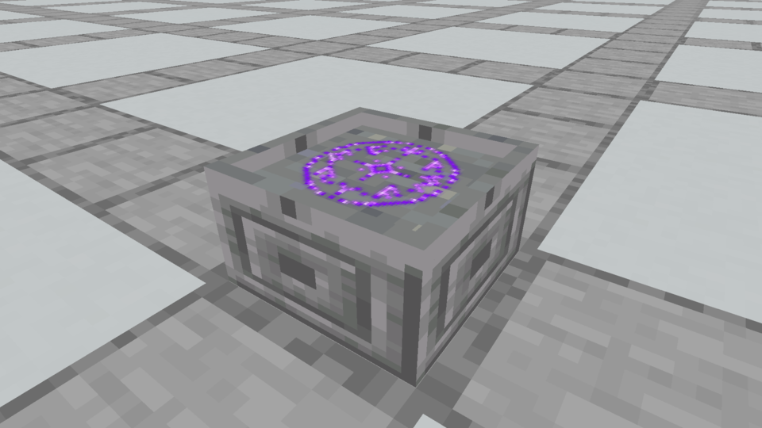
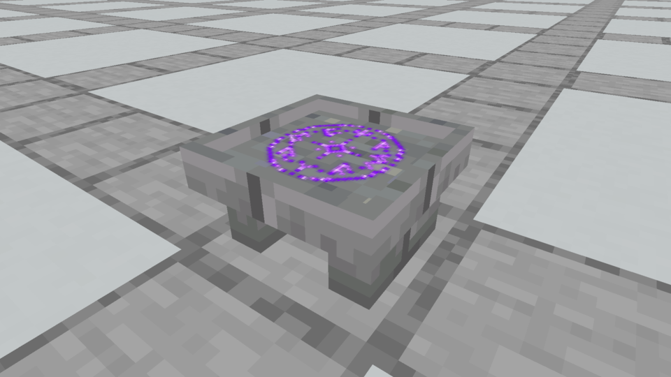
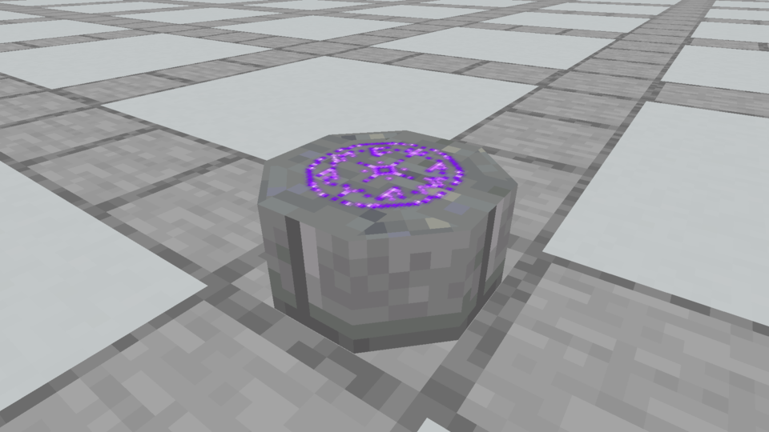
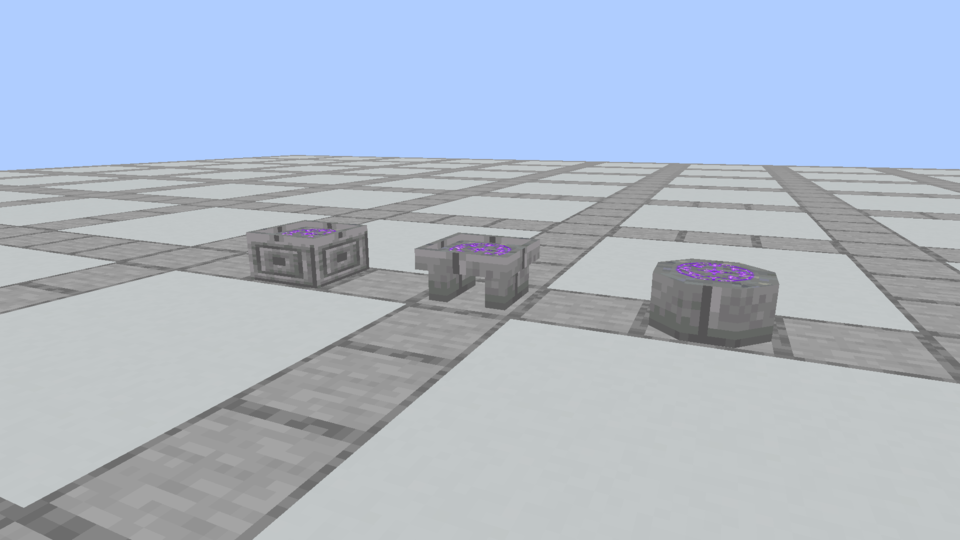

# Three Spellstone redesigns

**Owner feedback:** the Sealstone is roughly the preferred silhouette, but it still feels too basic. [Sealstone refinements](../sealstone-refinements/README.md) now explore a narrow rim, engraved sides and a recessed body belt. The three initial options and their evidence below remain preserved.

The owner rejected the detailed Spellstone and the subsequent corner-cut foundation edit. These alternatives start from new silhouettes rather than adjusting the old moldings. They keep a broad, flat scroll bed near half-block height and use the existing purple rune as the main magical detail.

## Runic Tablet



A solid rectangular stone with carved side panels and a shallow rim around the inscription. Five solid cuboids; no separate footing, supports, bevels or tiny gems. This is the most compact, block-like option.

## Twin-Pier Altar



A broad inscribed slab on two substantial stone supports, with an open space underneath. Seven solid cuboids. The two supports give it an architectural silhouette without a stepped base or elaborate corner settings.

## Sealstone



A low octagonal monolith with the inscription directly on its top. Seven solid cuboids; no raised rim, neck, separate foot or top settings. It treats the whole block as an ancient seal rather than a miniature pedestal.

## Matched comparison and scope



All three use the same vanilla Stone Brick finish, with a quieter Polished Andesite top. The Tablet adds Chiseled Stone Brick side panels. All vanilla material textures are 16×16; the existing intact rune is the separate, previously accepted overlay. Individual views use the same camera, lighting and scale. Images are unchanged Minecraft framebuffer captures, not illustrated concepts.

These are **capture-only art candidates**. One isolated preview pack maps three existing Spellstone variant IDs to the three models, all using Stone Brick textures. The registered blocks and actual native rune renderer produce these images. Candidate collision and production integration are not yet implemented, and the Prism installation remains the earlier corner-cut build. Scroll position, crafting recipes and gameplay are unchanged. Selection among these designs belongs to the owner.

The [candidate ledger](designs.json), [model files](models/) and [native capture evidence](capture-evidence.json) preserve the options. `python3 tools/author_spellstone_designs.py --check` checks their reproducible generation, model bounds, permitted rotations, texture/UV references, unchanged rune and eight-element maximum. Both native capture runs compiled and completed; the final four views were inspected. No production model/collision change was made, so world mechanics tests were not rerun for these art previews.

## Review trail

- The preceding layered altar and small foundation edit remained visually unsatisfactory to the owner. None of these candidates restores its Diamond crown settings, many moldings or stepped foot.
- First native review: `round-one/` preserves the initial models and frames. Brick texture detail on the top competed with the rune, so all three received a quieter Polished Andesite surface. The Sealstone's overlapping top faces received an imperceptible 0.002-model-unit offset to prevent coplanar texture flicker; no extra visible tier was added.
- Current native frames were recaptured after those changes. They document the alternatives without choosing a winner or replacing the owner's installed art.

Reproduce:

```bash
python3 tools/author_spellstone_designs.py
./gradlew runEffectsCapture -Pcapture_kind=apparatus -Pcapture_spells=spellstone_design_tablet,spellstone_design_altar,spellstone_design_seal,spellstone_designs -Papparatus_preview=spellstone-designs -Pcapture_material=stone_bricks -Pcapture_seconds=2 -Pcapture_output=build/spellstone-redesign-fresh
```
