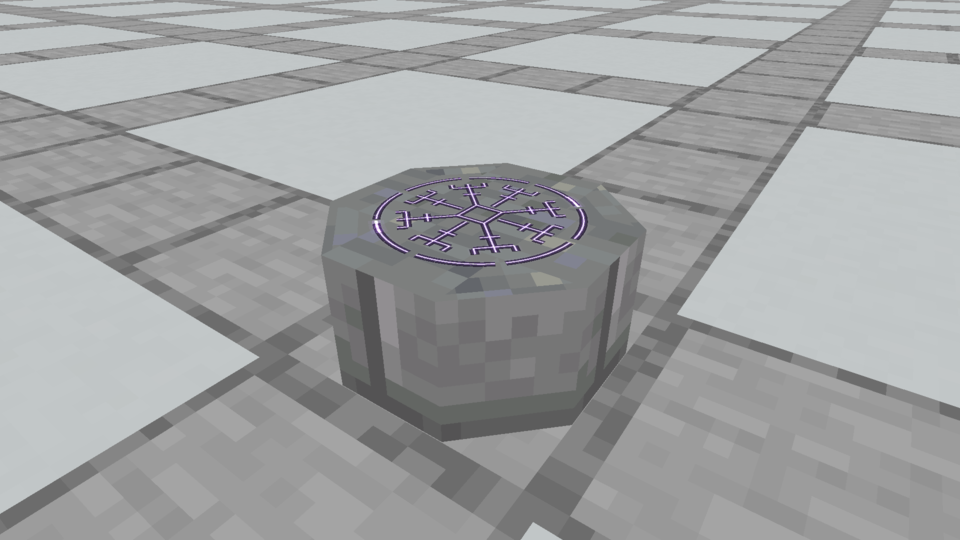
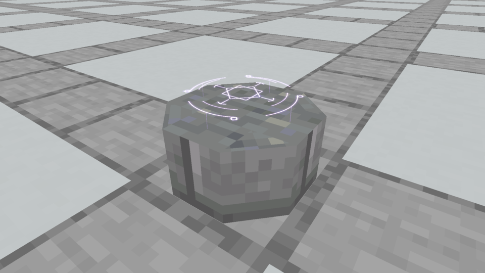
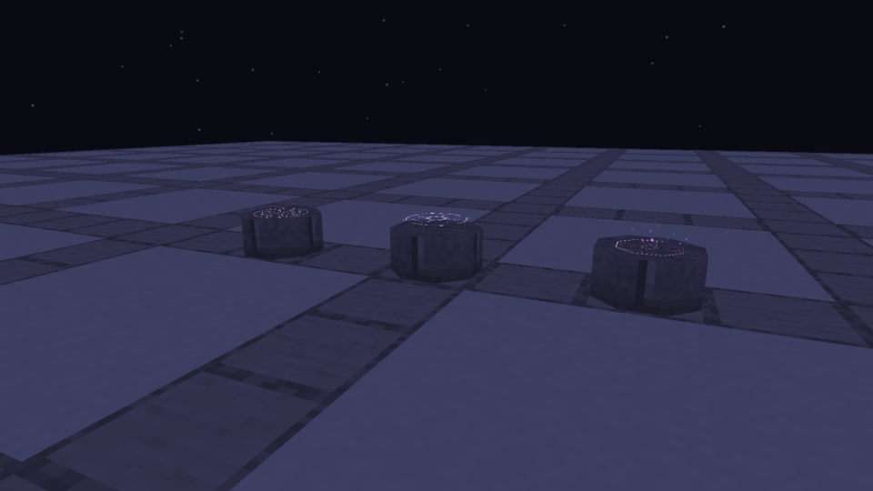

# Spellstone · continuous light instead of the enlarged pixel rune

The owner identified the purple pixel overlay as another reason the Spellstone felt basic. These three options replace that overlay with continuous strokes rendered by Minecraft. They all use the same plain seven-cuboid Sealstone, Stone Brick sides and Polished Andesite top, so the rune treatment is the variable being compared. No body details from the previous rim/carving/belt review are added here.

**Owner selection:** Astral Seal was selected, with a lower hover and a request for restrained trim/Diamond corner notches. [Current native Astral Spellstone](../astral-spellstone/README.md) implements that direction. The images and verification below record the earlier three-option review; the original renderer source is frozen in `renderer-source.java.txt`.

## Illuminated Engraving



A stationary eight-armed inscription sits in dark, inset-looking channels. Fine violet lines with pale cores illuminate the carving, with a gentle pulse and two moving highlights around the broken outer ring. The groove is a visual surface treatment, not additional collision geometry. The inscription itself stays fixed to the stone.

[Actual movement](native/rune_engraving.mp4) · [night recording](native/rune_engraving_night.mp4)

## Astral Seal



An interlocked central glyph floats above the stone between two broken rings rotating in opposite directions. Four small luminous marks orbit the outside, and faint vertical filaments attach the projection to its source. The floating plane gently breathes in height. Its pale violet cores are deliberately brighter than the engraving.

[Actual movement](native/rune_astral.mp4) · [night recording](native/rune_astral_night.mp4)

## Living Script


A bright point of light traces an angular inscription over a 4.8-second cycle. Each stroke brightens and leaves a fading trace; fourteen small motes rise from the inscription. The moving trace and motes are bounded local renderer geometry, without persistent world entities, gameplay effects, networking or stored particle state. They are not painted into a screenshot.

[Actual movement](native/rune_living.mp4) · [night recording](native/rune_living_night.mp4)

## Compare at night



[Native daytime comparison](native/rune_comparison.mp4) · [native nighttime comparison](native/rune_comparison_night.mp4)

These are unchanged 960×540 Minecraft framebuffer captures, with six-second recordings encoded at their measured frame times. Matched close-up cameras, the same body and both noon/midnight lighting make the different treatments visible. Videos include no composited light, illustration frames, artificial slow motion or audio. They use native additive unlit ribbons and a layered halo, with normal depth testing. No shader pack or bloom postprocessing is required. Emissive strokes remain luminous in darkness; these previews do not illuminate adjacent blocks or change world light levels.

## Implementation and review boundary

- `SpellstoneRuneOptions.java` provides the three native effects only when the opt-in capture renderer is enabled. An ordinary client retains the production presentation.
- `tools/author_spellstone_rune_options.py` generates the isolated `rune-options` resource pack and [model/design ledger](designs.json). The inventory preview model omits the rune; these animated effects are being reviewed on the placed Spellstone. Production inventory art remains unchanged.
- Three existing registered Spellstone finishes act as capture carriers, all overridden with the same body appearance. Their IDs do not select a new gameplay ability.
- `tools/archive_rune_captures.py` checks loaded model/renderer hashes, copies PNG frames unchanged, encodes and decodes all eight MP4s, and pins [capture evidence](capture-evidence.json). Both lighting conditions, three matched close-ups and a comparison were inspected. Different animation phases were also inspected for the rotating rings and moving trace.
- Native capture and packaging builds pass, with all 85 unit tests passing. Model generation, UV/bounds validation and production apparatus generation checks pass. No recipe, collision, ritual, Plinth or world behavior change was made; the 151 passing world tests from the prior production geometry revision remain the latest mechanics run.
- The Prism / Kithkyn Testing installation retains SHA-256 `dfeedc862c28603643569cba9c7d351d21219c633c6c0aa47fd1b323de8a22c8`. These are review options, not a silently selected replacement. Final integration should cover the chosen effect with reference/output scrolls, underwater appearance and all finishes.

The earlier chunky purple raster rune is now a rejected direction. Its assets and original captures remain historical evidence. The owner roughly preferred the Sealstone body; its surface details and final rune treatment are still under visual review.

Reproduce:

```bash
python3 tools/author_spellstone_rune_options.py
./gradlew runEffectsCapture -Pcapture_kind=apparatus -Pcapture_spells=rune_engraving,rune_astral,rune_living,rune_comparison,rune_engraving_night,rune_astral_night,rune_living_night,rune_comparison_night -Papparatus_preview=rune-options -Pcapture_material=stone_bricks -Pcapture_seconds=6 -Pcapture_output=build/spellstone-rune-options-fresh
python3 tools/archive_rune_captures.py build/spellstone-rune-options-fresh
```
