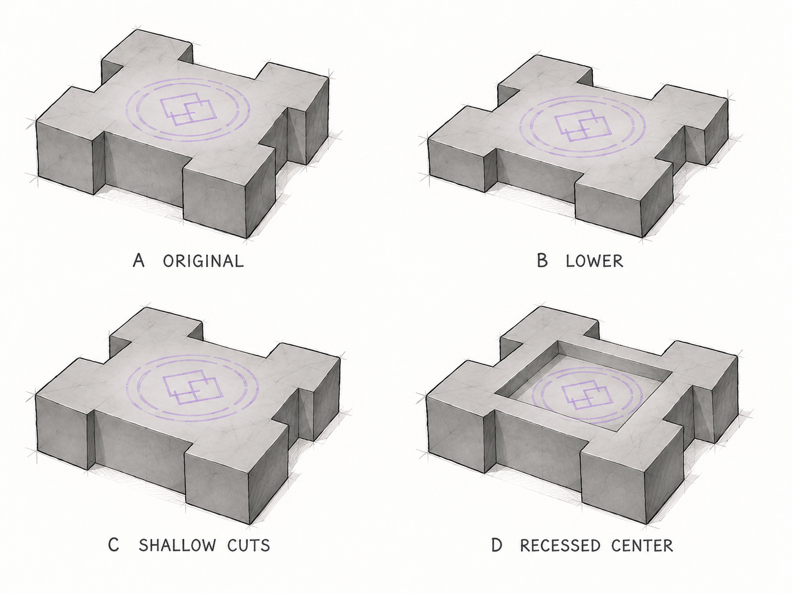

# Spellstone silhouette selection

**Superseded October 6:** the owner locked the [low three-piece tent table](../spellstone-tent-table/README.md), with two angled supports, a flat rune surface and subtle Diamond corner insets. The notched selection below remains historical evidence.

October 5, 2026. **Owner selected A — Original Notched Monolith.** The choice refers to the body in the four-variant sheet below. It preserves the original notched body's proportions: B's flatter height, C's shallower cuts and D's recessed center are not selected.

The owner initially preferred number 12 in [the twelve-shape exploration](twelve-shapes.png), then explicitly chose A after the four-variant study. The broad, squat stone mass has rectangular inward cuts between substantial corner sections and an uninterrupted flat receiving center. It is not the prior octagonal/chamfered slab. Keep the accepted lowered native Astral Seal; the pale rune drawn in these sketches is only a schematic placeholder for that effect.

Both sheets were generated with the built-in image generation tool and copied unchanged. These are low-fidelity concepts, not Minecraft models or framebuffer captures. The notched outline was never modeled or installed before the owner selected the tent table. This study had superseded the former fractured-relic native preview; its archived captures remain evidence of that previous unapproved study.

The Plinth appearance, 36 masonry finishes, construction recipes, reference/result placement, material sockets and leyline mechanics are unaffected by this silhouette choice.
