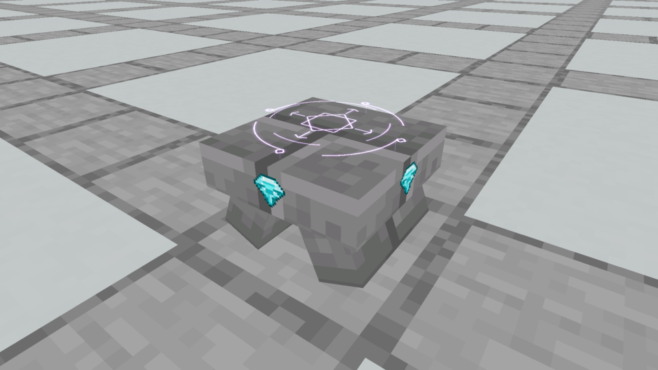
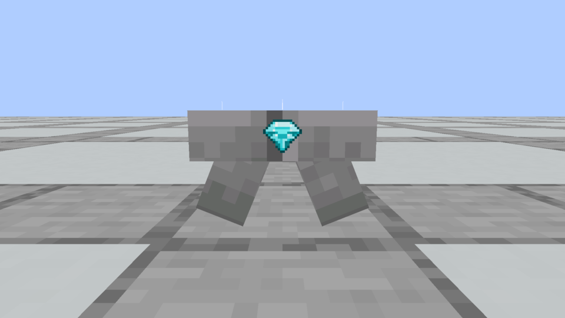
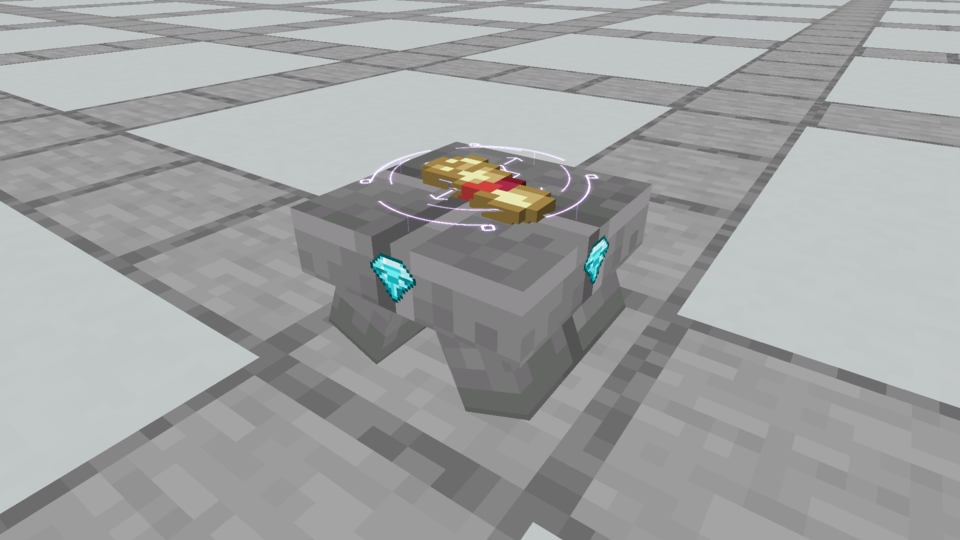

# Spellstone · compact stonework and four rim gemstones

**Current selection:** [smaller A corner chips and native ritual review](../spellstone-corner-details/locked-a/README.md) replace the side-center gemstone decoration shown here. The thick three-piece body is retained. This page is historical implementation evidence.

**Superseded decoration, October 6:** the owner rejected the side-center gemstone placement and sprite style. They clarified details at the vertical edge corners and requested [four native pixel corner studies with smoother finishes](../spellstone-corner-details/README.md). The following captures document the earlier implemented baseline; its smaller thick three-piece body is retained in the new studies. A replacement corner treatment has not been selected.

**Current owner direction, October 6, 2026.** Keep three substantial stone pieces, make the broad top smaller and thicker, and put four separate cut gemstones on its vertical rim sides. The owner clarified that “diamond edge” meant those four gems with bare stone between them. The connected-line frame was a rejected interpretation.

## Current actual Minecraft appearance

These unchanged framebuffer captures show production blocks in Minecraft 1.21.1 / NeoForge 21.1.72, with the sibling Kithkyn mod loaded. There is no preview resource pack, shader pack or generated-image overlay.







[Night](native/spellstone_astral_night.png), [underwater](native/spellstone_astral_underwater.png) and [Stone Brick / Tuff / Quartz finishes](native/spellstone_astral_finishes.png) were also visually inspected. The gems receive normal world lighting; the native Astral Seal remains luminous at night and naturally tinted through water.

## Current native proportions and artwork

Exactly three solid model pieces remain: two inward-leaning supports and one thick top stone. The top shrinks from 14×14 to **12×12 model units**, and thickens from 2.25 to **3.25 units**. Its upper surface rises from y7 to **y8**. Supports thicken from 3 to **3.5 units** and shorten in depth from 12 to **10 units**. Their native 22.5-degree lean gives the thick stones a clean opening without a crossed joint below the cap. The physical footprint is 12/16 square and height is 8/16 block.

Four isolated cutout faces put one [cut gemstone sprite](side-gems/README.md) on each vertical north/south/east/west rim face, centered at y6.375. The top and stone between gems remain bare. There are **three solids plus four decorative faces: 7 elements / 22 baked faces**, shared across all 36 block/item finishes. Gems add no collision. Quarter-model-unit horizontal collision slices follow the supports, and the top is one flat receiving box.

The 32×32 transparent gemstone sprite was made with the **built-in image generation tool**. Its [exact prompt](side-gems/generation-prompt.txt), unchanged [generated source](side-gems/generated-gem.png), [native asset](../../../src/main/resources/assets/vestige/textures/block/spellstone_diamond_gem.png) and [asset evidence](side-gems/asset-evidence.json) are saved in the project. Only nearest-neighbor size conversion was applied, retaining alpha; model UVs crop the clear margins. Existing vanilla stone tiles retain their native 16×16 size, bytes and coherent model-unit UV scale. No concept sketch pixels are used as game art.

Scrolls derive their placement from the receiving surface, now y8/16. The Astral renderer's surface offset rises by the same 1/16 block; its interlocked glyph, counter-rotating rings, faint anchors, 0.045-block relative hover and ±0.006 breathing are unchanged. Recipes, registry/state IDs, Plinths, waterlogging, sockets, stored items, shaping and attunement identity retain their behavior. Prism still has the previous jar; installation is pending.

## Verification

Java 21 `build`, `verifyKithkynCompatibility` and `runGameTestServer` pass: **95 unit tests and all 158 required Minecraft tests**, zero failures/errors/skips. The collision/selection world test checks clear opening rays, both supports, and a downward hit on the flat scroll surface across every finish. Production authoring, the independent geometry/UV/bounds/collision/Plinth-seam audit, historical comparison checks and whitespace verification pass.

All **72 Spellstone block/item models**, the gemstone sprite and five relevant compiled classes match the built jar. The **252 pinned Plinth models and construction recipes** remain byte-identical. The Astral source differs only in its surface-height constant. The rejected connected-frame asset and references are absent from the jar. [Verification](verification.json) pins these results and artifact hashes; [the model/seam audit](model-and-seam-audit.json) checks the three solids, legal rotations, side-only gem faces, transparent isolated sprite, sampled support coverage and clear opening.

[Daylight recording](native/spellstone_astral.mp4) and [front recording](native/spellstone_astral_side.mp4) retain measured frame timing. All six recordings encode and decode at 960×540. [Capture evidence](capture-evidence.json) pins the unchanged images/videos, loaded model/sprite hashes and compiled renderer. Screenshots were visually inspected; video verification covers successful encoding/decoding and native timestamps.

Reproduce:

```bash
python3 tools/author_apparatus_models.py --check
python3 tools/audit_apparatus_detail.py --check
./gradlew build verifyKithkynCompatibility runGameTestServer
./gradlew runEffectsCapture -Pcapture_kind=apparatus -Pcapture_spells=spellstone_astral,spellstone_astral_side,spellstone_astral_night,spellstone_astral_scrolls,spellstone_astral_underwater,spellstone_astral_finishes -Pcapture_material=stone_bricks -Pcapture_seconds=4 -Pcapture_output=build/spellstone-side-gems-fresh
python3 tools/archive_rune_captures.py build/spellstone-side-gems-fresh --table
```

## Historical references

The owner originally locked the [low three-piece concept](approved-concept.png) with “Yes. Yeah, this is great. Lock it in, kid.” It establishes the three-stone direction, while later native reviews supersede its broad low proportions and top-chip placement. The [first native table](first-native/README.md), [thicker broad table](thicker-native/README.md) and [rejected connected-frame interpretation](diamond-edge/README.md) are preserved separately.

The original concept and [initial tall comparison](initial-concept.png) were made with built-in image generation. Their [generation prompt](generation-prompt.txt) and [refinement prompt](refinement-prompt.txt) are retained. Approved concept SHA-256: `ba212c9e741fb8a902b159c96a99c0f94070f8c76918da370059275b01463007`; initial concept: `a5868936fd87b6037f6bbdf61b5e57d291c8f923a4f707d19849097ea65ad37f`. Both images remain unchanged historical evidence.
