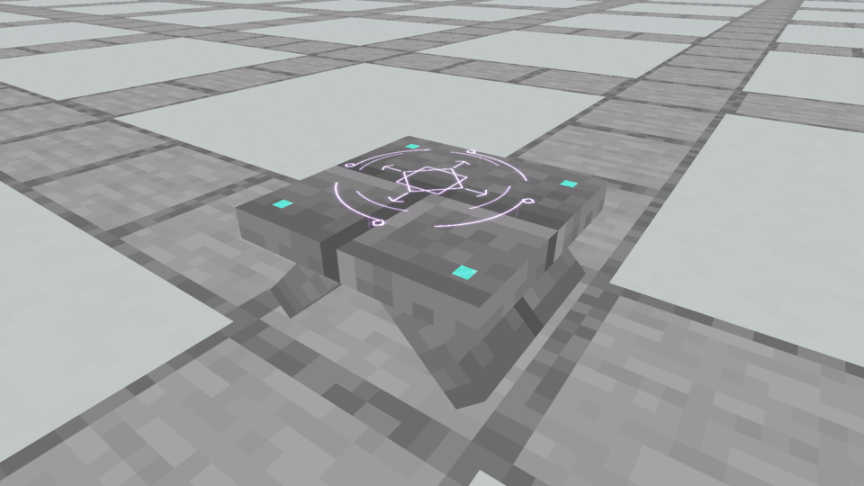
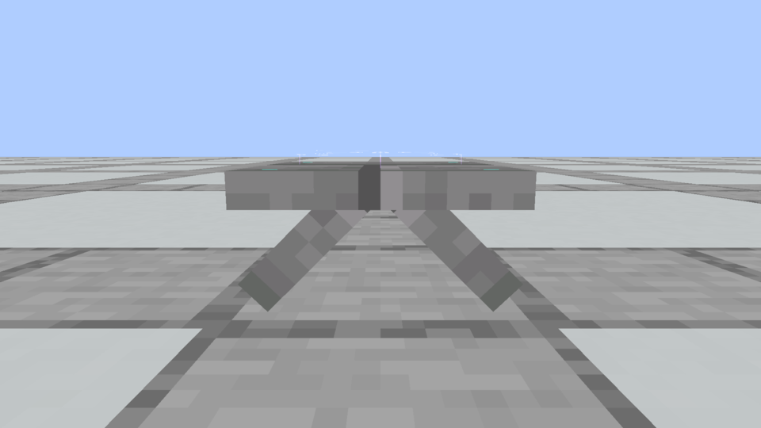

# First native tent-table Spellstone · historical comparison

The owner reviewed this first implementation and requested thicker stones and clearer Diamond chips. Its two supports were 2 model units thick, its tabletop 1.75 units thick, and each corner was one 0.75×0.75 cyan square. This archived version is superseded by the [current thicker table and faceted chips](../README.md).

These are unaltered Minecraft captures. The original [capture evidence](capture-evidence.json), [model audit](model-and-seam-audit.json) and [verification](verification.json) are preserved with their old artifact hashes. Paths inside those records describe their original archive/build locations, before this historical copy. The concept reference and native Astral Seal remain accepted.
